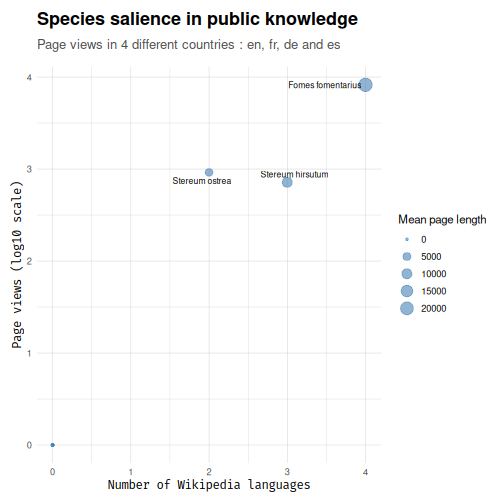

# Checking Taxa Presence in Samples

``` r

library(taxinfo)
library(MiscMetabar)
library(ggplot2)
library(dplyr)
```

## Overview

One of the key challenges in environmental sequencing studies is
determining whether detected taxa are likely to be actually present at
your sampling sites. This vignette demonstrates how to use `taxinfo`’s
occurrence checking functions to validate the likelihood of taxa
presence based on known geographic distributions.

As most of `taxinfo`’s utilities, these functions can accept either a
phyloseq object with cleaned taxonomic names or a vector of taxonomic
names (`taxnames` parameter). The algorithm used to assign the taxonomic
names must be stringent enough to avoid false positives. Moreover, we
recommend using
[`gna_verifier_pq()`](https://adrientaudiere.github.io/taxinfo/reference/gna_verifier_pq.md)
to clean taxonomic names by disambiguating synonyms and correcting
misspellings.

## Core Functions

The main functions for checking taxa presence are:

- [`tax_occur_check()`](https://adrientaudiere.github.io/taxinfo/reference/tax_occur_check.md):
  Core occurrence checking function for individual taxa
- [`tax_occur_check_pq()`](https://adrientaudiere.github.io/taxinfo/reference/tax_occur_check_pq.md):
  Check occurrence likelihood within a radius around samples
- [`tax_occur_multi_check_pq()`](https://adrientaudiere.github.io/taxinfo/reference/tax_occur_multi_check_pq.md):
  Check multiple locations simultaneously

## Basic Occurrence Checking for individual taxa

How many *Quercus robur* occurrences have been reported within 100km of
Paris, France?

🛈⚠

×

**Messages**

``` popup-pre
#> Reading 'ne_50m_land.zip' from naturalearth...
#> ℹ After cleaning with CoordinateCleaner::clean_coordinates:
#> - 955 occurrences remain(s)
#> - Total original: 1000
#> - Retention rate: 95.5%
#> 
#> ✔ Found 755 occurrences for species Quercus robur:
#> 
#> • Closest occurrence: 7.82 km
```

×

**Warnings**

``` popup-pre
#> Warning: [vect] guessed crs
```

``` r

Q_rob_in_Paris <- tax_occur_check("Quercus robur", 2.3522, 48.8566, 100)
```

``` r

Q_rob_in_Paris$count_in_radius
```

    #> [1] 755

🛈⚠

×

**Messages**

``` popup-pre
#> Reading 'ne_50m_land.zip' from naturalearth...
#> ℹ After cleaning with CoordinateCleaner::clean_coordinates:
#> - 870 occurrences remain(s)
#> - Total original: 1000
#> - Retention rate: 87%
#> 
#> ✔ Found 667 occurrences for species Fagus sylvatica:
#> 
#> • Closest occurrence: 8.3 km
```

×

**Warnings**

``` popup-pre
#> Warning: [vect] guessed crs
```

``` r

# Visualize occurrences around Paris for Fagus sylvatica
res_occ <- tax_occur_check("Fagus sylvatica", 2.3522, 48.8566, 200,
  return_all_occ = TRUE
)
```

``` r


occ_data_sf <- sf::st_as_sf(res_occ$occ_data,
  coords = c("decimalLongitude", "decimalLatitude"),
  crs = 4326
)

if (requireNamespace("leaflet")) {
  library(leaflet)
}
if (requireNamespace("leafpop")) {
  library(leafpop)
}
leaflet() |>
  addTiles() |>
  setView(2.3522, 48.8566, zoom = 12) |>
  fitBounds(
    lat1 = as.vector(sf::st_bbox(occ_data_sf))[2],
    lng1 = as.vector(sf::st_bbox(occ_data_sf))[1],
    lat2 = as.vector(sf::st_bbox(occ_data_sf))[4],
    lng2 = as.vector(sf::st_bbox(occ_data_sf))[3]
  ) |>
  leaflet::addCircles(data = occ_data_sf, color = "blue", stroke = 1, opacity = 0.8) |>
  leaflet::addCircleMarkers(2.3522, 48.8566, color = "orange", radius = 2, opacity = 1)
```

    #> Error in `loadNamespace()`:
    #> ! there is no package called 'webshot'

## Basic Occurrence Checking fo phyloseq object

### Setting Up the Data

🛈

×

**Messages**

``` popup-pre
#> ✔ GNA verification summary:
#> • Total taxa in phyloseq: 20
#> • Taxa submitted for verification: 19
#> • Genus-level only taxa: 2
#> • Total matches found: 15
#> • Synonyms: 4 (including 4 at genus level)
#> • Accepted names: 11 (including 6 at genus level)
#> Cleaning suppress 0 taxa and 6 samples.
```

``` r

# Load example data
data("data_fungi_mini", package = "MiscMetabar")

# Keep only first 20 taxa for speed
data_clean <- prune_taxa(taxa = taxa_names(data_fungi_mini)[1:20], data_fungi_mini) |>
  gna_verifier_pq(data_sources = 210)
```

``` r


summary_plot_pq(data_clean)
```



plot of chunk unnamed-chunk-4

``` r

head(data_clean@tax_table[, c("Genus", "Species", "currentCanonicalSimple")])
```

    #> Taxonomy Table:     [6 taxa by 3 taxonomic ranks]:
    #>       Genus        Species      currentCanonicalSimple
    #> ASV7  NA           NA           NA                    
    #> ASV8  "Stereum"    "ostrea"     "Stereum ostrea"      
    #> ASV12 "Xylodon"    "raduloides" "Xylodon"             
    #> ASV18 "Stereum"    "ostrea"     "Stereum ostrea"      
    #> ASV25 "Ossicaulis" "lachnopus"  "Ossicaulis lachnopus"
    #> ASV26 "Stereum"    "hirsutum"   "Stereum hirsutum"

### Single Location Occurrence Check

Check if taxa in your phyloseq object have been reported within a
specific radius of your sampling location:

🛈⚠

×

**Messages**

``` popup-pre
#> Reading 'ne_50m_land.zip' from naturalearth...
#> ℹ After cleaning with CoordinateCleaner::clean_coordinates:
#> - 1 occurrences remain(s)
#> - Total original: 1
#> - Retention rate: 100%
#> 
#> ✔ Found 1 occurrences for species Stereum ostrea:
#> 
#> • Closest occurrence: 47.07 km
#> 
#> ! No occurrences found for Ossicaulis lachnopus
#> Reading 'ne_50m_land.zip' from naturalearth...
#> ℹ After cleaning with CoordinateCleaner::clean_coordinates:
#> - 478 occurrences remain(s)
#> - Total original: 491
#> - Retention rate: 97.4%
#> 
#> ✔ Found 439 occurrences for species Stereum hirsutum:
#> 
#> • Closest occurrence: 8.3 km
#> Reading 'ne_50m_land.zip' from naturalearth...
#> ℹ After cleaning with CoordinateCleaner::clean_coordinates:
#> - 3 occurrences remain(s)
#> - Total original: 3
#> - Retention rate: 100%
#> 
#> ✔ Found 3 occurrences for species Basidiodendron eyrei:
#> 
#> • Closest occurrence: 55.36 km
#> Reading 'ne_50m_land.zip' from naturalearth...
#> ℹ After cleaning with CoordinateCleaner::clean_coordinates:
#> - 1 occurrences remain(s)
#> - Total original: 1
#> - Retention rate: 100%
#> 
#> ✔ Found 1 occurrences for species Sistotrema oblongisporum:
#> 
#> • Closest occurrence: 53 km
#> Reading 'ne_50m_land.zip' from naturalearth...
#> ℹ After cleaning with CoordinateCleaner::clean_coordinates:
#> - 651 occurrences remain(s)
#> - Total original: 673
#> - Retention rate: 96.7%
#> 
#> ✔ Found 606 occurrences for species Fomes fomentarius:
#> 
#> • Closest occurrence: 8.17 km
#> Reading 'ne_50m_land.zip' from naturalearth...
#> ℹ After cleaning with CoordinateCleaner::clean_coordinates:
#> - 28 occurrences remain(s)
#> - Total original: 30
#> - Retention rate: 93.3%
#> 
#> ✔ Found 28 occurrences for species Cerocorticium molare:
#> 
#> • Closest occurrence: 12.71 km
#> Reading 'ne_50m_land.zip' from naturalearth...
#> ℹ After cleaning with CoordinateCleaner::clean_coordinates:
#> - 5 occurrences remain(s)
#> - Total original: 5
#> - Retention rate: 100%
#> 
#> ✔ Found 5 occurrences for species Aporpium canescens:
#> 
#> • Closest occurrence: 52.86 km
#> Reading 'ne_50m_land.zip' from naturalearth...
#> ℹ After cleaning with CoordinateCleaner::clean_coordinates:
#> - 22 occurrences remain(s)
#> - Total original: 22
#> - Retention rate: 100%
#> 
#> ✔ Found 22 occurrences for species Hypochnicium analogum:
#> 
#> • Closest occurrence: 52.86 km
```

×

**Warnings**

``` popup-pre
#> Warning: [vect] guessed crs
#> Warning: [vect] guessed crs
#> Warning: [vect] guessed crs
#> Warning: [vect] guessed crs
#> Warning: [vect] guessed crs
#> Warning: [vect] guessed crs
#> Warning: [vect] guessed crs
#> Warning: [vect] guessed crs
```

``` r

# Define sampling coordinates (example: Paris, France)
longitude <- 2.3488
latitude <- 48.8534

# Check occurrence within 100km radius
occurrence_check <- tax_occur_check_pq(
  data_clean,
  longitude = longitude,
  latitude = latitude,
  radius_km = 100,
  n_occur = 1000,
  add_to_phyloseq = FALSE
)
```

``` r


# View results
head(occurrence_check)
```

    #> # A tibble: 6 × 10
    #>   taxa_name                count_in_radius closest_distance_km mean_distance_km
    #>   <chr>                              <dbl>               <dbl>            <dbl>
    #> 1 Stereum ostrea                         1               47.1              47.1
    #> 2 Ossicaulis lachnopus                   0               NA                NA  
    #> 3 Stereum hirsutum                     439                8.3              57.2
    #> 4 Basidiodendron eyrei                   3               55.4              58.9
    #> 5 Sistotrema oblongisporum               1               53                53  
    #> 6 Fomes fomentarius                    606                8.17             54.0
    #> # ℹ 6 more variables: total_count_in_world <dbl>, search_radius <dbl>,
    #> #   closest_point_lat <dbl>, closest_point_lon <dbl>, sample_point_lat <dbl>,
    #> #   sample_point_lon <dbl>

### Example Visualization

Here’s what occurrence checking results might look like:

⚠

×

**Warnings**

``` popup-pre
#> Warning: `scale_fill_idest_d()` was deprecated in taxinfo 0.2.0.
#> ℹ Please use `ggplotpq::scale_fill_idest_d()` instead.
#> This warning is displayed once per session.
#> Call `lifecycle::last_lifecycle_warnings()` to see where this warning was generated.
```


plot of chunk unnamed-chunk-7

We can also explore the minimum and mean distance to sampling location.

``` r

occurrence_check |>
  mutate(Genus = stringr::word(taxa_name, 1)) |>
  filter(!is.na(mean_distance_km)) |>
  mutate(taxa_name = forcats::fct_reorder(taxa_name, mean_distance_km)) |>
  ggplot(aes(x = mean_distance_km, y = taxa_name)) +
  geom_col(aes(fill = Genus)) +
  scale_fill_idest_d(name = "Genus") +
  geom_text(aes(label = paste0("Closest: ", closest_distance_km, " km"), x = 10), size = 3) +
  geom_text(aes(label = paste0("n=", count_in_radius)), nudge_x = -2, size = 3)
```


plot of chunk unnamed-chunk-8

The results include:

- `taxa_name`: Taxonomic name checked
- `count_in_radius`: Number of occurrences within the specified radius
- `total_count_in_world`: Total global occurrences for this taxon
- `radius_km`: Search radius used
- `longitude`/`latitude`: Center coordinates
- `closest_distance_km`: The distance to the closest occurrence point
- `closest_distance_km`: The mean distance to occurrence point

## Advanced Occurrence Checking

### Multiple Radius Analysis

Compare occurrence patterns at different spatial scales:

🛈⚠

×

**Messages**

``` popup-pre
#> Reading 'ne_50m_land.zip' from naturalearth...
#> ℹ After cleaning with CoordinateCleaner::clean_coordinates:
#> - 1 occurrences remain(s)
#> - Total original: 1
#> - Retention rate: 100%
#> 
#> ✔ Found 1 occurrences for species Stereum ostrea:
#> 
#> • Closest occurrence: 47.07 km
#> 
#> ! No occurrences found for Ossicaulis lachnopus
#> Reading 'ne_50m_land.zip' from naturalearth...
#> ℹ After cleaning with CoordinateCleaner::clean_coordinates:
#> - 273 occurrences remain(s)
#> - Total original: 286
#> - Retention rate: 95.5%
#> 
#> ✔ Found 177 occurrences for species Stereum hirsutum:
#> 
#> • Closest occurrence: 8.3 km
#> Reading 'ne_50m_land.zip' from naturalearth...
#> ℹ After cleaning with CoordinateCleaner::clean_coordinates:
#> - 1 occurrences remain(s)
#> - Total original: 1
#> - Retention rate: 100%
#> 
#> ✔ Found 0 occurrences for species Basidiodendron eyrei:
#> 
#> • Closest occurrence: 55.36 km
#> Reading 'ne_50m_land.zip' from naturalearth...
#> ℹ After cleaning with CoordinateCleaner::clean_coordinates:
#> - 1 occurrences remain(s)
#> - Total original: 1
#> - Retention rate: 100%
#> 
#> ✔ Found 0 occurrences for species Sistotrema oblongisporum:
#> 
#> • Closest occurrence: 53 km
#> Reading 'ne_50m_land.zip' from naturalearth...
#> ℹ After cleaning with CoordinateCleaner::clean_coordinates:
#> - 448 occurrences remain(s)
#> - Total original: 470
#> - Retention rate: 95.3%
#> 
#> ✔ Found 223 occurrences for species Fomes fomentarius:
#> 
#> • Closest occurrence: 8.17 km
#> Reading 'ne_50m_land.zip' from naturalearth...
#> ℹ After cleaning with CoordinateCleaner::clean_coordinates:
#> - 24 occurrences remain(s)
#> - Total original: 24
#> - Retention rate: 100%
#> 
#> ✔ Found 17 occurrences for species Cerocorticium molare:
#> 
#> • Closest occurrence: 12.71 km
#> Reading 'ne_50m_land.zip' from naturalearth...
#> ℹ After cleaning with CoordinateCleaner::clean_coordinates:
#> - 5 occurrences remain(s)
#> - Total original: 5
#> - Retention rate: 100%
#> 
#> ✔ Found 0 occurrences for species Aporpium canescens:
#> 
#> • Closest occurrence: 52.86 km
#> Reading 'ne_50m_land.zip' from naturalearth...
#> ℹ After cleaning with CoordinateCleaner::clean_coordinates:
#> - 18 occurrences remain(s)
#> - Total original: 18
#> - Retention rate: 100%
#> 
#> ✔ Found 0 occurrences for species Hypochnicium analogum:
#> 
#> • Closest occurrence: 52.86 km
#> Reading 'ne_50m_land.zip' from naturalearth...
#> ℹ After cleaning with CoordinateCleaner::clean_coordinates:
#> - 1 occurrences remain(s)
#> - Total original: 1
#> - Retention rate: 100%
#> 
#> ✔ Found 1 occurrences for species Stereum ostrea:
#> 
#> • Closest occurrence: 47.07 km
#> 
#> ! No occurrences found for Ossicaulis lachnopus
#> Reading 'ne_50m_land.zip' from naturalearth...
#> ℹ After cleaning with CoordinateCleaner::clean_coordinates:
#> - 478 occurrences remain(s)
#> - Total original: 491
#> - Retention rate: 97.4%
#> 
#> ✔ Found 439 occurrences for species Stereum hirsutum:
#> 
#> • Closest occurrence: 8.3 km
#> Reading 'ne_50m_land.zip' from naturalearth...
#> ℹ After cleaning with CoordinateCleaner::clean_coordinates:
#> - 3 occurrences remain(s)
#> - Total original: 3
#> - Retention rate: 100%
#> 
#> ✔ Found 3 occurrences for species Basidiodendron eyrei:
#> 
#> • Closest occurrence: 55.36 km
#> Reading 'ne_50m_land.zip' from naturalearth...
#> ℹ After cleaning with CoordinateCleaner::clean_coordinates:
#> - 1 occurrences remain(s)
#> - Total original: 1
#> - Retention rate: 100%
#> 
#> ✔ Found 1 occurrences for species Sistotrema oblongisporum:
#> 
#> • Closest occurrence: 53 km
#> Reading 'ne_50m_land.zip' from naturalearth...
#> ℹ After cleaning with CoordinateCleaner::clean_coordinates:
#> - 651 occurrences remain(s)
#> - Total original: 673
#> - Retention rate: 96.7%
#> 
#> ✔ Found 606 occurrences for species Fomes fomentarius:
#> 
#> • Closest occurrence: 8.17 km
#> Reading 'ne_50m_land.zip' from naturalearth...
#> ℹ After cleaning with CoordinateCleaner::clean_coordinates:
#> - 28 occurrences remain(s)
#> - Total original: 30
#> - Retention rate: 93.3%
#> 
#> ✔ Found 28 occurrences for species Cerocorticium molare:
#> 
#> • Closest occurrence: 12.71 km
#> Reading 'ne_50m_land.zip' from naturalearth...
#> ℹ After cleaning with CoordinateCleaner::clean_coordinates:
#> - 5 occurrences remain(s)
#> - Total original: 5
#> - Retention rate: 100%
#> 
#> ✔ Found 5 occurrences for species Aporpium canescens:
#> 
#> • Closest occurrence: 52.86 km
#> Reading 'ne_50m_land.zip' from naturalearth...
#> ℹ After cleaning with CoordinateCleaner::clean_coordinates:
#> - 22 occurrences remain(s)
#> - Total original: 22
#> - Retention rate: 100%
#> 
#> ✔ Found 22 occurrences for species Hypochnicium analogum:
#> 
#> • Closest occurrence: 52.86 km
#> Reading 'ne_50m_land.zip' from naturalearth...
#> ℹ After cleaning with CoordinateCleaner::clean_coordinates:
#> - 1 occurrences remain(s)
#> - Total original: 1
#> - Retention rate: 100%
#> 
#> ✔ Found 1 occurrences for species Stereum ostrea:
#> 
#> • Closest occurrence: 47.07 km
#> 
#> ! No occurrences found for Ossicaulis lachnopus
#> Reading 'ne_50m_land.zip' from naturalearth...
#> ℹ After cleaning with CoordinateCleaner::clean_coordinates:
#> - 992 occurrences remain(s)
#> - Total original: 1000
#> - Retention rate: 99.2%
#> 
#> ✔ Found 691 occurrences for species Stereum hirsutum:
#> 
#> • Closest occurrence: 9.51 km
#> Reading 'ne_50m_land.zip' from naturalearth...
#> ℹ After cleaning with CoordinateCleaner::clean_coordinates:
#> - 6 occurrences remain(s)
#> - Total original: 6
#> - Retention rate: 100%
#> 
#> ✔ Found 6 occurrences for species Basidiodendron eyrei:
#> 
#> • Closest occurrence: 55.36 km
#> Reading 'ne_50m_land.zip' from naturalearth...
#> ℹ After cleaning with CoordinateCleaner::clean_coordinates:
#> - 10 occurrences remain(s)
#> - Total original: 10
#> - Retention rate: 100%
#> 
#> ✔ Found 7 occurrences for species Sistotrema oblongisporum:
#> 
#> • Closest occurrence: 53 km
#> Reading 'ne_50m_land.zip' from naturalearth...
#> ℹ After cleaning with CoordinateCleaner::clean_coordinates:
#> - 978 occurrences remain(s)
#> - Total original: 1000
#> - Retention rate: 97.8%
#> 
#> ✔ Found 747 occurrences for species Fomes fomentarius:
#> 
#> • Closest occurrence: 8.17 km
#> Reading 'ne_50m_land.zip' from naturalearth...
#> ℹ After cleaning with CoordinateCleaner::clean_coordinates:
#> - 64 occurrences remain(s)
#> - Total original: 64
#> - Retention rate: 100%
#> 
#> ✔ Found 47 occurrences for species Cerocorticium molare:
#> 
#> • Closest occurrence: 12.71 km
#> Reading 'ne_50m_land.zip' from naturalearth...
#> ℹ After cleaning with CoordinateCleaner::clean_coordinates:
#> - 5 occurrences remain(s)
#> - Total original: 5
#> - Retention rate: 100%
#> 
#> ✔ Found 5 occurrences for species Aporpium canescens:
#> 
#> • Closest occurrence: 52.86 km
#> Reading 'ne_50m_land.zip' from naturalearth...
#> ℹ After cleaning with CoordinateCleaner::clean_coordinates:
#> - 22 occurrences remain(s)
#> - Total original: 22
#> - Retention rate: 100%
#> 
#> ✔ Found 22 occurrences for species Hypochnicium analogum:
#> 
#> • Closest occurrence: 52.86 km
#> Reading 'ne_50m_land.zip' from naturalearth...
#> ℹ After cleaning with CoordinateCleaner::clean_coordinates:
#> - 12 occurrences remain(s)
#> - Total original: 15
#> - Retention rate: 80%
#> 
#> ✔ Found 8 occurrences for species Stereum ostrea:
#> 
#> • Closest occurrence: 47.07 km
#> 
#> ! No occurrences found for Ossicaulis lachnopus
#> Reading 'ne_50m_land.zip' from naturalearth...
#> ℹ After cleaning with CoordinateCleaner::clean_coordinates:
#> - 952 occurrences remain(s)
#> - Total original: 1000
#> - Retention rate: 95.2%
#> 
#> ✔ Found 797 occurrences for species Stereum hirsutum:
#> 
#> • Closest occurrence: 39.08 km
#> Reading 'ne_50m_land.zip' from naturalearth...
#> ℹ After cleaning with CoordinateCleaner::clean_coordinates:
#> - 256 occurrences remain(s)
#> - Total original: 265
#> - Retention rate: 96.6%
#> 
#> ✔ Found 200 occurrences for species Basidiodendron eyrei:
#> 
#> • Closest occurrence: 55.36 km
#> Reading 'ne_50m_land.zip' from naturalearth...
#> ℹ After cleaning with CoordinateCleaner::clean_coordinates:
#> - 244 occurrences remain(s)
#> - Total original: 380
#> - Retention rate: 64.2%
#> 
#> ✔ Found 200 occurrences for species Sistotrema oblongisporum:
#> 
#> • Closest occurrence: 53 km
#> Reading 'ne_50m_land.zip' from naturalearth...
#> ℹ After cleaning with CoordinateCleaner::clean_coordinates:
#> - 953 occurrences remain(s)
#> - Total original: 1000
#> - Retention rate: 95.3%
#> 
#> ✔ Found 835 occurrences for species Fomes fomentarius:
#> 
#> • Closest occurrence: 37.76 km
#> Reading 'ne_50m_land.zip' from naturalearth...
#> ℹ After cleaning with CoordinateCleaner::clean_coordinates:
#> - 906 occurrences remain(s)
#> - Total original: 1000
#> - Retention rate: 90.6%
#> 
#> ✔ Found 906 occurrences for species Cerocorticium molare:
#> 
#> • Closest occurrence: 103.21 km
#> Reading 'ne_50m_land.zip' from naturalearth...
#> ℹ After cleaning with CoordinateCleaner::clean_coordinates:
#> - 12 occurrences remain(s)
#> - Total original: 13
#> - Retention rate: 92.3%
#> 
#> ✔ Found 12 occurrences for species Aporpium canescens:
#> 
#> • Closest occurrence: 52.86 km
#> Reading 'ne_50m_land.zip' from naturalearth...
#> ℹ After cleaning with CoordinateCleaner::clean_coordinates:
#> - 22 occurrences remain(s)
#> - Total original: 28
#> - Retention rate: 78.6%
#> 
#> ✔ Found 22 occurrences for species Hypochnicium analogum:
#> 
#> • Closest occurrence: 52.86 km
```

×

**Warnings**

``` popup-pre
#> Warning: [vect] guessed crs
#> Warning: [vect] guessed crs
#> Warning: [vect] guessed crs
#> Warning: [vect] guessed crs
#> Warning: [vect] guessed crs
#> Warning: [vect] guessed crs
#> Warning: [vect] guessed crs
#> Warning: [vect] guessed crs
#> Warning: [vect] guessed crs
#> Warning: [vect] guessed crs
#> Warning: [vect] guessed crs
#> Warning: [vect] guessed crs
#> Warning: [vect] guessed crs
#> Warning: [vect] guessed crs
#> Warning: [vect] guessed crs
#> Warning: [vect] guessed crs
#> Warning: [vect] guessed crs
#> Warning: [vect] guessed crs
#> Warning: [vect] guessed crs
#> Warning: [vect] guessed crs
#> Warning: [vect] guessed crs
#> Warning: [vect] guessed crs
#> Warning: [vect] guessed crs
#> Warning: [vect] guessed crs
#> Warning: [vect] guessed crs
#> Warning: [vect] guessed crs
#> Warning: [vect] guessed crs
#> Warning: [vect] guessed crs
#> Warning: [vect] guessed crs
#> Warning: [vect] guessed crs
#> Warning: [vect] guessed crs
#> Warning: [vect] guessed crs
```

``` r

# Check multiple radii
radii <- c(50, 100, 200, 500)

occurrence_multi_radius <- purrr::map_dfr(radii, function(r) {
  tax_occur_check_pq(data_clean,
    longitude = longitude,
    latitude = latitude,
    radius_km = r,
    n_occur = 1000,
    add_to_phyloseq = FALSE
  ) |>
    mutate(radius_category = paste(r, "km"))
})
```

``` r


occurrence_multi_radius$radius_category <- factor(occurrence_multi_radius$radius_category,
  levels = paste(radii, "km")
)
```

``` r

# Visualize scaling patterns
occurrence_multi_radius |>
  ggplot(aes(x = radius_category, y = count_in_radius, group = taxa_name)) +
  geom_line(alpha = 0.6) +
  geom_point(alpha = 0.8) +
  facet_wrap(~taxa_name, scales = "free_y") +
  labs(
    title = "Occurrence Scaling by Radius",
    x = "Search Radius",
    y = "Count in Radius"
  ) +
  theme_idest(base_size = 8, strip_text_size = 7, strip_text_face = "italic")
```


plot of chunk unnamed-chunk-10

### Filtering Unlikely Taxa

Use occurrence data to filter taxa that are unlikely to be present:

🛈⚠

×

**Messages**

``` popup-pre
#> Number of non-matching ASV 0
#> Number of matching ASV 20
#> Number of filtered-out ASV 14
#> Number of kept ASV 6
#> Number of kept samples 137
#> Cleaning suppress 0 taxa and 110 samples.
#> Compute the number of clusters
#> Compute the number of samples
```

×

**Warnings**

``` popup-pre
#> Warning in verify_pq(physeq, verbose = verbose): At least one of your sample
#> contains less than 500 sequences.
#> Warning in verify_pq(physeq, verbose = verbose): At least one of your taxa is
#> represent by less than 1 sequences.
#> Warning in verify_pq(physeq, verbose = verbose): At least one of your samples
#> metadata columns contains NA.
```

``` r

# Set threshold for likely presence (e.g., at least 5 occurrences within 100km)
min_occurrences <- 5

likely_present <- occurrence_check |>
  filter(count_in_radius >= min_occurrences) |>
  pull(taxa_name)

# Filter phyloseq object to keep only likely present taxa
# Note that all samples are kept, use clean_pq if you want to remove empty samples
data_filtered <- select_taxa_pq(data_clean, taxnames = likely_present)
```

``` r


compar <- MiscMetabar::track_wkflow(
  list(
    "initial" = data_clean,
    "filtered" = clean_pq(data_filtered)
  ),
  verbose = FALSE
)
```

``` r

knitr::kable(compar)
```

    <!-- KNITR_ASIS_OUTPUT_TOKEN -->

    |         | nb_sequences| nb_clusters| nb_samples|
    |:--------|------------:|-----------:|----------:|
    |initial  |       388567|          20|        137|
    |filtered |        77836|           6|         27|

    <!-- KNITR_ASIS_OUTPUT_TOKEN -->```
    </div>


    ## Multi-Location Checking

    For studies with multiple sampling sites:

    <div class='chunk-with-popups' style='position: relative; margin: 0; padding: 0;'>
    <div class='popup-icons' style='position: absolute; bottom: 5px; right: 5px; z-index: 10; background: rgba(255,255,255,0.9); padding: 2px 6px; border-radius: 4px;'><span class='popup-toggle' data-target='msg-popup-unnamed-chunk-12' title='Messages' aria-haspopup='true' aria-expanded='false'>🛈</span><span class='popup-toggle' data-target='warn-popup-unnamed-chunk-12' title='Warnings' aria-haspopup='true' aria-expanded='false'>⚠</span></div>
    <div id='msg-popup-unnamed-chunk-12' class='popup' role='dialog' aria-hidden='true' onclick='event.stopPropagation();'><button class='popup-close' aria-label='Close'>&times;</button><div class='popup-header'><strong>Messages</strong></div><pre class='popup-pre'>#&gt; ℹ Processing GPS point: "1.4861010918996_47.8236795176018"
    #&gt; Cleaning suppress 15 taxa and 0 samples.
    #&gt; Reading 'ne_50m_land.zip' from naturalearth...
    #&gt; ℹ After cleaning with CoordinateCleaner::clean_coordinates:
    #&gt; - 1 occurrences remain(s)
    #&gt; - Total original: 1
    #&gt; - Retention rate: 100%
    #&gt; ✔ Found 1 occurrences for species Stereum ostrea:
    #&gt; • Closest occurrence: 89.7 km
    #&gt; Reading 'ne_50m_land.zip' from naturalearth...
    #&gt; ℹ After cleaning with CoordinateCleaner::clean_coordinates:
    #&gt; - 281 occurrences remain(s)
    #&gt; - Total original: 281
    #&gt; - Retention rate: 100%
    #&gt; ✔ Found 116 occurrences for species Stereum hirsutum:
    #&gt; • Closest occurrence: 8.29 km
    #&gt; 
    ■                                  1% | ETA:  6m
[K

    
[Kℹ Processing GPS point: "2.2993352883976_48.2367350320308"
    #&gt; ■                                  1% | ETA:  6m
    Cleaning suppress 17 taxa and 0 samples.
    #&gt; Reading 'ne_50m_land.zip' from naturalearth...
    #&gt; 
    
[K
    #&gt; ℹ After cleaning with CoordinateCleaner::clean_coordinates:
    #&gt; - 1 occurrences remain(s)
    #&gt; - Total original: 1
    #&gt; - Retention rate: 100%
    #&gt; 
    #&gt; ■                                  1% | ETA:  6m
    #&gt; 
    
[K
    #&gt; ✔ Found 1 occurrences for species Stereum ostrea:
    #&gt; 
    #&gt; ■                                  1% | ETA:  6m
    #&gt; 
    
[K
    #&gt; • Closest occurrence: 21.83 km
    #&gt; 
    #&gt; ■                                  1% | ETA:  6m
    #&gt; 
    ■■                                 2% | ETA:  5m
[K
    #&gt; 
    
[K
    #&gt; ℹ Processing GPS point: "1.75391880935241_47.8166291060034"
    #&gt; 
    #&gt; ■■                                 2% | ETA:  5m
    #&gt; Cleaning suppress 15 taxa and 0 samples.
    #&gt; Reading 'ne_50m_land.zip' from naturalearth...
    #&gt; 
    
[K
    #&gt; ℹ After cleaning with CoordinateCleaner::clean_coordinates:
    #&gt; - 1 occurrences remain(s)
    #&gt; - Total original: 1
    #&gt; - Retention rate: 100%
    #&gt; 
    #&gt; ■■                                 2% | ETA:  5m
    #&gt; 
    
[K
    #&gt; ✔ Found 1 occurrences for species Stereum ostrea:
    #&gt; 
    #&gt; ■■                                 2% | ETA:  5m
    #&gt; 
    
[K
    #&gt; • Closest occurrence: 78.8 km
    #&gt; 
    #&gt; ■■                                 2% | ETA:  5m
    #&gt; 
    ■■                                 3% | ETA:  4m
[K
    #&gt; 
    
[K
    #&gt; ℹ Processing GPS point: "1.75792730852202_48.5406438706496"
    #&gt; 
    #&gt; ■■                                 3% | ETA:  4m
    #&gt; Cleaning suppress 14 taxa and 0 samples.
    #&gt; Reading 'ne_50m_land.zip' from naturalearth...
    #&gt; 
    
[K
    #&gt; ℹ After cleaning with CoordinateCleaner::clean_coordinates:
    #&gt; - 1 occurrences remain(s)
    #&gt; - Total original: 1
    #&gt; - Retention rate: 100%
    #&gt; 
    #&gt; ■■                                 3% | ETA:  4m
    #&gt; 
    
[K
    #&gt; ✔ Found 1 occurrences for species Stereum ostrea:
    #&gt; 
    #&gt; ■■                                 3% | ETA:  4m
    #&gt; 
    
[K
    #&gt; • Closest occurrence: 40.23 km
    #&gt; 
    #&gt; ■■                                 3% | ETA:  4m
    #&gt; 
    ■■                                 4% | ETA:  4m
[K
    #&gt; 
    
[K
    #&gt; ℹ Processing GPS point: "2.11533779950779_47.9584116800543"
    #&gt; 
    #&gt; ■■                                 4% | ETA:  4m
    #&gt; Cleaning suppress 18 taxa and 0 samples.
    #&gt; Reading 'ne_50m_land.zip' from naturalearth...
    #&gt; 
    
[K
    #&gt; ℹ After cleaning with CoordinateCleaner::clean_coordinates:
    #&gt; - 1 occurrences remain(s)
    #&gt; - Total original: 1
    #&gt; - Retention rate: 100%
    #&gt; 
    #&gt; ■■                                 4% | ETA:  4m
    #&gt; 
    
[K
    #&gt; ✔ Found 1 occurrences for species Stereum ostrea:
    #&gt; 
    #&gt; ■■                                 4% | ETA:  4m
    #&gt; 
    
[K
    #&gt; • Closest occurrence: 54.1 km
    #&gt; 
    #&gt; ■■                                 4% | ETA:  4m
    #&gt; 
    ■■                                 4% | ETA:  4m
[K
    #&gt; 
    
[K
    #&gt; ℹ Processing GPS point: "1.98968665610563_47.7518540364153"
    #&gt; 
    #&gt; ■■                                 4% | ETA:  4m
    #&gt; Cleaning suppress 18 taxa and 0 samples.
    #&gt; Reading 'ne_50m_land.zip' from naturalearth...
    #&gt; 
    
[K
    #&gt; ℹ After cleaning with CoordinateCleaner::clean_coordinates:
    #&gt; - 1 occurrences remain(s)
    #&gt; - Total original: 1
    #&gt; - Retention rate: 100%
    #&gt; 
    #&gt; ■■                                 4% | ETA:  4m
    #&gt; 
    
[K
    #&gt; ✔ Found 1 occurrences for species Stereum ostrea:
    #&gt; 
    #&gt; ■■                                 4% | ETA:  4m
    #&gt; 
    
[K
    #&gt; • Closest occurrence: 78.69 km
    #&gt; 
    #&gt; ■■                                 4% | ETA:  4m
    #&gt; 
    
[K
    #&gt; ! No occurrences found for Ossicaulis lachnopus
    #&gt; 
    #&gt; ■■                                 4% | ETA:  4m
    #&gt; 
    ■■■                                5% | ETA:  4m
[K
    #&gt; 
    
[K
    #&gt; ℹ Processing GPS point: "1.99594050913231_47.9730602147973"
    #&gt; 
    #&gt; ■■■                                5% | ETA:  4m
    #&gt; Cleaning suppress 16 taxa and 0 samples.
    #&gt; Reading 'ne_50m_land.zip' from naturalearth...
    #&gt; 
    
[K
    #&gt; ℹ After cleaning with CoordinateCleaner::clean_coordinates:
    #&gt; - 1 occurrences remain(s)
    #&gt; - Total original: 1
    #&gt; - Retention rate: 100%
    #&gt; 
    #&gt; ■■■                                5% | ETA:  4m
    #&gt; 
    
[K
    #&gt; ✔ Found 1 occurrences for species Stereum ostrea:
    #&gt; 
    #&gt; ■■■                                5% | ETA:  4m
    #&gt; 
    
[K
    #&gt; • Closest occurrence: 55.23 km
    #&gt; 
    #&gt; ■■■                                5% | ETA:  4m
    #&gt; 
    ■■■                                6% | ETA:  3m
[K
    #&gt; 
    
[K
    #&gt; ℹ Processing GPS point: "1.68379530350899_47.9636910609151"
    #&gt; 
    #&gt; ■■■                                6% | ETA:  3m
    #&gt; Cleaning suppress 16 taxa and 0 samples.
    #&gt; Reading 'ne_50m_land.zip' from naturalearth...
    #&gt; 
    
[K
    #&gt; ℹ After cleaning with CoordinateCleaner::clean_coordinates:
    #&gt; - 1 occurrences remain(s)
    #&gt; - Total original: 1
    #&gt; - Retention rate: 100%
    #&gt; 
    #&gt; ■■■                                6% | ETA:  3m
    #&gt; 
    
[K
    #&gt; ✔ Found 1 occurrences for species Stereum ostrea:
    #&gt; 
    #&gt; ■■■                                6% | ETA:  3m
    #&gt; 
    
[K
    #&gt; • Closest occurrence: 68.29 km
    #&gt; 
    #&gt; ■■■                                6% | ETA:  3m
    #&gt; 
    ■■■                                7% | ETA:  3m
[K
    #&gt; 
    
[K
    #&gt; ℹ Processing GPS point: "1.55556511489069_47.9021549864714"
    #&gt; 
    #&gt; ■■■                                7% | ETA:  3m
    #&gt; Cleaning suppress 17 taxa and 0 samples.
    #&gt; Reading 'ne_50m_land.zip' from naturalearth...
    #&gt; 
    
[K
    #&gt; ℹ After cleaning with CoordinateCleaner::clean_coordinates:
    #&gt; - 1 occurrences remain(s)
    #&gt; - Total original: 1
    #&gt; - Retention rate: 100%
    #&gt; 
    #&gt; ■■■                                7% | ETA:  3m
    #&gt; 
    
[K
    #&gt; ✔ Found 1 occurrences for species Stereum ostrea:
    #&gt; 
    #&gt; ■■■                                7% | ETA:  3m
    #&gt; 
    
[K
    #&gt; • Closest occurrence: 79.73 km
    #&gt; 
    #&gt; ■■■                                7% | ETA:  3m
    #&gt; 
    ■■■                                7% | ETA:  3m
[K
    #&gt; 
    
[K
    #&gt; ℹ Processing GPS point: "1.76283250266615_47.9245699828038"
    #&gt; 
    #&gt; ■■■                                7% | ETA:  3m
    #&gt; Cleaning suppress 18 taxa and 0 samples.
    #&gt; Reading 'ne_50m_land.zip' from naturalearth...
    #&gt; 
    
[K
    #&gt; ℹ After cleaning with CoordinateCleaner::clean_coordinates:
    #&gt; - 1 occurrences remain(s)
    #&gt; - Total original: 1
    #&gt; - Retention rate: 100%
    #&gt; 
    #&gt; ■■■                                7% | ETA:  3m
    #&gt; 
    
[K
    #&gt; ✔ Found 1 occurrences for species Stereum ostrea:
    #&gt; 
    #&gt; ■■■                                7% | ETA:  3m
    #&gt; 
    
[K
    #&gt; • Closest occurrence: 68.23 km
    #&gt; 
    #&gt; ■■■                                7% | ETA:  3m
    #&gt; 
    ■■■                                8% | ETA:  3m
[K
    #&gt; 
    
[K
    #&gt; ℹ Processing GPS point: "2.24408058438146_47.8155687267114"
    #&gt; 
    #&gt; ■■■                                8% | ETA:  3m
    #&gt; Cleaning suppress 18 taxa and 0 samples.
    #&gt; 
    #&gt; 
    
[K
    #&gt; ! No taxonomic names found at the specified taxonomic rank.Please check the `taxonomic_rank` parameter and your phyloseq object.
    #&gt; 
    #&gt; ■■■                                8% | ETA:  3m
    #&gt; 
    ■■■■                               9% | ETA:  3m
[K
    #&gt; 
    
[K
    #&gt; ℹ Processing GPS point: "2.18060256056189_47.7163803338367"
    #&gt; 
    #&gt; ■■■■                               9% | ETA:  3m
    #&gt; Reading 'ne_50m_land.zip' from naturalearth...
    #&gt; 
    
[K
    #&gt; ℹ After cleaning with CoordinateCleaner::clean_coordinates:
    #&gt; - 1 occurrences remain(s)
    #&gt; - Total original: 1
    #&gt; - Retention rate: 100%
    #&gt; 
    #&gt; ■■■■                               9% | ETA:  3m
    #&gt; 
    
[K
    #&gt; ✔ Found 1 occurrences for species Stereum ostrea:
    #&gt; 
    #&gt; ■■■■                               9% | ETA:  3m
    #&gt; 
    
[K
    #&gt; • Closest occurrence: 79.98 km
    #&gt; 
    #&gt; ■■■■                               9% | ETA:  3m
    #&gt; 
    
[K
    #&gt; ! No occurrences found for Ossicaulis lachnopus
    #&gt; 
    #&gt; ■■■■                               9% | ETA:  3m
    #&gt; Reading 'ne_50m_land.zip' from naturalearth...
    #&gt; 
    
[K
    #&gt; ℹ After cleaning with CoordinateCleaner::clean_coordinates:
    #&gt; - 211 occurrences remain(s)
    #&gt; - Total original: 211
    #&gt; - Retention rate: 100%
    #&gt; 
    #&gt; ■■■■                               9% | ETA:  3m
    #&gt; 
    
[K
    #&gt; ✔ Found 195 occurrences for species Stereum hirsutum:
    #&gt; 
    #&gt; ■■■■                               9% | ETA:  3m
    #&gt; 
    
[K
    #&gt; • Closest occurrence: 15.59 km
    #&gt; 
    #&gt; ■■■■                               9% | ETA:  3m
    #&gt; Reading 'ne_50m_land.zip' from naturalearth...
    #&gt; 
    
[K
    #&gt; ℹ After cleaning with CoordinateCleaner::clean_coordinates:
    #&gt; - 3 occurrences remain(s)
    #&gt; - Total original: 3
    #&gt; - Retention rate: 100%
    #&gt; 
    #&gt; ■■■■                               9% | ETA:  3m
    #&gt; 
    
[K
    #&gt; ✔ Found 3 occurrences for species Basidiodendron eyrei:
    #&gt; 
    #&gt; ■■■■                               9% | ETA:  3m
    #&gt; 
    
[K
    #&gt; • Closest occurrence: 81.97 km
    #&gt; 
    #&gt; ■■■■                               9% | ETA:  3m
    #&gt; Reading 'ne_50m_land.zip' from naturalearth...
    #&gt; 
    
[K
    #&gt; ℹ After cleaning with CoordinateCleaner::clean_coordinates:
    #&gt; - 1 occurrences remain(s)
    #&gt; - Total original: 1
    #&gt; - Retention rate: 100%
    #&gt; 
    #&gt; ■■■■                               9% | ETA:  3m
    #&gt; 
    
[K
    #&gt; ✔ Found 1 occurrences for species Sistotrema oblongisporum:
    #&gt; 
    #&gt; ■■■■                               9% | ETA:  3m
    #&gt; 
    
[K
    #&gt; • Closest occurrence: 86.43 km
    #&gt; 
    #&gt; ■■■■                               9% | ETA:  3m
    #&gt; Reading 'ne_50m_land.zip' from naturalearth...
    #&gt; 
    
[K
    #&gt; ℹ After cleaning with CoordinateCleaner::clean_coordinates:
    #&gt; - 495 occurrences remain(s)
    #&gt; - Total original: 495
    #&gt; - Retention rate: 100%
    #&gt; 
    #&gt; ■■■■                               9% | ETA:  3m
    #&gt; 
    
[K
    #&gt; ✔ Found 465 occurrences for species Fomes fomentarius:
    #&gt; 
    #&gt; ■■■■                               9% | ETA:  3m
    #&gt; 
    
[K
    #&gt; • Closest occurrence: 12.78 km
    #&gt; 
    #&gt; ■■■■                               9% | ETA:  3m
    #&gt; Reading 'ne_50m_land.zip' from naturalearth...
    #&gt; 
    
[K
    #&gt; ℹ After cleaning with CoordinateCleaner::clean_coordinates:
    #&gt; - 17 occurrences remain(s)
    #&gt; - Total original: 17
    #&gt; - Retention rate: 100%
    #&gt; 
    #&gt; ■■■■                               9% | ETA:  3m
    #&gt; 
    
[K
    #&gt; ✔ Found 17 occurrences for species Cerocorticium molare:
    #&gt; 
    #&gt; ■■■■                               9% | ETA:  3m
    #&gt; 
    
[K
    #&gt; • Closest occurrence: 23 km
    #&gt; 
    #&gt; ■■■■                               9% | ETA:  3m
    #&gt; Reading 'ne_50m_land.zip' from naturalearth...
    #&gt; 
    
[K
    #&gt; ℹ After cleaning with CoordinateCleaner::clean_coordinates:
    #&gt; - 5 occurrences remain(s)
    #&gt; - Total original: 5
    #&gt; - Retention rate: 100%
    #&gt; 
    #&gt; ■■■■                               9% | ETA:  3m
    #&gt; 
    
[K
    #&gt; ✔ Found 5 occurrences for species Aporpium canescens:
    #&gt; 
    #&gt; ■■■■                               9% | ETA:  3m
    #&gt; 
    
[K
    #&gt; • Closest occurrence: 84.44 km
    #&gt; 
    #&gt; ■■■■                               9% | ETA:  3m
    #&gt; Reading 'ne_50m_land.zip' from naturalearth...
    #&gt; 
    
[K
    #&gt; ℹ After cleaning with CoordinateCleaner::clean_coordinates:
    #&gt; - 22 occurrences remain(s)
    #&gt; - Total original: 22
    #&gt; - Retention rate: 100%
    #&gt; 
    #&gt; ■■■■                               9% | ETA:  3m
    #&gt; 
    
[K
    #&gt; ✔ Found 22 occurrences for species Hypochnicium analogum:
    #&gt; 
    #&gt; ■■■■                               9% | ETA:  3m
    #&gt; 
    
[K
    #&gt; • Closest occurrence: 81.97 km
    #&gt; 
    #&gt; ■■■■                               9% | ETA:  3m
    #&gt; 
    ■■■■                               9% | ETA:  5m
[K
    #&gt; 
    
[K
    #&gt; ℹ Processing GPS point: "2.194041359546_48.3226996810885"
    #&gt; 
    #&gt; ■■■■                               9% | ETA:  5m
    #&gt; Cleaning suppress 17 taxa and 0 samples.
    #&gt; 
    #&gt; 
    
[K
    #&gt; ! No taxonomic names found at the specified taxonomic rank.Please check the `taxonomic_rank` parameter and your phyloseq object.
    #&gt; 
    #&gt; ■■■■                               9% | ETA:  5m
    #&gt; 
    
[K
    #&gt; ℹ Processing GPS point: "1.55570790684956_48.2329909701314"
    #&gt; 
    #&gt; ■■■■                               9% | ETA:  5m
    #&gt; Cleaning suppress 17 taxa and 0 samples.
    #&gt; Reading 'ne_50m_land.zip' from naturalearth...
    #&gt; 
    
[K
    #&gt; ℹ After cleaning with CoordinateCleaner::clean_coordinates:
    #&gt; - 1 occurrences remain(s)
    #&gt; - Total original: 1
    #&gt; - Retention rate: 100%
    #&gt; 
    #&gt; ■■■■                               9% | ETA:  5m
    #&gt; 
    
[K
    #&gt; ✔ Found 1 occurrences for species Stereum ostrea:
    #&gt; 
    #&gt; ■■■■                               9% | ETA:  5m
    #&gt; 
    
[K
    #&gt; • Closest occurrence: 57.88 km
    #&gt; 
    #&gt; ■■■■                               9% | ETA:  5m
    #&gt; Reading 'ne_50m_land.zip' from naturalearth...
    #&gt; 
    
[K
    #&gt; ℹ After cleaning with CoordinateCleaner::clean_coordinates:
    #&gt; - 4 occurrences remain(s)
    #&gt; - Total original: 4
    #&gt; - Retention rate: 100%
    #&gt; 
    #&gt; ■■■■                               9% | ETA:  5m
    #&gt; 
    
[K
    #&gt; ✔ Found 4 occurrences for species Basidiodendron eyrei:
    #&gt; 
    #&gt; ■■■■                               9% | ETA:  5m
    #&gt; 
    
[K
    #&gt; • Closest occurrence: 75.04 km
    #&gt; 
    #&gt; ■■■■                               9% | ETA:  5m
    #&gt; 
    ■■■■                              11% | ETA:  4m
[K
    #&gt; 
    
[K
    #&gt; ℹ Processing GPS point: "1.94402037644304_47.8232108413603"
    #&gt; 
    #&gt; ■■■■                              11% | ETA:  4m
    #&gt; Cleaning suppress 16 taxa and 0 samples.
    #&gt; Reading 'ne_50m_land.zip' from naturalearth...
    #&gt; 
    
[K
    #&gt; ℹ After cleaning with CoordinateCleaner::clean_coordinates:
    #&gt; - 1 occurrences remain(s)
    #&gt; - Total original: 1
    #&gt; - Retention rate: 100%
    #&gt; 
    #&gt; ■■■■                              11% | ETA:  4m
    #&gt; 
    
[K
    #&gt; ✔ Found 1 occurrences for species Stereum ostrea:
    #&gt; 
    #&gt; ■■■■                              11% | ETA:  4m
    #&gt; 
    
[K
    #&gt; • Closest occurrence: 72.18 km
    #&gt; 
    #&gt; ■■■■                              11% | ETA:  4m
    #&gt; 
    ■■■■■                             12% | ETA:  4m
[K
    #&gt; 
    
[K
    #&gt; ℹ Processing GPS point: "2.15212296392716_48.1076730627936"
    #&gt; 
    #&gt; ■■■■■                             12% | ETA:  4m
    #&gt; Cleaning suppress 17 taxa and 0 samples.
    #&gt; Reading 'ne_50m_land.zip' from naturalearth...
    #&gt; 
    
[K
    #&gt; ℹ After cleaning with CoordinateCleaner::clean_coordinates:
    #&gt; - 1 occurrences remain(s)
    #&gt; - Total original: 1
    #&gt; - Retention rate: 100%
    #&gt; 
    #&gt; ■■■■■                             12% | ETA:  4m
    #&gt; 
    
[K
    #&gt; ✔ Found 1 occurrences for species Stereum ostrea:
    #&gt; 
    #&gt; ■■■■■                             12% | ETA:  4m
    #&gt; 
    
[K
    #&gt; • Closest occurrence: 37.33 km
    #&gt; 
    #&gt; ■■■■■                             12% | ETA:  4m
    #&gt; 
    ■■■■■                             12% | ETA:  4m
[K
    #&gt; 
    
[K
    #&gt; ℹ Processing GPS point: "2.17866024451568_47.9784287809566"
    #&gt; 
    #&gt; ■■■■■                             12% | ETA:  4m
    #&gt; Cleaning suppress 14 taxa and 0 samples.
    #&gt; Reading 'ne_50m_land.zip' from naturalearth...
    #&gt; 
    
[K
    #&gt; ℹ After cleaning with CoordinateCleaner::clean_coordinates:
    #&gt; - 1 occurrences remain(s)
    #&gt; - Total original: 1
    #&gt; - Retention rate: 100%
    #&gt; 
    #&gt; ■■■■■                             12% | ETA:  4m
    #&gt; 
    
[K
    #&gt; ✔ Found 1 occurrences for species Stereum ostrea:
    #&gt; 
    #&gt; ■■■■■                             12% | ETA:  4m
    #&gt; 
    
[K
    #&gt; • Closest occurrence: 51.05 km
    #&gt; 
    #&gt; ■■■■■                             12% | ETA:  4m
    #&gt; 
    
[K
    #&gt; ! No occurrences found for Ossicaulis lachnopus
    #&gt; 
    #&gt; ■■■■■                             12% | ETA:  4m
    #&gt; Reading 'ne_50m_land.zip' from naturalearth...
    #&gt; 
    
[K
    #&gt; ℹ After cleaning with CoordinateCleaner::clean_coordinates:
    #&gt; - 3 occurrences remain(s)
    #&gt; - Total original: 3
    #&gt; - Retention rate: 100%
    #&gt; 
    #&gt; ■■■■■                             12% | ETA:  4m
    #&gt; 
    
[K
    #&gt; ✔ Found 3 occurrences for species Basidiodendron eyrei:
    #&gt; 
    #&gt; ■■■■■                             12% | ETA:  4m
    #&gt; 
    
[K
    #&gt; • Closest occurrence: 58.15 km
    #&gt; 
    #&gt; ■■■■■                             12% | ETA:  4m
    #&gt; Reading 'ne_50m_land.zip' from naturalearth...
    #&gt; 
    
[K
    #&gt; ℹ After cleaning with CoordinateCleaner::clean_coordinates:
    #&gt; - 5 occurrences remain(s)
    #&gt; - Total original: 5
    #&gt; - Retention rate: 100%
    #&gt; 
    #&gt; ■■■■■                             12% | ETA:  4m
    #&gt; 
    
[K
    #&gt; ✔ Found 5 occurrences for species Aporpium canescens:
    #&gt; 
    #&gt; ■■■■■                             12% | ETA:  4m
    #&gt; 
    
[K
    #&gt; • Closest occurrence: 58.98 km
    #&gt; 
    #&gt; ■■■■■                             12% | ETA:  4m
    #&gt; 
    ■■■■■                             13% | ETA:  4m
[K
    #&gt; 
    
[K
    #&gt; ℹ Processing GPS point: "1.60122818798864_47.8599313706998"
    #&gt; 
    #&gt; ■■■■■                             13% | ETA:  4m
    #&gt; Cleaning suppress 19 taxa and 0 samples.
    #&gt; 
    #&gt; 
    
[K
    #&gt; ! No taxonomic names found at the specified taxonomic rank.Please check the `taxonomic_rank` parameter and your phyloseq object.
    #&gt; 
    #&gt; ■■■■■                             13% | ETA:  4m
    #&gt; 
    
[K
    #&gt; ℹ Processing GPS point: "1.98980478971632_48.0790437367661"
    #&gt; 
    #&gt; ■■■■■                             13% | ETA:  4m
    #&gt; Cleaning suppress 17 taxa and 0 samples.
    #&gt; Reading 'ne_50m_land.zip' from naturalearth...
    #&gt; 
    
[K
    #&gt; ℹ After cleaning with CoordinateCleaner::clean_coordinates:
    #&gt; - 1 occurrences remain(s)
    #&gt; - Total original: 1
    #&gt; - Retention rate: 100%
    #&gt; 
    #&gt; ■■■■■                             13% | ETA:  4m
    #&gt; 
    
[K
    #&gt; ✔ Found 1 occurrences for species Stereum ostrea:
    #&gt; 
    #&gt; ■■■■■                             13% | ETA:  4m
    #&gt; 
    
[K
    #&gt; • Closest occurrence: 44.76 km
    #&gt; 
    #&gt; ■■■■■                             13% | ETA:  4m
    #&gt; Reading 'ne_50m_land.zip' from naturalearth...
    #&gt; 
    
[K
    #&gt; ℹ After cleaning with CoordinateCleaner::clean_coordinates:
    #&gt; - 29 occurrences remain(s)
    #&gt; - Total original: 32
    #&gt; - Retention rate: 90.6%
    #&gt; 
    #&gt; ■■■■■                             13% | ETA:  4m
    #&gt; 
    
[K
    #&gt; ✔ Found 29 occurrences for species Cerocorticium molare:
    #&gt; 
    #&gt; ■■■■■                             13% | ETA:  4m
    #&gt; 
    
[K
    #&gt; • Closest occurrence: 52.75 km
    #&gt; 
    #&gt; ■■■■■                             13% | ETA:  4m
    #&gt; 
    ■■■■■                             15% | ETA:  4m
[K
    #&gt; 
    
[K
    #&gt; ℹ Processing GPS point: "2.04364455202932_48.3227813435762"
    #&gt; 
    #&gt; ■■■■■                             15% | ETA:  4m
    #&gt; Cleaning suppress 16 taxa and 0 samples.
    #&gt; Reading 'ne_50m_land.zip' from naturalearth...
    #&gt; 
    
[K
    #&gt; ℹ After cleaning with CoordinateCleaner::clean_coordinates:
    #&gt; - 1 occurrences remain(s)
    #&gt; - Total original: 1
    #&gt; - Retention rate: 100%
    #&gt; 
    #&gt; ■■■■■                             15% | ETA:  4m
    #&gt; 
    
[K
    #&gt; ✔ Found 1 occurrences for species Stereum ostrea:
    #&gt; 
    #&gt; ■■■■■                             15% | ETA:  4m
    #&gt; 
    
[K
    #&gt; • Closest occurrence: 21.24 km
    #&gt; 
    #&gt; ■■■■■                             15% | ETA:  4m
    #&gt; 
    ■■■■■■                            15% | ETA:  4m
[K
    #&gt; 
    
[K
    #&gt; ℹ Processing GPS point: "1.9251944020232_47.7722906194223"
    #&gt; 
    #&gt; ■■■■■■                            15% | ETA:  4m
    #&gt; Cleaning suppress 19 taxa and 0 samples.
    #&gt; 
    #&gt; 
    
[K
    #&gt; ! No occurrences found for Ossicaulis lachnopus
    #&gt; 
    #&gt; ■■■■■■                            15% | ETA:  4m
    #&gt; 
    ■■■■■■                            16% | ETA:  4m
[K
    #&gt; 
    
[K
    #&gt; ℹ Processing GPS point: "1.87206048896544_47.7724218267879"
    #&gt; 
    #&gt; ■■■■■■                            16% | ETA:  4m
    #&gt; Cleaning suppress 16 taxa and 0 samples.
    #&gt; Reading 'ne_50m_land.zip' from naturalearth...
    #&gt; 
    
[K
    #&gt; ℹ After cleaning with CoordinateCleaner::clean_coordinates:
    #&gt; - 1 occurrences remain(s)
    #&gt; - Total original: 1
    #&gt; - Retention rate: 100%
    #&gt; 
    #&gt; ■■■■■■                            16% | ETA:  4m
    #&gt; 
    
[K
    #&gt; ✔ Found 1 occurrences for species Stereum ostrea:
    #&gt; 
    #&gt; ■■■■■■                            16% | ETA:  4m
    #&gt; 
    
[K
    #&gt; • Closest occurrence: 79.38 km
    #&gt; 
    #&gt; ■■■■■■                            16% | ETA:  4m
    #&gt; 
    
[K
    #&gt; ! No occurrences found for Ossicaulis lachnopus
    #&gt; 
    #&gt; ■■■■■■                            16% | ETA:  4m
    #&gt; 
    ■■■■■■                            17% | ETA:  3m
[K
    #&gt; 
    
[K
    #&gt; ℹ Processing GPS point: "1.74062920158094_47.9138174489072"
    #&gt; 
    #&gt; ■■■■■■                            17% | ETA:  3m
    #&gt; Cleaning suppress 17 taxa and 0 samples.
    #&gt; Reading 'ne_50m_land.zip' from naturalearth...
    #&gt; 
    
[K
    #&gt; ℹ After cleaning with CoordinateCleaner::clean_coordinates:
    #&gt; - 1 occurrences remain(s)
    #&gt; - Total original: 1
    #&gt; - Retention rate: 100%
    #&gt; 
    #&gt; ■■■■■■                            17% | ETA:  3m
    #&gt; 
    
[K
    #&gt; ✔ Found 1 occurrences for species Stereum ostrea:
    #&gt; 
    #&gt; ■■■■■■                            17% | ETA:  3m
    #&gt; 
    
[K
    #&gt; • Closest occurrence: 70.15 km
    #&gt; 
    #&gt; ■■■■■■                            17% | ETA:  3m
    #&gt; 
    ■■■■■■                            18% | ETA:  3m
[K
    #&gt; 
    
[K
    #&gt; ℹ Processing GPS point: "1.97431155666963_47.8919119497415"
    #&gt; 
    #&gt; ■■■■■■                            18% | ETA:  3m
    #&gt; Cleaning suppress 18 taxa and 0 samples.
    #&gt; Reading 'ne_50m_land.zip' from naturalearth...
    #&gt; 
    
[K
    #&gt; ℹ After cleaning with CoordinateCleaner::clean_coordinates:
    #&gt; - 1 occurrences remain(s)
    #&gt; - Total original: 1
    #&gt; - Retention rate: 100%
    #&gt; 
    #&gt; ■■■■■■                            18% | ETA:  3m
    #&gt; 
    
[K
    #&gt; ✔ Found 1 occurrences for species Stereum ostrea:
    #&gt; 
    #&gt; ■■■■■■                            18% | ETA:  3m
    #&gt; 
    
[K
    #&gt; • Closest occurrence: 64.23 km
    #&gt; 
    #&gt; ■■■■■■                            18% | ETA:  3m
    #&gt; 
    ■■■■■■                            18% | ETA:  3m
[K
    #&gt; 
    
[K
    #&gt; ℹ Processing GPS point: "1.48263441603355_48.0261924844287"
    #&gt; 
    #&gt; ■■■■■■                            18% | ETA:  3m
    #&gt; Cleaning suppress 16 taxa and 0 samples.
    #&gt; Reading 'ne_50m_land.zip' from naturalearth...
    #&gt; 
    
[K
    #&gt; ℹ After cleaning with CoordinateCleaner::clean_coordinates:
    #&gt; - 1 occurrences remain(s)
    #&gt; - Total original: 1
    #&gt; - Retention rate: 100%
    #&gt; 
    #&gt; ■■■■■■                            18% | ETA:  3m
    #&gt; 
    
[K
    #&gt; ✔ Found 1 occurrences for species Stereum ostrea:
    #&gt; 
    #&gt; ■■■■■■                            18% | ETA:  3m
    #&gt; 
    
[K
    #&gt; • Closest occurrence: 74.3 km
    #&gt; 
    #&gt; ■■■■■■                            18% | ETA:  3m
    #&gt; Reading 'ne_50m_land.zip' from naturalearth...
    #&gt; 
    
[K
    #&gt; ℹ After cleaning with CoordinateCleaner::clean_coordinates:
    #&gt; - 4 occurrences remain(s)
    #&gt; - Total original: 4
    #&gt; - Retention rate: 100%
    #&gt; 
    #&gt; ■■■■■■                            18% | ETA:  3m
    #&gt; 
    
[K
    #&gt; ✔ Found 4 occurrences for species Basidiodendron eyrei:
    #&gt; 
    #&gt; ■■■■■■                            18% | ETA:  3m
    #&gt; 
    
[K
    #&gt; • Closest occurrence: 78.3 km
    #&gt; 
    #&gt; ■■■■■■                            18% | ETA:  3m
    #&gt; 
    ■■■■■■■                           19% | ETA:  3m
[K
    #&gt; 
    
[K
    #&gt; ℹ Processing GPS point: "1.57243356349822_48.0868322859995"
    #&gt; 
    #&gt; ■■■■■■■                           19% | ETA:  3m
    #&gt; Cleaning suppress 16 taxa and 0 samples.
    #&gt; Reading 'ne_50m_land.zip' from naturalearth...
    #&gt; 
    
[K
    #&gt; ℹ After cleaning with CoordinateCleaner::clean_coordinates:
    #&gt; - 1 occurrences remain(s)
    #&gt; - Total original: 1
    #&gt; - Retention rate: 100%
    #&gt; 
    #&gt; ■■■■■■■                           19% | ETA:  3m
    #&gt; 
    
[K
    #&gt; ✔ Found 1 occurrences for species Stereum ostrea:
    #&gt; 
    #&gt; ■■■■■■■                           19% | ETA:  3m
    #&gt; 
    
[K
    #&gt; • Closest occurrence: 64.91 km
    #&gt; 
    #&gt; ■■■■■■■                           19% | ETA:  3m
    #&gt; 
    ■■■■■■■                           20% | ETA:  3m
[K
    #&gt; 
    
[K
    #&gt; ℹ Processing GPS point: "2.0292250789377_48.0726171498082"
    #&gt; 
    #&gt; ■■■■■■■                           20% | ETA:  3m
    #&gt; Cleaning suppress 19 taxa and 0 samples.
    #&gt; 
    #&gt; 
    
[K
    #&gt; ! No taxonomic names found at the specified taxonomic rank.Please check the `taxonomic_rank` parameter and your phyloseq object.
    #&gt; 
    #&gt; ■■■■■■■                           20% | ETA:  3m
    #&gt; 
    
[K
    #&gt; ℹ Processing GPS point: "2.29209124736533_47.8283733758595"
    #&gt; 
    #&gt; ■■■■■■■                           20% | ETA:  3m
    #&gt; Cleaning suppress 19 taxa and 0 samples.
    #&gt; Reading 'ne_50m_land.zip' from naturalearth...
    #&gt; 
    
[K
    #&gt; ℹ After cleaning with CoordinateCleaner::clean_coordinates:
    #&gt; - 1 occurrences remain(s)
    #&gt; - Total original: 1
    #&gt; - Retention rate: 100%
    #&gt; 
    #&gt; ■■■■■■■                           20% | ETA:  3m
    #&gt; 
    
[K
    #&gt; ✔ Found 1 occurrences for species Stereum ostrea:
    #&gt; 
    #&gt; ■■■■■■■                           20% | ETA:  3m
    #&gt; 
    
[K
    #&gt; • Closest occurrence: 67.2 km
    #&gt; 
    #&gt; ■■■■■■■                           20% | ETA:  3m
    #&gt; 
    ■■■■■■■                           21% | ETA:  3m
[K
    #&gt; 
    
[K
    #&gt; ℹ Processing GPS point: "1.61470233209667_48.0988313611085"
    #&gt; 
    #&gt; ■■■■■■■                           21% | ETA:  3m
    #&gt; Cleaning suppress 15 taxa and 0 samples.
    #&gt; Reading 'ne_50m_land.zip' from naturalearth...
    #&gt; 
    
[K
    #&gt; ℹ After cleaning with CoordinateCleaner::clean_coordinates:
    #&gt; - 1 occurrences remain(s)
    #&gt; - Total original: 1
    #&gt; - Retention rate: 100%
    #&gt; 
    #&gt; ■■■■■■■                           21% | ETA:  3m
    #&gt; 
    
[K
    #&gt; ✔ Found 1 occurrences for species Stereum ostrea:
    #&gt; 
    #&gt; ■■■■■■■                           21% | ETA:  3m
    #&gt; 
    
[K
    #&gt; • Closest occurrence: 61.6 km
    #&gt; 
    #&gt; ■■■■■■■                           21% | ETA:  3m
    #&gt; 
    
[K
    #&gt; ! No occurrences found for Ossicaulis lachnopus
    #&gt; 
    #&gt; ■■■■■■■                           21% | ETA:  3m
    #&gt; Reading 'ne_50m_land.zip' from naturalearth...
    #&gt; 
    
[K
    #&gt; ℹ After cleaning with CoordinateCleaner::clean_coordinates:
    #&gt; - 389 occurrences remain(s)
    #&gt; - Total original: 402
    #&gt; - Retention rate: 96.8%
    #&gt; 
    #&gt; ■■■■■■■                           21% | ETA:  3m
    #&gt; 
    
[K
    #&gt; ✔ Found 350 occurrences for species Stereum hirsutum:
    #&gt; 
    #&gt; ■■■■■■■                           21% | ETA:  3m
    #&gt; 
    
[K
    #&gt; • Closest occurrence: 26.46 km
    #&gt; 
    #&gt; ■■■■■■■                           21% | ETA:  3m
    #&gt; 
    ■■■■■■■■                          22% | ETA:  3m
[K
    #&gt; 
    
[K
    #&gt; ℹ Processing GPS point: "2.21498966421748_48.295972436813"
    #&gt; 
    #&gt; ■■■■■■■■                          22% | ETA:  3m
    #&gt; Cleaning suppress 16 taxa and 0 samples.
    #&gt; 
    #&gt; 
    
[K
    #&gt; ! No occurrences found for Ossicaulis lachnopus
    #&gt; 
    #&gt; ■■■■■■■■                          22% | ETA:  3m
    #&gt; Reading 'ne_50m_land.zip' from naturalearth...
    #&gt; 
    
[K
    #&gt; ℹ After cleaning with CoordinateCleaner::clean_coordinates:
    #&gt; - 1 occurrences remain(s)
    #&gt; - Total original: 1
    #&gt; - Retention rate: 100%
    #&gt; 
    #&gt; ■■■■■■■■                          22% | ETA:  3m
    #&gt; 
    
[K
    #&gt; ✔ Found 1 occurrences for species Sistotrema oblongisporum:
    #&gt; 
    #&gt; ■■■■■■■■                          22% | ETA:  3m
    #&gt; 
    
[K
    #&gt; • Closest occurrence: 35.96 km
    #&gt; 
    #&gt; ■■■■■■■■                          22% | ETA:  3m
    #&gt; 
    ■■■■■■■■                          23% | ETA:  3m
[K
    #&gt; 
    
[K
    #&gt; ℹ Processing GPS point: "1.89493312259817_48.01884545766"
    #&gt; 
    #&gt; ■■■■■■■■                          23% | ETA:  3m
    #&gt; Cleaning suppress 19 taxa and 0 samples.
    #&gt; Reading 'ne_50m_land.zip' from naturalearth...
    #&gt; 
    
[K
    #&gt; ℹ After cleaning with CoordinateCleaner::clean_coordinates:
    #&gt; - 1 occurrences remain(s)
    #&gt; - Total original: 1
    #&gt; - Retention rate: 100%
    #&gt; 
    #&gt; ■■■■■■■■                          23% | ETA:  3m
    #&gt; 
    
[K
    #&gt; ✔ Found 1 occurrences for species Stereum ostrea:
    #&gt; 
    #&gt; ■■■■■■■■                          23% | ETA:  3m
    #&gt; 
    
[K
    #&gt; • Closest occurrence: 54.09 km
    #&gt; 
    #&gt; ■■■■■■■■                          23% | ETA:  3m
    #&gt; 
    ■■■■■■■■                          23% | ETA:  3m
[K
    #&gt; 
    
[K
    #&gt; ℹ Processing GPS point: "2.25486553201844_47.7644966605838"
    #&gt; 
    #&gt; ■■■■■■■■                          23% | ETA:  3m
    #&gt; Cleaning suppress 16 taxa and 0 samples.
    #&gt; Reading 'ne_50m_land.zip' from naturalearth...
    #&gt; 
    
[K
    #&gt; ℹ After cleaning with CoordinateCleaner::clean_coordinates:
    #&gt; - 1 occurrences remain(s)
    #&gt; - Total original: 1
    #&gt; - Retention rate: 100%
    #&gt; 
    #&gt; ■■■■■■■■                          23% | ETA:  3m
    #&gt; 
    
[K
    #&gt; ✔ Found 1 occurrences for species Stereum ostrea:
    #&gt; 
    #&gt; ■■■■■■■■                          23% | ETA:  3m
    #&gt; 
    
[K
    #&gt; • Closest occurrence: 74.31 km
    #&gt; 
    #&gt; ■■■■■■■■                          23% | ETA:  3m
    #&gt; Reading 'ne_50m_land.zip' from naturalearth...
    #&gt; 
    
[K
    #&gt; ℹ After cleaning with CoordinateCleaner::clean_coordinates:
    #&gt; - 22 occurrences remain(s)
    #&gt; - Total original: 22
    #&gt; - Retention rate: 100%
    #&gt; 
    #&gt; ■■■■■■■■                          23% | ETA:  3m
    #&gt; 
    
[K
    #&gt; ✔ Found 22 occurrences for species Hypochnicium analogum:
    #&gt; 
    #&gt; ■■■■■■■■                          23% | ETA:  3m
    #&gt; 
    
[K
    #&gt; • Closest occurrence: 74.65 km
    #&gt; 
    #&gt; ■■■■■■■■                          23% | ETA:  3m
    #&gt; 
    ■■■■■■■■                          24% | ETA:  3m
[K
    #&gt; 
    
[K
    #&gt; ℹ Processing GPS point: "2.03049928179273_47.8518325317124"
    #&gt; 
    #&gt; ■■■■■■■■                          24% | ETA:  3m
    #&gt; Cleaning suppress 17 taxa and 0 samples.
    #&gt; Reading 'ne_50m_land.zip' from naturalearth...
    #&gt; 
    
[K
    #&gt; ℹ After cleaning with CoordinateCleaner::clean_coordinates:
    #&gt; - 1 occurrences remain(s)
    #&gt; - Total original: 1
    #&gt; - Retention rate: 100%
    #&gt; 
    #&gt; ■■■■■■■■                          24% | ETA:  3m
    #&gt; 
    
[K
    #&gt; ✔ Found 1 occurrences for species Stereum ostrea:
    #&gt; 
    #&gt; ■■■■■■■■                          24% | ETA:  3m
    #&gt; 
    
[K
    #&gt; • Closest occurrence: 67.16 km
    #&gt; 
    #&gt; ■■■■■■■■                          24% | ETA:  3m
    #&gt; Reading 'ne_50m_land.zip' from naturalearth...
    #&gt; 
    
[K
    #&gt; ℹ After cleaning with CoordinateCleaner::clean_coordinates:
    #&gt; - 1 occurrences remain(s)
    #&gt; - Total original: 1
    #&gt; - Retention rate: 100%
    #&gt; 
    #&gt; ■■■■■■■■                          24% | ETA:  3m
    #&gt; 
    
[K
    #&gt; ✔ Found 1 occurrences for species Sistotrema oblongisporum:
    #&gt; 
    #&gt; ■■■■■■■■                          24% | ETA:  3m
    #&gt; 
    
[K
    #&gt; • Closest occurrence: 79.02 km
    #&gt; 
    #&gt; ■■■■■■■■                          24% | ETA:  3m
    #&gt; 
    ■■■■■■■■                          25% | ETA:  3m
[K
    #&gt; 
    
[K
    #&gt; ℹ Processing GPS point: "2.01390756079847_48.1646937552455"
    #&gt; 
    #&gt; ■■■■■■■■                          25% | ETA:  3m
    #&gt; Cleaning suppress 19 taxa and 0 samples.
    #&gt; Reading 'ne_50m_land.zip' from naturalearth...
    #&gt; 
    
[K
    #&gt; ℹ After cleaning with CoordinateCleaner::clean_coordinates:
    #&gt; - 1 occurrences remain(s)
    #&gt; - Total original: 1
    #&gt; - Retention rate: 100%
    #&gt; 
    #&gt; ■■■■■■■■                          25% | ETA:  3m
    #&gt; 
    
[K
    #&gt; ✔ Found 1 occurrences for species Stereum ostrea:
    #&gt; 
    #&gt; ■■■■■■■■                          25% | ETA:  3m
    #&gt; 
    
[K
    #&gt; • Closest occurrence: 35.66 km
    #&gt; 
    #&gt; ■■■■■■■■                          25% | ETA:  3m
    #&gt; 
    ■■■■■■■■■                         26% | ETA:  3m
[K
    #&gt; 
    
[K
    #&gt; ℹ Processing GPS point: "2.38329502714333_47.9179197636477"
    #&gt; 
    #&gt; ■■■■■■■■■                         26% | ETA:  3m
    #&gt; Cleaning suppress 17 taxa and 0 samples.
    #&gt; Reading 'ne_50m_land.zip' from naturalearth...
    #&gt; 
    
[K
    #&gt; ℹ After cleaning with CoordinateCleaner::clean_coordinates:
    #&gt; - 1 occurrences remain(s)
    #&gt; - Total original: 1
    #&gt; - Retention rate: 100%
    #&gt; 
    #&gt; ■■■■■■■■■                         26% | ETA:  3m
    #&gt; 
    
[K
    #&gt; ✔ Found 1 occurrences for species Stereum ostrea:
    #&gt; 
    #&gt; ■■■■■■■■■                         26% | ETA:  3m
    #&gt; 
    
[K
    #&gt; • Closest occurrence: 57.75 km
    #&gt; 
    #&gt; ■■■■■■■■■                         26% | ETA:  3m
    #&gt; 
    ■■■■■■■■■                         26% | ETA:  3m
[K
    #&gt; 
    
[K
    #&gt; ℹ Processing GPS point: "1.79653093345683_48.0116087875764"
    #&gt; 
    #&gt; ■■■■■■■■■                         26% | ETA:  3m
    #&gt; Cleaning suppress 16 taxa and 0 samples.
    #&gt; Reading 'ne_50m_land.zip' from naturalearth...
    #&gt; 
    
[K
    #&gt; ℹ After cleaning with CoordinateCleaner::clean_coordinates:
    #&gt; - 1 occurrences remain(s)
    #&gt; - Total original: 1
    #&gt; - Retention rate: 100%
    #&gt; 
    #&gt; ■■■■■■■■■                         26% | ETA:  3m
    #&gt; 
    
[K
    #&gt; ✔ Found 1 occurrences for species Stereum ostrea:
    #&gt; 
    #&gt; ■■■■■■■■■                         26% | ETA:  3m
    #&gt; 
    
[K
    #&gt; • Closest occurrence: 58.89 km
    #&gt; 
    #&gt; ■■■■■■■■■                         26% | ETA:  3m
    #&gt; Reading 'ne_50m_land.zip' from naturalearth...
    #&gt; 
    
[K
    #&gt; ℹ After cleaning with CoordinateCleaner::clean_coordinates:
    #&gt; - 22 occurrences remain(s)
    #&gt; - Total original: 22
    #&gt; - Retention rate: 100%
    #&gt; 
    #&gt; ■■■■■■■■■                         26% | ETA:  3m
    #&gt; 
    
[K
    #&gt; ✔ Found 22 occurrences for species Hypochnicium analogum:
    #&gt; 
    #&gt; ■■■■■■■■■                         26% | ETA:  3m
    #&gt; 
    
[K
    #&gt; • Closest occurrence: 76.4 km
    #&gt; 
    #&gt; ■■■■■■■■■                         26% | ETA:  3m
    #&gt; 
    ■■■■■■■■■                         27% | ETA:  3m
[K
    #&gt; 
    
[K
    #&gt; ℹ Processing GPS point: "1.80452770460834_48.0072137534363"
    #&gt; 
    #&gt; ■■■■■■■■■                         27% | ETA:  3m
    #&gt; Cleaning suppress 17 taxa and 0 samples.
    #&gt; Reading 'ne_50m_land.zip' from naturalearth...
    #&gt; 
    
[K
    #&gt; ℹ After cleaning with CoordinateCleaner::clean_coordinates:
    #&gt; - 1 occurrences remain(s)
    #&gt; - Total original: 1
    #&gt; - Retention rate: 100%
    #&gt; 
    #&gt; ■■■■■■■■■                         27% | ETA:  3m
    #&gt; 
    
[K
    #&gt; ✔ Found 1 occurrences for species Stereum ostrea:
    #&gt; 
    #&gt; ■■■■■■■■■                         27% | ETA:  3m
    #&gt; 
    
[K
    #&gt; • Closest occurrence: 58.93 km
    #&gt; 
    #&gt; ■■■■■■■■■                         27% | ETA:  3m
    #&gt; Reading 'ne_50m_land.zip' from naturalearth...
    #&gt; 
    
[K
    #&gt; ℹ After cleaning with CoordinateCleaner::clean_coordinates:
    #&gt; - 350 occurrences remain(s)
    #&gt; - Total original: 375
    #&gt; - Retention rate: 93.3%
    #&gt; 
    #&gt; ■■■■■■■■■                         27% | ETA:  3m
    #&gt; 
    
[K
    #&gt; ✔ Found 305 occurrences for species Stereum hirsutum:
    #&gt; 
    #&gt; ■■■■■■■■■                         27% | ETA:  3m
    #&gt; 
    
[K
    #&gt; • Closest occurrence: 15.54 km
    #&gt; 
    #&gt; ■■■■■■■■■                         27% | ETA:  3m
    #&gt; 
    ■■■■■■■■■                         28% | ETA:  3m
[K
    #&gt; 
    
[K
    #&gt; ℹ Processing GPS point: "2.00024748559981_47.7333852356941"
    #&gt; 
    #&gt; ■■■■■■■■■                         28% | ETA:  3m
    #&gt; Cleaning suppress 19 taxa and 0 samples.
    #&gt; Reading 'ne_50m_land.zip' from naturalearth...
    #&gt; 
    
[K
    #&gt; ℹ After cleaning with CoordinateCleaner::clean_coordinates:
    #&gt; - 1 occurrences remain(s)
    #&gt; - Total original: 1
    #&gt; - Retention rate: 100%
    #&gt; 
    #&gt; ■■■■■■■■■                         28% | ETA:  3m
    #&gt; 
    
[K
    #&gt; ✔ Found 1 occurrences for species Stereum ostrea:
    #&gt; 
    #&gt; ■■■■■■■■■                         28% | ETA:  3m
    #&gt; 
    
[K
    #&gt; • Closest occurrence: 80.46 km
    #&gt; 
    #&gt; ■■■■■■■■■                         28% | ETA:  3m
    #&gt; 
    ■■■■■■■■■■                        28% | ETA:  3m
[K
    #&gt; 
    
[K
    #&gt; ℹ Processing GPS point: "1.87981820501418_48.1128645586334"
    #&gt; 
    #&gt; ■■■■■■■■■■                        28% | ETA:  3m
    #&gt; Cleaning suppress 16 taxa and 0 samples.
    #&gt; Reading 'ne_50m_land.zip' from naturalearth...
    #&gt; 
    
[K
    #&gt; ℹ After cleaning with CoordinateCleaner::clean_coordinates:
    #&gt; - 1 occurrences remain(s)
    #&gt; - Total original: 1
    #&gt; - Retention rate: 100%
    #&gt; 
    #&gt; ■■■■■■■■■■                        28% | ETA:  3m
    #&gt; 
    
[K
    #&gt; ✔ Found 1 occurrences for species Stereum ostrea:
    #&gt; 
    #&gt; ■■■■■■■■■■                        28% | ETA:  3m
    #&gt; 
    
[K
    #&gt; • Closest occurrence: 46.22 km
    #&gt; 
    #&gt; ■■■■■■■■■■                        28% | ETA:  3m
    #&gt; 
    ■■■■■■■■■■                        29% | ETA:  3m
[K
    #&gt; 
    
[K
    #&gt; ℹ Processing GPS point: "2.44862432057724_47.8143614451431"
    #&gt; 
    #&gt; ■■■■■■■■■■                        29% | ETA:  3m
    #&gt; Cleaning suppress 19 taxa and 0 samples.
    #&gt; Reading 'ne_50m_land.zip' from naturalearth...
    #&gt; 
    
[K
    #&gt; ℹ After cleaning with CoordinateCleaner::clean_coordinates:
    #&gt; - 1 occurrences remain(s)
    #&gt; - Total original: 1
    #&gt; - Retention rate: 100%
    #&gt; 
    #&gt; ■■■■■■■■■■                        29% | ETA:  3m
    #&gt; 
    
[K
    #&gt; ✔ Found 1 occurrences for species Stereum ostrea:
    #&gt; 
    #&gt; ■■■■■■■■■■                        29% | ETA:  3m
    #&gt; 
    
[K
    #&gt; • Closest occurrence: 69.89 km
    #&gt; 
    #&gt; ■■■■■■■■■■                        29% | ETA:  3m
    #&gt; 
    ■■■■■■■■■■                        30% | ETA:  3m
[K
    #&gt; 
    
[K
    #&gt; ℹ Processing GPS point: "1.8952190532575_47.7112928397872"
    #&gt; 
    #&gt; ■■■■■■■■■■                        30% | ETA:  3m
    #&gt; Cleaning suppress 17 taxa and 0 samples.
    #&gt; Reading 'ne_50m_land.zip' from naturalearth...
    #&gt; 
    
[K
    #&gt; ℹ After cleaning with CoordinateCleaner::clean_coordinates:
    #&gt; - 1 occurrences remain(s)
    #&gt; - Total original: 1
    #&gt; - Retention rate: 100%
    #&gt; 
    #&gt; ■■■■■■■■■■                        30% | ETA:  3m
    #&gt; 
    
[K
    #&gt; ✔ Found 1 occurrences for species Stereum ostrea:
    #&gt; 
    #&gt; ■■■■■■■■■■                        30% | ETA:  3m
    #&gt; 
    
[K
    #&gt; • Closest occurrence: 85.12 km
    #&gt; 
    #&gt; ■■■■■■■■■■                        30% | ETA:  3m
    #&gt; Reading 'ne_50m_land.zip' from naturalearth...
    #&gt; 
    
[K
    #&gt; ℹ After cleaning with CoordinateCleaner::clean_coordinates:
    #&gt; - 17 occurrences remain(s)
    #&gt; - Total original: 17
    #&gt; - Retention rate: 100%
    #&gt; 
    #&gt; ■■■■■■■■■■                        30% | ETA:  3m
    #&gt; 
    
[K
    #&gt; ✔ Found 17 occurrences for species Cerocorticium molare:
    #&gt; 
    #&gt; ■■■■■■■■■■                        30% | ETA:  3m
    #&gt; 
    
[K
    #&gt; • Closest occurrence: 21.89 km
    #&gt; 
    #&gt; ■■■■■■■■■■                        30% | ETA:  3m
    #&gt; 
    ■■■■■■■■■■                        31% | ETA:  3m
[K
    #&gt; 
    
[K
    #&gt; ℹ Processing GPS point: "1.89928147562711_47.888655500778"
    #&gt; 
    #&gt; ■■■■■■■■■■                        31% | ETA:  3m
    #&gt; Cleaning suppress 17 taxa and 0 samples.
    #&gt; Reading 'ne_50m_land.zip' from naturalearth...
    #&gt; 
    
[K
    #&gt; ℹ After cleaning with CoordinateCleaner::clean_coordinates:
    #&gt; - 1 occurrences remain(s)
    #&gt; - Total original: 1
    #&gt; - Retention rate: 100%
    #&gt; 
    #&gt; ■■■■■■■■■■                        31% | ETA:  3m
    #&gt; 
    
[K
    #&gt; ✔ Found 1 occurrences for species Stereum ostrea:
    #&gt; 
    #&gt; ■■■■■■■■■■                        31% | ETA:  3m
    #&gt; 
    
[K
    #&gt; • Closest occurrence: 66.72 km
    #&gt; 
    #&gt; ■■■■■■■■■■                        31% | ETA:  3m
    #&gt; 
    
[K
    #&gt; ! No occurrences found for Ossicaulis lachnopus
    #&gt; 
    #&gt; ■■■■■■■■■■                        31% | ETA:  3m
    #&gt; 
    ■■■■■■■■■■                        31% | ETA:  3m
[K
    #&gt; 
    
[K
    #&gt; ℹ Processing GPS point: "1.96107944701493_47.6767521091196"
    #&gt; 
    #&gt; ■■■■■■■■■■                        31% | ETA:  3m
    #&gt; Cleaning suppress 19 taxa and 0 samples.
    #&gt; 
    #&gt; 
    
[K
    #&gt; ! No taxonomic names found at the specified taxonomic rank.Please check the `taxonomic_rank` parameter and your phyloseq object.
    #&gt; 
    #&gt; ■■■■■■■■■■                        31% | ETA:  3m
    #&gt; 
    
[K
    #&gt; ℹ Processing GPS point: "2.00396596832688_47.9267196096506"
    #&gt; 
    #&gt; ■■■■■■■■■■                        31% | ETA:  3m
    #&gt; Cleaning suppress 17 taxa and 0 samples.
    #&gt; Reading 'ne_50m_land.zip' from naturalearth...
    #&gt; 
    
[K
    #&gt; ℹ After cleaning with CoordinateCleaner::clean_coordinates:
    #&gt; - 1 occurrences remain(s)
    #&gt; - Total original: 1
    #&gt; - Retention rate: 100%
    #&gt; 
    #&gt; ■■■■■■■■■■                        31% | ETA:  3m
    #&gt; 
    
[K
    #&gt; ✔ Found 1 occurrences for species Stereum ostrea:
    #&gt; 
    #&gt; ■■■■■■■■■■                        31% | ETA:  3m
    #&gt; 
    
[K
    #&gt; • Closest occurrence: 59.83 km
    #&gt; 
    #&gt; ■■■■■■■■■■                        31% | ETA:  3m
    #&gt; Reading 'ne_50m_land.zip' from naturalearth...
    #&gt; 
    
[K
    #&gt; ℹ After cleaning with CoordinateCleaner::clean_coordinates:
    #&gt; - 1 occurrences remain(s)
    #&gt; - Total original: 1
    #&gt; - Retention rate: 100%
    #&gt; 
    #&gt; ■■■■■■■■■■                        31% | ETA:  3m
    #&gt; 
    
[K
    #&gt; ✔ Found 1 occurrences for species Sistotrema oblongisporum:
    #&gt; 
    #&gt; ■■■■■■■■■■                        31% | ETA:  3m
    #&gt; 
    
[K
    #&gt; • Closest occurrence: 73.74 km
    #&gt; 
    #&gt; ■■■■■■■■■■                        31% | ETA:  3m
    #&gt; 
    ■■■■■■■■■■■                       33% | ETA:  3m
[K
    #&gt; 
    
[K
    #&gt; ℹ Processing GPS point: "1.98038288416931_48.0538816328756"
    #&gt; 
    #&gt; ■■■■■■■■■■■                       33% | ETA:  3m
    #&gt; Cleaning suppress 19 taxa and 0 samples.
    #&gt; 
    #&gt; 
    
[K
    #&gt; ! No occurrences found for Ossicaulis lachnopus
    #&gt; 
    #&gt; ■■■■■■■■■■■                       33% | ETA:  3m
    #&gt; 
    ■■■■■■■■■■■                       34% | ETA:  3m
[K
    #&gt; 
    
[K
    #&gt; ℹ Processing GPS point: "2.03951410085234_47.8141564719444"
    #&gt; 
    #&gt; ■■■■■■■■■■■                       34% | ETA:  3m
    #&gt; Cleaning suppress 15 taxa and 0 samples.
    #&gt; Reading 'ne_50m_land.zip' from naturalearth...
    #&gt; 
    
[K
    #&gt; ℹ After cleaning with CoordinateCleaner::clean_coordinates:
    #&gt; - 1 occurrences remain(s)
    #&gt; - Total original: 1
    #&gt; - Retention rate: 100%
    #&gt; 
    #&gt; ■■■■■■■■■■■                       34% | ETA:  3m
    #&gt; 
    
[K
    #&gt; ✔ Found 1 occurrences for species Stereum ostrea:
    #&gt; 
    #&gt; ■■■■■■■■■■■                       34% | ETA:  3m
    #&gt; 
    
[K
    #&gt; • Closest occurrence: 71.03 km
    #&gt; 
    #&gt; ■■■■■■■■■■■                       34% | ETA:  3m
    #&gt; 
    
[K
    #&gt; ! No occurrences found for Ossicaulis lachnopus
    #&gt; 
    #&gt; ■■■■■■■■■■■                       34% | ETA:  3m
    #&gt; 
    ■■■■■■■■■■■                       34% | ETA:  2m
[K
    #&gt; 
    
[K
    #&gt; ℹ Processing GPS point: "1.91916129044248_47.9690486959801"
    #&gt; 
    #&gt; ■■■■■■■■■■■                       34% | ETA:  2m
    #&gt; Cleaning suppress 19 taxa and 0 samples.
    #&gt; Reading 'ne_50m_land.zip' from naturalearth...
    #&gt; 
    
[K
    #&gt; ℹ After cleaning with CoordinateCleaner::clean_coordinates:
    #&gt; - 336 occurrences remain(s)
    #&gt; - Total original: 361
    #&gt; - Retention rate: 93.1%
    #&gt; 
    #&gt; ■■■■■■■■■■■                       34% | ETA:  2m
    #&gt; 
    
[K
    #&gt; ✔ Found 304 occurrences for species Stereum hirsutum:
    #&gt; 
    #&gt; ■■■■■■■■■■■                       34% | ETA:  2m
    #&gt; 
    
[K
    #&gt; • Closest occurrence: 6.07 km
    #&gt; 
    #&gt; ■■■■■■■■■■■                       34% | ETA:  2m
    #&gt; 
    ■■■■■■■■■■■■                      35% | ETA:  3m
[K
    #&gt; 
    
[K
    #&gt; ℹ Processing GPS point: "1.75249793897135_47.9626277044037"
    #&gt; 
    #&gt; ■■■■■■■■■■■■                      35% | ETA:  3m
    #&gt; Cleaning suppress 19 taxa and 0 samples.
    #&gt; 
    #&gt; 
    
[K
    #&gt; ! No taxonomic names found at the specified taxonomic rank.Please check the `taxonomic_rank` parameter and your phyloseq object.
    #&gt; 
    #&gt; ■■■■■■■■■■■■                      35% | ETA:  3m
    #&gt; 
    
[K
    #&gt; ℹ Processing GPS point: "2.01614424799679_48.1580134942152"
    #&gt; 
    #&gt; ■■■■■■■■■■■■                      35% | ETA:  3m
    #&gt; Cleaning suppress 16 taxa and 0 samples.
    #&gt; Reading 'ne_50m_land.zip' from naturalearth...
    #&gt; 
    
[K
    #&gt; ℹ After cleaning with CoordinateCleaner::clean_coordinates:
    #&gt; - 1 occurrences remain(s)
    #&gt; - Total original: 1
    #&gt; - Retention rate: 100%
    #&gt; 
    #&gt; ■■■■■■■■■■■■                      35% | ETA:  3m
    #&gt; 
    
[K
    #&gt; ✔ Found 1 occurrences for species Stereum ostrea:
    #&gt; 
    #&gt; ■■■■■■■■■■■■                      35% | ETA:  3m
    #&gt; 
    
[K
    #&gt; • Closest occurrence: 36.2 km
    #&gt; 
    #&gt; ■■■■■■■■■■■■                      35% | ETA:  3m
    #&gt; Reading 'ne_50m_land.zip' from naturalearth...
    #&gt; 
    
[K
    #&gt; ℹ After cleaning with CoordinateCleaner::clean_coordinates:
    #&gt; - 364 occurrences remain(s)
    #&gt; - Total original: 388
    #&gt; - Retention rate: 93.8%
    #&gt; 
    #&gt; ■■■■■■■■■■■■                      35% | ETA:  3m
    #&gt; 
    
[K
    #&gt; ✔ Found 330 occurrences for species Stereum hirsutum:
    #&gt; 
    #&gt; ■■■■■■■■■■■■                      35% | ETA:  3m
    #&gt; 
    
[K
    #&gt; • Closest occurrence: 14.6 km
    #&gt; 
    #&gt; ■■■■■■■■■■■■                      35% | ETA:  3m
    #&gt; Reading 'ne_50m_land.zip' from naturalearth...
    #&gt; 
    
[K
    #&gt; ℹ After cleaning with CoordinateCleaner::clean_coordinates:
    #&gt; - 29 occurrences remain(s)
    #&gt; - Total original: 32
    #&gt; - Retention rate: 90.6%
    #&gt; 
    #&gt; ■■■■■■■■■■■■                      35% | ETA:  3m
    #&gt; 
    
[K
    #&gt; ✔ Found 29 occurrences for species Cerocorticium molare:
    #&gt; 
    #&gt; ■■■■■■■■■■■■                      35% | ETA:  3m
    #&gt; 
    
[K
    #&gt; • Closest occurrence: 43.86 km
    #&gt; 
    #&gt; ■■■■■■■■■■■■                      35% | ETA:  3m
    #&gt; 
    ■■■■■■■■■■■■                      36% | ETA:  3m
[K
    #&gt; 
    
[K
    #&gt; ℹ Processing GPS point: "2.05760676880779_48.4208011005223"
    #&gt; 
    #&gt; ■■■■■■■■■■■■                      36% | ETA:  3m
    #&gt; Cleaning suppress 17 taxa and 0 samples.
    #&gt; Reading 'ne_50m_land.zip' from naturalearth...
    #&gt; 
    
[K
    #&gt; ℹ After cleaning with CoordinateCleaner::clean_coordinates:
    #&gt; - 1 occurrences remain(s)
    #&gt; - Total original: 1
    #&gt; - Retention rate: 100%
    #&gt; 
    #&gt; ■■■■■■■■■■■■                      36% | ETA:  3m
    #&gt; 
    
[K
    #&gt; ✔ Found 1 occurrences for species Stereum ostrea:
    #&gt; 
    #&gt; ■■■■■■■■■■■■                      36% | ETA:  3m
    #&gt; 
    
[K
    #&gt; • Closest occurrence: 16.38 km
    #&gt; 
    #&gt; ■■■■■■■■■■■■                      36% | ETA:  3m
    #&gt; 
    
[K
    #&gt; ! No occurrences found for Ossicaulis lachnopus
    #&gt; 
    #&gt; ■■■■■■■■■■■■                      36% | ETA:  3m
    #&gt; 
    ■■■■■■■■■■■■                      37% | ETA:  3m
[K
    #&gt; 
    
[K
    #&gt; ℹ Processing GPS point: "1.96750508635991_48.2583979892214"
    #&gt; 
    #&gt; ■■■■■■■■■■■■                      37% | ETA:  3m
    #&gt; Cleaning suppress 19 taxa and 0 samples.
    #&gt; Reading 'ne_50m_land.zip' from naturalearth...
    #&gt; 
    
[K
    #&gt; ℹ After cleaning with CoordinateCleaner::clean_coordinates:
    #&gt; - 3 occurrences remain(s)
    #&gt; - Total original: 3
    #&gt; - Retention rate: 100%
    #&gt; 
    #&gt; ■■■■■■■■■■■■                      37% | ETA:  3m
    #&gt; 
    
[K
    #&gt; ✔ Found 3 occurrences for species Basidiodendron eyrei:
    #&gt; 
    #&gt; ■■■■■■■■■■■■                      37% | ETA:  3m
    #&gt; 
    
[K
    #&gt; • Closest occurrence: 55.25 km
    #&gt; 
    #&gt; ■■■■■■■■■■■■                      37% | ETA:  3m
    #&gt; 
    ■■■■■■■■■■■■                      38% | ETA:  3m
[K
    #&gt; 
    
[K
    #&gt; ℹ Processing GPS point: "1.6648152807142_47.6512805131074"
    #&gt; 
    #&gt; ■■■■■■■■■■■■                      38% | ETA:  3m
    #&gt; Cleaning suppress 16 taxa and 0 samples.
    #&gt; Reading 'ne_50m_land.zip' from naturalearth...
    #&gt; 
    
[K
    #&gt; ℹ After cleaning with CoordinateCleaner::clean_coordinates:
    #&gt; - 1 occurrences remain(s)
    #&gt; - Total original: 1
    #&gt; - Retention rate: 100%
    #&gt; 
    #&gt; ■■■■■■■■■■■■                      38% | ETA:  3m
    #&gt; 
    
[K
    #&gt; ✔ Found 1 occurrences for species Stereum ostrea:
    #&gt; 
    #&gt; ■■■■■■■■■■■■                      38% | ETA:  3m
    #&gt; 
    
[K
    #&gt; • Closest occurrence: 98.14 km
    #&gt; 
    #&gt; ■■■■■■■■■■■■                      38% | ETA:  3m
    #&gt; 
    
[K
    #&gt; ! No occurrences found for Ossicaulis lachnopus
    #&gt; 
    #&gt; ■■■■■■■■■■■■                      38% | ETA:  3m
    #&gt; 
    ■■■■■■■■■■■■■                     39% | ETA:  2m
[K
    #&gt; 
    
[K
    #&gt; ℹ Processing GPS point: "2.0208957460923_47.8011478160344"
    #&gt; 
    #&gt; ■■■■■■■■■■■■■                     39% | ETA:  2m
    #&gt; Cleaning suppress 15 taxa and 0 samples.
    #&gt; Reading 'ne_50m_land.zip' from naturalearth...
    #&gt; 
    
[K
    #&gt; ℹ After cleaning with CoordinateCleaner::clean_coordinates:
    #&gt; - 1 occurrences remain(s)
    #&gt; - Total original: 1
    #&gt; - Retention rate: 100%
    #&gt; 
    #&gt; ■■■■■■■■■■■■■                     39% | ETA:  2m
    #&gt; 
    
[K
    #&gt; ✔ Found 1 occurrences for species Stereum ostrea:
    #&gt; 
    #&gt; ■■■■■■■■■■■■■                     39% | ETA:  2m
    #&gt; 
    
[K
    #&gt; • Closest occurrence: 72.78 km
    #&gt; 
    #&gt; ■■■■■■■■■■■■■                     39% | ETA:  2m
    #&gt; 
    
[K
    #&gt; ! No occurrences found for Ossicaulis lachnopus
    #&gt; 
    #&gt; ■■■■■■■■■■■■■                     39% | ETA:  2m
    #&gt; 
    ■■■■■■■■■■■■■                     39% | ETA:  2m
[K
    #&gt; 
    
[K
    #&gt; ℹ Processing GPS point: "2.14252394307795_48.2639421994398"
    #&gt; 
    #&gt; ■■■■■■■■■■■■■                     39% | ETA:  2m
    #&gt; Cleaning suppress 18 taxa and 0 samples.
    #&gt; Reading 'ne_50m_land.zip' from naturalearth...
    #&gt; 
    
[K
    #&gt; ℹ After cleaning with CoordinateCleaner::clean_coordinates:
    #&gt; - 405 occurrences remain(s)
    #&gt; - Total original: 418
    #&gt; - Retention rate: 96.9%
    #&gt; 
    #&gt; ■■■■■■■■■■■■■                     39% | ETA:  2m
    #&gt; 
    
[K
    #&gt; ✔ Found 357 occurrences for species Stereum hirsutum:
    #&gt; 
    #&gt; ■■■■■■■■■■■■■                     39% | ETA:  2m
    #&gt; 
    
[K
    #&gt; • Closest occurrence: 9.53 km
    #&gt; 
    #&gt; ■■■■■■■■■■■■■                     39% | ETA:  2m
    #&gt; Reading 'ne_50m_land.zip' from naturalearth...
    #&gt; 
    
[K
    #&gt; ℹ After cleaning with CoordinateCleaner::clean_coordinates:
    #&gt; - 3 occurrences remain(s)
    #&gt; - Total original: 3
    #&gt; - Retention rate: 100%
    #&gt; 
    #&gt; ■■■■■■■■■■■■■                     39% | ETA:  2m
    #&gt; 
    
[K
    #&gt; ✔ Found 3 occurrences for species Basidiodendron eyrei:
    #&gt; 
    #&gt; ■■■■■■■■■■■■■                     39% | ETA:  2m
    #&gt; 
    
[K
    #&gt; • Closest occurrence: 42.84 km
    #&gt; 
    #&gt; ■■■■■■■■■■■■■                     39% | ETA:  2m
    #&gt; 
    ■■■■■■■■■■■■■                     40% | ETA:  2m
[K
    #&gt; 
    
[K
    #&gt; ℹ Processing GPS point: "1.72377103410667_47.9989421202064"
    #&gt; 
    #&gt; ■■■■■■■■■■■■■                     40% | ETA:  2m
    #&gt; Cleaning suppress 14 taxa and 0 samples.
    #&gt; Reading 'ne_50m_land.zip' from naturalearth...
    #&gt; 
    
[K
    #&gt; ℹ After cleaning with CoordinateCleaner::clean_coordinates:
    #&gt; - 1 occurrences remain(s)
    #&gt; - Total original: 1
    #&gt; - Retention rate: 100%
    #&gt; 
    #&gt; ■■■■■■■■■■■■■                     40% | ETA:  2m
    #&gt; 
    
[K
    #&gt; ✔ Found 1 occurrences for species Stereum ostrea:
    #&gt; 
    #&gt; ■■■■■■■■■■■■■                     40% | ETA:  2m
    #&gt; 
    
[K
    #&gt; • Closest occurrence: 63.38 km
    #&gt; 
    #&gt; ■■■■■■■■■■■■■                     40% | ETA:  2m
    #&gt; Reading 'ne_50m_land.zip' from naturalearth...
    #&gt; 
    
[K
    #&gt; ℹ After cleaning with CoordinateCleaner::clean_coordinates:
    #&gt; - 350 occurrences remain(s)
    #&gt; - Total original: 377
    #&gt; - Retention rate: 92.8%
    #&gt; 
    #&gt; ■■■■■■■■■■■■■                     40% | ETA:  2m
    #&gt; 
    
[K
    #&gt; ✔ Found 313 occurrences for species Stereum hirsutum:
    #&gt; 
    #&gt; ■■■■■■■■■■■■■                     40% | ETA:  2m
    #&gt; 
    
[K
    #&gt; • Closest occurrence: 19.36 km
    #&gt; 
    #&gt; ■■■■■■■■■■■■■                     40% | ETA:  2m
    #&gt; Reading 'ne_50m_land.zip' from naturalearth...
    #&gt; 
    
[K
    #&gt; ℹ After cleaning with CoordinateCleaner::clean_coordinates:
    #&gt; - 4 occurrences remain(s)
    #&gt; - Total original: 4
    #&gt; - Retention rate: 100%
    #&gt; 
    #&gt; ■■■■■■■■■■■■■                     40% | ETA:  2m
    #&gt; 
    
[K
    #&gt; ✔ Found 4 occurrences for species Basidiodendron eyrei:
    #&gt; 
    #&gt; ■■■■■■■■■■■■■                     40% | ETA:  2m
    #&gt; 
    
[K
    #&gt; • Closest occurrence: 83.58 km
    #&gt; 
    #&gt; ■■■■■■■■■■■■■                     40% | ETA:  2m
    #&gt; Reading 'ne_50m_land.zip' from naturalearth...
    #&gt; 
    
[K
    #&gt; ℹ After cleaning with CoordinateCleaner::clean_coordinates:
    #&gt; - 481 occurrences remain(s)
    #&gt; - Total original: 500
    #&gt; - Retention rate: 96.2%
    #&gt; 
    #&gt; ■■■■■■■■■■■■■                     40% | ETA:  2m
    #&gt; 
    
[K
    #&gt; ✔ Found 388 occurrences for species Fomes fomentarius:
    #&gt; 
    #&gt; ■■■■■■■■■■■■■                     40% | ETA:  2m
    #&gt; 
    
[K
    #&gt; • Closest occurrence: 9.43 km
    #&gt; 
    #&gt; ■■■■■■■■■■■■■                     40% | ETA:  2m
    #&gt; 
    ■■■■■■■■■■■■■                     41% | ETA:  3m
[K
    #&gt; 
    
[K
    #&gt; ℹ Processing GPS point: "2.210883969947_47.8377142602746"
    #&gt; 
    #&gt; ■■■■■■■■■■■■■                     41% | ETA:  3m
    #&gt; Cleaning suppress 18 taxa and 0 samples.
    #&gt; Reading 'ne_50m_land.zip' from naturalearth...
    #&gt; 
    
[K
    #&gt; ℹ After cleaning with CoordinateCleaner::clean_coordinates:
    #&gt; - 1 occurrences remain(s)
    #&gt; - Total original: 1
    #&gt; - Retention rate: 100%
    #&gt; 
    #&gt; ■■■■■■■■■■■■■                     41% | ETA:  3m
    #&gt; 
    
[K
    #&gt; ✔ Found 1 occurrences for species Stereum ostrea:
    #&gt; 
    #&gt; ■■■■■■■■■■■■■                     41% | ETA:  3m
    #&gt; 
    
[K
    #&gt; • Closest occurrence: 66.34 km
    #&gt; 
    #&gt; ■■■■■■■■■■■■■                     41% | ETA:  3m
    #&gt; 
    ■■■■■■■■■■■■■                     42% | ETA:  3m
[K
    #&gt; 
    
[K
    #&gt; ℹ Processing GPS point: "2.29943018778344_47.9222739558244"
    #&gt; 
    #&gt; ■■■■■■■■■■■■■                     42% | ETA:  3m
    #&gt; Cleaning suppress 19 taxa and 0 samples.
    #&gt; 
    #&gt; 
    
[K
    #&gt; ! No taxonomic names found at the specified taxonomic rank.Please check the `taxonomic_rank` parameter and your phyloseq object.
    #&gt; 
    #&gt; ■■■■■■■■■■■■■                     42% | ETA:  3m
    #&gt; 
    
[K
    #&gt; ℹ Processing GPS point: "2.00686588187344_47.9354214811856"
    #&gt; 
    #&gt; ■■■■■■■■■■■■■                     42% | ETA:  3m
    #&gt; Reading 'ne_50m_land.zip' from naturalearth...
    #&gt; 
    
[K
    #&gt; ℹ After cleaning with CoordinateCleaner::clean_coordinates:
    #&gt; - 1 occurrences remain(s)
    #&gt; - Total original: 1
    #&gt; - Retention rate: 100%
    #&gt; 
    #&gt; ■■■■■■■■■■■■■                     42% | ETA:  3m
    #&gt; 
    
[K
    #&gt; ✔ Found 1 occurrences for species Stereum ostrea:
    #&gt; 
    #&gt; ■■■■■■■■■■■■■                     42% | ETA:  3m
    #&gt; 
    
[K
    #&gt; • Closest occurrence: 58.85 km
    #&gt; 
    #&gt; ■■■■■■■■■■■■■                     42% | ETA:  3m
    #&gt; 
    
[K
    #&gt; ! No occurrences found for Ossicaulis lachnopus
    #&gt; 
    #&gt; ■■■■■■■■■■■■■                     42% | ETA:  3m
    #&gt; Reading 'ne_50m_land.zip' from naturalearth...
    #&gt; 
    
[K
    #&gt; ℹ After cleaning with CoordinateCleaner::clean_coordinates:
    #&gt; - 329 occurrences remain(s)
    #&gt; - Total original: 340
    #&gt; - Retention rate: 96.8%
    #&gt; 
    #&gt; ■■■■■■■■■■■■■                     42% | ETA:  3m
    #&gt; 
    
[K
    #&gt; ✔ Found 303 occurrences for species Stereum hirsutum:
    #&gt; 
    #&gt; ■■■■■■■■■■■■■                     42% | ETA:  3m
    #&gt; 
    
[K
    #&gt; • Closest occurrence: 0.9 km
    #&gt; 
    #&gt; ■■■■■■■■■■■■■                     42% | ETA:  3m
    #&gt; Reading 'ne_50m_land.zip' from naturalearth...
    #&gt; 
    
[K
    #&gt; ℹ After cleaning with CoordinateCleaner::clean_coordinates:
    #&gt; - 3 occurrences remain(s)
    #&gt; - Total original: 3
    #&gt; - Retention rate: 100%
    #&gt; 
    #&gt; ■■■■■■■■■■■■■                     42% | ETA:  3m
    #&gt; 
    
[K
    #&gt; ✔ Found 3 occurrences for species Basidiodendron eyrei:
    #&gt; 
    #&gt; ■■■■■■■■■■■■■                     42% | ETA:  3m
    #&gt; 
    
[K
    #&gt; • Closest occurrence: 70.58 km
    #&gt; 
    #&gt; ■■■■■■■■■■■■■                     42% | ETA:  3m
    #&gt; Reading 'ne_50m_land.zip' from naturalearth...
    #&gt; 
    
[K
    #&gt; ℹ After cleaning with CoordinateCleaner::clean_coordinates:
    #&gt; - 1 occurrences remain(s)
    #&gt; - Total original: 1
    #&gt; - Retention rate: 100%
    #&gt; 
    #&gt; ■■■■■■■■■■■■■                     42% | ETA:  3m
    #&gt; 
    
[K
    #&gt; ✔ Found 1 occurrences for species Sistotrema oblongisporum:
    #&gt; 
    #&gt; ■■■■■■■■■■■■■                     42% | ETA:  3m
    #&gt; 
    
[K
    #&gt; • Closest occurrence: 72.88 km
    #&gt; 
    #&gt; ■■■■■■■■■■■■■                     42% | ETA:  3m
    #&gt; Reading 'ne_50m_land.zip' from naturalearth...
    #&gt; 
    
[K
    #&gt; ℹ After cleaning with CoordinateCleaner::clean_coordinates:
    #&gt; - 494 occurrences remain(s)
    #&gt; - Total original: 500
    #&gt; - Retention rate: 98.8%
    #&gt; 
    #&gt; ■■■■■■■■■■■■■                     42% | ETA:  3m
    #&gt; 
    
[K
    #&gt; ✔ Found 455 occurrences for species Fomes fomentarius:
    #&gt; 
    #&gt; ■■■■■■■■■■■■■                     42% | ETA:  3m
    #&gt; 
    
[K
    #&gt; • Closest occurrence: 1.43 km
    #&gt; 
    #&gt; ■■■■■■■■■■■■■                     42% | ETA:  3m
    #&gt; Reading 'ne_50m_land.zip' from naturalearth...
    #&gt; 
    
[K
    #&gt; ℹ After cleaning with CoordinateCleaner::clean_coordinates:
    #&gt; - 29 occurrences remain(s)
    #&gt; - Total original: 32
    #&gt; - Retention rate: 90.6%
    #&gt; 
    #&gt; ■■■■■■■■■■■■■                     42% | ETA:  3m
    #&gt; 
    
[K
    #&gt; ✔ Found 28 occurrences for species Cerocorticium molare:
    #&gt; 
    #&gt; ■■■■■■■■■■■■■                     42% | ETA:  3m
    #&gt; 
    
[K
    #&gt; • Closest occurrence: 54.94 km
    #&gt; 
    #&gt; ■■■■■■■■■■■■■                     42% | ETA:  3m
    #&gt; Reading 'ne_50m_land.zip' from naturalearth...
    #&gt; 
    
[K
    #&gt; ℹ After cleaning with CoordinateCleaner::clean_coordinates:
    #&gt; - 5 occurrences remain(s)
    #&gt; - Total original: 5
    #&gt; - Retention rate: 100%
    #&gt; 
    #&gt; ■■■■■■■■■■■■■                     42% | ETA:  3m
    #&gt; 
    
[K
    #&gt; ✔ Found 5 occurrences for species Aporpium canescens:
    #&gt; 
    #&gt; ■■■■■■■■■■■■■                     42% | ETA:  3m
    #&gt; 
    
[K
    #&gt; • Closest occurrence: 70.66 km
    #&gt; 
    #&gt; ■■■■■■■■■■■■■                     42% | ETA:  3m
    #&gt; Reading 'ne_50m_land.zip' from naturalearth...
    #&gt; 
    
[K
    #&gt; ℹ After cleaning with CoordinateCleaner::clean_coordinates:
    #&gt; - 22 occurrences remain(s)
    #&gt; - Total original: 22
    #&gt; - Retention rate: 100%
    #&gt; 
    #&gt; ■■■■■■■■■■■■■                     42% | ETA:  3m
    #&gt; 
    
[K
    #&gt; ✔ Found 22 occurrences for species Hypochnicium analogum:
    #&gt; 
    #&gt; ■■■■■■■■■■■■■                     42% | ETA:  3m
    #&gt; 
    
[K
    #&gt; • Closest occurrence: 70.54 km
    #&gt; 
    #&gt; ■■■■■■■■■■■■■                     42% | ETA:  3m
    #&gt; 
    ■■■■■■■■■■■■■■                    43% | ETA:  3m
[K
    #&gt; 
    
[K
    #&gt; ℹ Processing GPS point: "1.91217774869042_47.5174079690895"
    #&gt; 
    #&gt; ■■■■■■■■■■■■■■                    43% | ETA:  3m
    #&gt; Cleaning suppress 19 taxa and 0 samples.
    #&gt; 
    #&gt; 
    
[K
    #&gt; ! No taxonomic names found at the specified taxonomic rank.Please check the `taxonomic_rank` parameter and your phyloseq object.
    #&gt; 
    #&gt; ■■■■■■■■■■■■■■                    43% | ETA:  3m
    #&gt; 
    
[K
    #&gt; ℹ Processing GPS point: "1.80985723692523_47.9575478589018"
    #&gt; 
    #&gt; ■■■■■■■■■■■■■■                    43% | ETA:  3m
    #&gt; Cleaning suppress 14 taxa and 0 samples.
    #&gt; Reading 'ne_50m_land.zip' from naturalearth...
    #&gt; 
    
[K
    #&gt; ℹ After cleaning with CoordinateCleaner::clean_coordinates:
    #&gt; - 1 occurrences remain(s)
    #&gt; - Total original: 1
    #&gt; - Retention rate: 100%
    #&gt; 
    #&gt; ■■■■■■■■■■■■■■                    43% | ETA:  3m
    #&gt; 
    
[K
    #&gt; ✔ Found 1 occurrences for species Stereum ostrea:
    #&gt; 
    #&gt; ■■■■■■■■■■■■■■                    43% | ETA:  3m
    #&gt; 
    
[K
    #&gt; • Closest occurrence: 63.24 km
    #&gt; 
    #&gt; ■■■■■■■■■■■■■■                    43% | ETA:  3m
    #&gt; Reading 'ne_50m_land.zip' from naturalearth...
    #&gt; 
    
[K
    #&gt; ℹ After cleaning with CoordinateCleaner::clean_coordinates:
    #&gt; - 345 occurrences remain(s)
    #&gt; - Total original: 363
    #&gt; - Retention rate: 95%
    #&gt; 
    #&gt; ■■■■■■■■■■■■■■                    43% | ETA:  3m
    #&gt; 
    
[K
    #&gt; ✔ Found 297 occurrences for species Stereum hirsutum:
    #&gt; 
    #&gt; ■■■■■■■■■■■■■■                    43% | ETA:  3m
    #&gt; 
    
[K
    #&gt; • Closest occurrence: 11.55 km
    #&gt; 
    #&gt; ■■■■■■■■■■■■■■                    43% | ETA:  3m
    #&gt; 
    ■■■■■■■■■■■■■■                    45% | ETA:  3m
[K
    #&gt; 
    
[K
    #&gt; ℹ Processing GPS point: "1.83395870853466_48.1219315017671"
    #&gt; 
    #&gt; ■■■■■■■■■■■■■■                    45% | ETA:  3m
    #&gt; Cleaning suppress 18 taxa and 0 samples.
    #&gt; Reading 'ne_50m_land.zip' from naturalearth...
    #&gt; 
    
[K
    #&gt; ℹ After cleaning with CoordinateCleaner::clean_coordinates:
    #&gt; - 1 occurrences remain(s)
    #&gt; - Total original: 1
    #&gt; - Retention rate: 100%
    #&gt; 
    #&gt; ■■■■■■■■■■■■■■                    45% | ETA:  3m
    #&gt; 
    
[K
    #&gt; ✔ Found 1 occurrences for species Stereum ostrea:
    #&gt; 
    #&gt; ■■■■■■■■■■■■■■                    45% | ETA:  3m
    #&gt; 
    
[K
    #&gt; • Closest occurrence: 47.72 km
    #&gt; 
    #&gt; ■■■■■■■■■■■■■■                    45% | ETA:  3m
    #&gt; 
    ■■■■■■■■■■■■■■■                   45% | ETA:  3m
[K
    #&gt; 
    
[K
    #&gt; ℹ Processing GPS point: "1.93395637851301_48.0678563568902"
    #&gt; 
    #&gt; ■■■■■■■■■■■■■■■                   45% | ETA:  3m
    #&gt; Cleaning suppress 15 taxa and 0 samples.
    #&gt; Reading 'ne_50m_land.zip' from naturalearth...
    #&gt; 
    
[K
    #&gt; ℹ After cleaning with CoordinateCleaner::clean_coordinates:
    #&gt; - 1 occurrences remain(s)
    #&gt; - Total original: 1
    #&gt; - Retention rate: 100%
    #&gt; 
    #&gt; ■■■■■■■■■■■■■■■                   45% | ETA:  3m
    #&gt; 
    
[K
    #&gt; ✔ Found 1 occurrences for species Stereum ostrea:
    #&gt; 
    #&gt; ■■■■■■■■■■■■■■■                   45% | ETA:  3m
    #&gt; 
    
[K
    #&gt; • Closest occurrence: 47.93 km
    #&gt; 
    #&gt; ■■■■■■■■■■■■■■■                   45% | ETA:  3m
    #&gt; 
    ■■■■■■■■■■■■■■■                   46% | ETA:  3m
[K
    #&gt; 
    
[K
    #&gt; ℹ Processing GPS point: "2.24290765102149_48.2813810125112"
    #&gt; 
    #&gt; ■■■■■■■■■■■■■■■                   46% | ETA:  3m
    #&gt; Cleaning suppress 17 taxa and 0 samples.
    #&gt; Reading 'ne_50m_land.zip' from naturalearth...
    #&gt; 
    
[K
    #&gt; ℹ After cleaning with CoordinateCleaner::clean_coordinates:
    #&gt; - 1 occurrences remain(s)
    #&gt; - Total original: 1
    #&gt; - Retention rate: 100%
    #&gt; 
    #&gt; ■■■■■■■■■■■■■■■                   46% | ETA:  3m
    #&gt; 
    
[K
    #&gt; ✔ Found 1 occurrences for species Stereum ostrea:
    #&gt; 
    #&gt; ■■■■■■■■■■■■■■■                   46% | ETA:  3m
    #&gt; 
    
[K
    #&gt; • Closest occurrence: 17.02 km
    #&gt; 
    #&gt; ■■■■■■■■■■■■■■■                   46% | ETA:  3m
    #&gt; 
    
[K
    #&gt; ! No occurrences found for Ossicaulis lachnopus
    #&gt; 
    #&gt; ■■■■■■■■■■■■■■■                   46% | ETA:  3m
    #&gt; 
    ■■■■■■■■■■■■■■■                   47% | ETA:  3m
[K
    #&gt; 
    
[K
    #&gt; ℹ Processing GPS point: "2.05872540028937_48.302394701658"
    #&gt; 
    #&gt; ■■■■■■■■■■■■■■■                   47% | ETA:  3m
    #&gt; Cleaning suppress 18 taxa and 0 samples.
    #&gt; 
    #&gt; 
    
[K
    #&gt; ! No occurrences found for Ossicaulis lachnopus
    #&gt; 
    #&gt; ■■■■■■■■■■■■■■■                   47% | ETA:  3m
    #&gt; 
    ■■■■■■■■■■■■■■■                   47% | ETA:  3m
[K
    #&gt; 
    
[K
    #&gt; ℹ Processing GPS point: "2.07311192398735_47.9918603563432"
    #&gt; 
    #&gt; ■■■■■■■■■■■■■■■                   47% | ETA:  3m
    #&gt; Cleaning suppress 17 taxa and 0 samples.
    #&gt; Reading 'ne_50m_land.zip' from naturalearth...
    #&gt; 
    
[K
    #&gt; ℹ After cleaning with CoordinateCleaner::clean_coordinates:
    #&gt; - 1 occurrences remain(s)
    #&gt; - Total original: 1
    #&gt; - Retention rate: 100%
    #&gt; 
    #&gt; ■■■■■■■■■■■■■■■                   47% | ETA:  3m
    #&gt; 
    
[K
    #&gt; ✔ Found 1 occurrences for species Stereum ostrea:
    #&gt; 
    #&gt; ■■■■■■■■■■■■■■■                   47% | ETA:  3m
    #&gt; 
    
[K
    #&gt; • Closest occurrence: 51.33 km
    #&gt; 
    #&gt; ■■■■■■■■■■■■■■■                   47% | ETA:  3m
    #&gt; 
    ■■■■■■■■■■■■■■■                   48% | ETA:  3m
[K
    #&gt; 
    
[K
    #&gt; ℹ Processing GPS point: "1.79423545440676_47.7104884597658"
    #&gt; 
    #&gt; ■■■■■■■■■■■■■■■                   48% | ETA:  3m
    #&gt; Cleaning suppress 16 taxa and 0 samples.
    #&gt; Reading 'ne_50m_land.zip' from naturalearth...
    #&gt; 
    
[K
    #&gt; ℹ After cleaning with CoordinateCleaner::clean_coordinates:
    #&gt; - 1 occurrences remain(s)
    #&gt; - Total original: 1
    #&gt; - Retention rate: 100%
    #&gt; 
    #&gt; ■■■■■■■■■■■■■■■                   48% | ETA:  3m
    #&gt; 
    
[K
    #&gt; ✔ Found 1 occurrences for species Stereum ostrea:
    #&gt; 
    #&gt; ■■■■■■■■■■■■■■■                   48% | ETA:  3m
    #&gt; 
    
[K
    #&gt; • Closest occurrence: 88 km
    #&gt; 
    #&gt; ■■■■■■■■■■■■■■■                   48% | ETA:  3m
    #&gt; 
    
[K
    #&gt; ! No occurrences found for Ossicaulis lachnopus
    #&gt; 
    #&gt; ■■■■■■■■■■■■■■■                   48% | ETA:  3m
    #&gt; 
    ■■■■■■■■■■■■■■■■                  49% | ETA:  2m
[K
    #&gt; 
    
[K
    #&gt; ℹ Processing GPS point: "2.27351268065882_48.0048125639325"
    #&gt; 
    #&gt; ■■■■■■■■■■■■■■■■                  49% | ETA:  2m
    #&gt; Cleaning suppress 19 taxa and 0 samples.
    #&gt; Reading 'ne_50m_land.zip' from naturalearth...
    #&gt; 
    
[K
    #&gt; ℹ After cleaning with CoordinateCleaner::clean_coordinates:
    #&gt; - 1 occurrences remain(s)
    #&gt; - Total original: 1
    #&gt; - Retention rate: 100%
    #&gt; 
    #&gt; ■■■■■■■■■■■■■■■■                  49% | ETA:  2m
    #&gt; 
    
[K
    #&gt; ✔ Found 1 occurrences for species Stereum ostrea:
    #&gt; 
    #&gt; ■■■■■■■■■■■■■■■■                  49% | ETA:  2m
    #&gt; 
    
[K
    #&gt; • Closest occurrence: 47.57 km
    #&gt; 
    #&gt; ■■■■■■■■■■■■■■■■                  49% | ETA:  2m
    #&gt; 
    ■■■■■■■■■■■■■■■■                  50% | ETA:  2m
[K
    #&gt; 
    
[K
    #&gt; ℹ Processing GPS point: "2.24363797030147_47.9447549477189"
    #&gt; 
    #&gt; ■■■■■■■■■■■■■■■■                  50% | ETA:  2m
    #&gt; Cleaning suppress 19 taxa and 0 samples.
    #&gt; Reading 'ne_50m_land.zip' from naturalearth...
    #&gt; 
    
[K
    #&gt; ℹ After cleaning with CoordinateCleaner::clean_coordinates:
    #&gt; - 1 occurrences remain(s)
    #&gt; - Total original: 1
    #&gt; - Retention rate: 100%
    #&gt; 
    #&gt; ■■■■■■■■■■■■■■■■                  50% | ETA:  2m
    #&gt; 
    
[K
    #&gt; ✔ Found 1 occurrences for species Stereum ostrea:
    #&gt; 
    #&gt; ■■■■■■■■■■■■■■■■                  50% | ETA:  2m
    #&gt; 
    
[K
    #&gt; • Closest occurrence: 54.31 km
    #&gt; 
    #&gt; ■■■■■■■■■■■■■■■■                  50% | ETA:  2m
    #&gt; 
    ■■■■■■■■■■■■■■■■                  50% | ETA:  2m
[K
    #&gt; 
    
[K
    #&gt; ℹ Processing GPS point: "2.12716836153844_48.0187295951851"
    #&gt; 
    #&gt; ■■■■■■■■■■■■■■■■                  50% | ETA:  2m
    #&gt; Cleaning suppress 16 taxa and 0 samples.
    #&gt; Reading 'ne_50m_land.zip' from naturalearth...
    #&gt; 
    
[K
    #&gt; ℹ After cleaning with CoordinateCleaner::clean_coordinates:
    #&gt; - 1 occurrences remain(s)
    #&gt; - Total original: 1
    #&gt; - Retention rate: 100%
    #&gt; 
    #&gt; ■■■■■■■■■■■■■■■■                  50% | ETA:  2m
    #&gt; 
    
[K
    #&gt; ✔ Found 1 occurrences for species Stereum ostrea:
    #&gt; 
    #&gt; ■■■■■■■■■■■■■■■■                  50% | ETA:  2m
    #&gt; 
    
[K
    #&gt; • Closest occurrence: 47.37 km
    #&gt; 
    #&gt; ■■■■■■■■■■■■■■■■                  50% | ETA:  2m
    #&gt; 
    
[K
    #&gt; ! No occurrences found for Ossicaulis lachnopus
    #&gt; 
    #&gt; ■■■■■■■■■■■■■■■■                  50% | ETA:  2m
    #&gt; 
    ■■■■■■■■■■■■■■■■                  51% | ETA:  2m
[K
    #&gt; 
    
[K
    #&gt; ℹ Processing GPS point: "2.26372728935724_48.0897399170468"
    #&gt; 
    #&gt; ■■■■■■■■■■■■■■■■                  51% | ETA:  2m
    #&gt; Cleaning suppress 19 taxa and 0 samples.
    #&gt; 
    #&gt; 
    
[K
    #&gt; ! No taxonomic names found at the specified taxonomic rank.Please check the `taxonomic_rank` parameter and your phyloseq object.
    #&gt; 
    #&gt; ■■■■■■■■■■■■■■■■                  51% | ETA:  2m
    #&gt; 
    
[K
    #&gt; ℹ Processing GPS point: "2.19121953447668_48.0927592222255"
    #&gt; 
    #&gt; ■■■■■■■■■■■■■■■■                  51% | ETA:  2m
    #&gt; Cleaning suppress 19 taxa and 0 samples.
    #&gt; Reading 'ne_50m_land.zip' from naturalearth...
    #&gt; 
    
[K
    #&gt; ℹ After cleaning with CoordinateCleaner::clean_coordinates:
    #&gt; - 1 occurrences remain(s)
    #&gt; - Total original: 1
    #&gt; - Retention rate: 100%
    #&gt; 
    #&gt; ■■■■■■■■■■■■■■■■                  51% | ETA:  2m
    #&gt; 
    
[K
    #&gt; ✔ Found 1 occurrences for species Stereum ostrea:
    #&gt; 
    #&gt; ■■■■■■■■■■■■■■■■                  51% | ETA:  2m
    #&gt; 
    
[K
    #&gt; • Closest occurrence: 38.34 km
    #&gt; 
    #&gt; ■■■■■■■■■■■■■■■■                  51% | ETA:  2m
    #&gt; 
    ■■■■■■■■■■■■■■■■■                 53% | ETA:  2m
[K
    #&gt; 
    
[K
    #&gt; ℹ Processing GPS point: "2.01782252475527_48.0515538003913"
    #&gt; 
    #&gt; ■■■■■■■■■■■■■■■■■                 53% | ETA:  2m
    #&gt; Cleaning suppress 19 taxa and 0 samples.
    #&gt; 
    #&gt; 
    
[K
    #&gt; ! No taxonomic names found at the specified taxonomic rank.Please check the `taxonomic_rank` parameter and your phyloseq object.
    #&gt; 
    #&gt; ■■■■■■■■■■■■■■■■■                 53% | ETA:  2m
    #&gt; 
    ■■■■■■■■■■■■■■■■■                 53% | ETA:  2m
[K
    #&gt; 
    
[K
    #&gt; ℹ Processing GPS point: "1.94832418800796_48.08649070254"
    #&gt; 
    #&gt; ■■■■■■■■■■■■■■■■■                 53% | ETA:  2m
    #&gt; Cleaning suppress 17 taxa and 0 samples.
    #&gt; 
    #&gt; 
    
[K
    #&gt; ! No occurrences found for Ossicaulis lachnopus
    #&gt; 
    #&gt; ■■■■■■■■■■■■■■■■■                 53% | ETA:  2m
    #&gt; 
    ■■■■■■■■■■■■■■■■■                 54% | ETA:  2m
[K
    #&gt; 
    
[K
    #&gt; ℹ Processing GPS point: "2.15250303422653_48.1201888916157"
    #&gt; 
    #&gt; ■■■■■■■■■■■■■■■■■                 54% | ETA:  2m
    #&gt; Cleaning suppress 17 taxa and 0 samples.
    #&gt; 
    #&gt; 
    
[K
    #&gt; ! No occurrences found for Ossicaulis lachnopus
    #&gt; 
    #&gt; ■■■■■■■■■■■■■■■■■                 54% | ETA:  2m
    #&gt; 
    ■■■■■■■■■■■■■■■■■                 55% | ETA:  2m
[K
    #&gt; 
    
[K
    #&gt; ℹ Processing GPS point: "2.16927616560517_48.2311025328875"
    #&gt; 
    #&gt; ■■■■■■■■■■■■■■■■■                 55% | ETA:  2m
    #&gt; Cleaning suppress 15 taxa and 0 samples.
    #&gt; Reading 'ne_50m_land.zip' from naturalearth...
    #&gt; 
    
[K
    #&gt; ℹ After cleaning with CoordinateCleaner::clean_coordinates:
    #&gt; - 1 occurrences remain(s)
    #&gt; - Total original: 1
    #&gt; - Retention rate: 100%
    #&gt; 
    #&gt; ■■■■■■■■■■■■■■■■■                 55% | ETA:  2m
    #&gt; 
    
[K
    #&gt; ✔ Found 1 occurrences for species Stereum ostrea:
    #&gt; 
    #&gt; ■■■■■■■■■■■■■■■■■                 55% | ETA:  2m
    #&gt; 
    
[K
    #&gt; • Closest occurrence: 23.83 km
    #&gt; 
    #&gt; ■■■■■■■■■■■■■■■■■                 55% | ETA:  2m
    #&gt; 
    ■■■■■■■■■■■■■■■■■■                55% | ETA:  2m
[K
    #&gt; 
    
[K
    #&gt; ℹ Processing GPS point: "2.01210694162616_48.3020599305486"
    #&gt; 
    #&gt; ■■■■■■■■■■■■■■■■■■                55% | ETA:  2m
    #&gt; Cleaning suppress 18 taxa and 0 samples.
    #&gt; Reading 'ne_50m_land.zip' from naturalearth...
    #&gt; 
    
[K
    #&gt; ℹ After cleaning with CoordinateCleaner::clean_coordinates:
    #&gt; - 1 occurrences remain(s)
    #&gt; - Total original: 1
    #&gt; - Retention rate: 100%
    #&gt; 
    #&gt; ■■■■■■■■■■■■■■■■■■                55% | ETA:  2m
    #&gt; 
    
[K
    #&gt; ✔ Found 1 occurrences for species Stereum ostrea:
    #&gt; 
    #&gt; ■■■■■■■■■■■■■■■■■■                55% | ETA:  2m
    #&gt; 
    
[K
    #&gt; • Closest occurrence: 24.48 km
    #&gt; 
    #&gt; ■■■■■■■■■■■■■■■■■■                55% | ETA:  2m
    #&gt; 
    
[K
    #&gt; ! No occurrences found for Ossicaulis lachnopus
    #&gt; 
    #&gt; ■■■■■■■■■■■■■■■■■■                55% | ETA:  2m
    #&gt; 
    ■■■■■■■■■■■■■■■■■■                56% | ETA:  2m
[K
    #&gt; 
    
[K
    #&gt; ℹ Processing GPS point: "1.9350825812771_47.8597752773594"
    #&gt; 
    #&gt; ■■■■■■■■■■■■■■■■■■                56% | ETA:  2m
    #&gt; Cleaning suppress 18 taxa and 0 samples.
    #&gt; 
    #&gt; 
    ■■■■■■■■■■■■■■■■■■                57% | ETA:  2m
[K
    #&gt; 
    
[K
    #&gt; ℹ Processing GPS point: "2.20507678326343_47.5035734427658"
    #&gt; 
    #&gt; ■■■■■■■■■■■■■■■■■■                57% | ETA:  2m
    #&gt; 
    
[K
    #&gt; ! No occurrences found for Stereum ostrea
    #&gt; 
    #&gt; ■■■■■■■■■■■■■■■■■■                57% | ETA:  2m
    #&gt; 
    
[K
    #&gt; ! No occurrences found for Ossicaulis lachnopus
    #&gt; 
    #&gt; ■■■■■■■■■■■■■■■■■■                57% | ETA:  2m
    #&gt; Reading 'ne_50m_land.zip' from naturalearth...
    #&gt; 
    
[K
    #&gt; ℹ After cleaning with CoordinateCleaner::clean_coordinates:
    #&gt; - 112 occurrences remain(s)
    #&gt; - Total original: 112
    #&gt; - Retention rate: 100%
    #&gt; 
    #&gt; ■■■■■■■■■■■■■■■■■■                57% | ETA:  2m
    #&gt; 
    
[K
    #&gt; ✔ Found 70 occurrences for species Stereum hirsutum:
    #&gt; 
    #&gt; ■■■■■■■■■■■■■■■■■■                57% | ETA:  2m
    #&gt; 
    
[K
    #&gt; • Closest occurrence: 13.69 km
    #&gt; 
    #&gt; ■■■■■■■■■■■■■■■■■■                57% | ETA:  2m
    #&gt; Reading 'ne_50m_land.zip' from naturalearth...
    #&gt; 
    
[K
    #&gt; ℹ After cleaning with CoordinateCleaner::clean_coordinates:
    #&gt; - 2 occurrences remain(s)
    #&gt; - Total original: 2
    #&gt; - Retention rate: 100%
    #&gt; 
    #&gt; ■■■■■■■■■■■■■■■■■■                57% | ETA:  2m
    #&gt; 
    
[K
    #&gt; ✔ Found 0 occurrences for species Basidiodendron eyrei:
    #&gt; 
    #&gt; ■■■■■■■■■■■■■■■■■■                57% | ETA:  2m
    #&gt; 
    
[K
    #&gt; • Closest occurrence: 102.69 km
    #&gt; 
    #&gt; ■■■■■■■■■■■■■■■■■■                57% | ETA:  2m
    #&gt; 
    
[K
    #&gt; ! No occurrences found for Sistotrema oblongisporum
    #&gt; 
    #&gt; ■■■■■■■■■■■■■■■■■■                57% | ETA:  2m
    #&gt; Reading 'ne_50m_land.zip' from naturalearth...
    #&gt; 
    
[K
    #&gt; ℹ After cleaning with CoordinateCleaner::clean_coordinates:
    #&gt; - 277 occurrences remain(s)
    #&gt; - Total original: 277
    #&gt; - Retention rate: 100%
    #&gt; 
    #&gt; ■■■■■■■■■■■■■■■■■■                57% | ETA:  2m
    #&gt; 
    
[K
    #&gt; ✔ Found 214 occurrences for species Fomes fomentarius:
    #&gt; 
    #&gt; ■■■■■■■■■■■■■■■■■■                57% | ETA:  2m
    #&gt; 
    
[K
    #&gt; • Closest occurrence: 3.41 km
    #&gt; 
    #&gt; ■■■■■■■■■■■■■■■■■■                57% | ETA:  2m
    #&gt; Reading 'ne_50m_land.zip' from naturalearth...
    #&gt; 
    
[K
    #&gt; ℹ After cleaning with CoordinateCleaner::clean_coordinates:
    #&gt; - 9 occurrences remain(s)
    #&gt; - Total original: 9
    #&gt; - Retention rate: 100%
    #&gt; 
    #&gt; ■■■■■■■■■■■■■■■■■■                57% | ETA:  2m
    #&gt; 
    
[K
    #&gt; ✔ Found 4 occurrences for species Cerocorticium molare:
    #&gt; 
    #&gt; ■■■■■■■■■■■■■■■■■■                57% | ETA:  2m
    #&gt; 
    
[K
    #&gt; • Closest occurrence: 13.69 km
    #&gt; 
    #&gt; ■■■■■■■■■■■■■■■■■■                57% | ETA:  2m
    #&gt; 
    
[K
    #&gt; ! No occurrences found for Aporpium canescens
    #&gt; 
    #&gt; ■■■■■■■■■■■■■■■■■■                57% | ETA:  2m
    #&gt; Reading 'ne_50m_land.zip' from naturalearth...
    #&gt; 
    
[K
    #&gt; ℹ After cleaning with CoordinateCleaner::clean_coordinates:
    #&gt; - 4 occurrences remain(s)
    #&gt; - Total original: 4
    #&gt; - Retention rate: 100%
    #&gt; 
    #&gt; ■■■■■■■■■■■■■■■■■■                57% | ETA:  2m
    #&gt; 
    
[K
    #&gt; ✔ Found 0 occurrences for species Hypochnicium analogum:
    #&gt; 
    #&gt; ■■■■■■■■■■■■■■■■■■                57% | ETA:  2m
    #&gt; 
    
[K
    #&gt; • Closest occurrence: 102.7 km
    #&gt; 
    #&gt; ■■■■■■■■■■■■■■■■■■                57% | ETA:  2m
    #&gt; 
    ■■■■■■■■■■■■■■■■■■                58% | ETA:  2m
[K
    #&gt; 
    
[K
    #&gt; ℹ Processing GPS point: "1.90686590016618_48.0168820455305"
    #&gt; 
    #&gt; ■■■■■■■■■■■■■■■■■■                58% | ETA:  2m
    #&gt; Cleaning suppress 16 taxa and 0 samples.
    #&gt; Reading 'ne_50m_land.zip' from naturalearth...
    #&gt; 
    
[K
    #&gt; ℹ After cleaning with CoordinateCleaner::clean_coordinates:
    #&gt; - 1 occurrences remain(s)
    #&gt; - Total original: 1
    #&gt; - Retention rate: 100%
    #&gt; 
    #&gt; ■■■■■■■■■■■■■■■■■■                58% | ETA:  2m
    #&gt; 
    
[K
    #&gt; ✔ Found 1 occurrences for species Stereum ostrea:
    #&gt; 
    #&gt; ■■■■■■■■■■■■■■■■■■                58% | ETA:  2m
    #&gt; 
    
[K
    #&gt; • Closest occurrence: 53.82 km
    #&gt; 
    #&gt; ■■■■■■■■■■■■■■■■■■                58% | ETA:  2m
    #&gt; Reading 'ne_50m_land.zip' from naturalearth...
    #&gt; 
    
[K
    #&gt; ℹ After cleaning with CoordinateCleaner::clean_coordinates:
    #&gt; - 481 occurrences remain(s)
    #&gt; - Total original: 500
    #&gt; - Retention rate: 96.2%
    #&gt; 
    #&gt; ■■■■■■■■■■■■■■■■■■                58% | ETA:  2m
    #&gt; 
    
[K
    #&gt; ✔ Found 421 occurrences for species Fomes fomentarius:
    #&gt; 
    #&gt; ■■■■■■■■■■■■■■■■■■                58% | ETA:  2m
    #&gt; 
    
[K
    #&gt; • Closest occurrence: 3.02 km
    #&gt; 
    #&gt; ■■■■■■■■■■■■■■■■■■                58% | ETA:  2m
    #&gt; 
    ■■■■■■■■■■■■■■■■■■■               58% | ETA:  2m
[K
    #&gt; 
    
[K
    #&gt; ℹ Processing GPS point: "2.07324487271148_48.0290363016356"
    #&gt; 
    #&gt; ■■■■■■■■■■■■■■■■■■■               58% | ETA:  2m
    #&gt; Cleaning suppress 18 taxa and 0 samples.
    #&gt; Reading 'ne_50m_land.zip' from naturalearth...
    #&gt; 
    
[K
    #&gt; ℹ After cleaning with CoordinateCleaner::clean_coordinates:
    #&gt; - 1 occurrences remain(s)
    #&gt; - Total original: 1
    #&gt; - Retention rate: 100%
    #&gt; 
    #&gt; ■■■■■■■■■■■■■■■■■■■               58% | ETA:  2m
    #&gt; 
    
[K
    #&gt; ✔ Found 1 occurrences for species Stereum ostrea:
    #&gt; 
    #&gt; ■■■■■■■■■■■■■■■■■■■               58% | ETA:  2m
    #&gt; 
    
[K
    #&gt; • Closest occurrence: 47.39 km
    #&gt; 
    #&gt; ■■■■■■■■■■■■■■■■■■■               58% | ETA:  2m
    #&gt; 
    ■■■■■■■■■■■■■■■■■■■               59% | ETA:  2m
[K
    #&gt; 
    
[K
    #&gt; ℹ Processing GPS point: "1.80635420214086_48.1394888162458"
    #&gt; 
    #&gt; ■■■■■■■■■■■■■■■■■■■               59% | ETA:  2m
    #&gt; Cleaning suppress 17 taxa and 0 samples.
    #&gt; Reading 'ne_50m_land.zip' from naturalearth...
    #&gt; 
    
[K
    #&gt; ℹ After cleaning with CoordinateCleaner::clean_coordinates:
    #&gt; - 1 occurrences remain(s)
    #&gt; - Total original: 1
    #&gt; - Retention rate: 100%
    #&gt; 
    #&gt; ■■■■■■■■■■■■■■■■■■■               59% | ETA:  2m
    #&gt; 
    
[K
    #&gt; ✔ Found 1 occurrences for species Stereum ostrea:
    #&gt; 
    #&gt; ■■■■■■■■■■■■■■■■■■■               59% | ETA:  2m
    #&gt; 
    
[K
    #&gt; • Closest occurrence: 47.8 km
    #&gt; 
    #&gt; ■■■■■■■■■■■■■■■■■■■               59% | ETA:  2m
    #&gt; 
    ■■■■■■■■■■■■■■■■■■■               60% | ETA:  2m
[K
    #&gt; 
    
[K
    #&gt; ℹ Processing GPS point: "1.98340127563098_47.9824995895498"
    #&gt; 
    #&gt; ■■■■■■■■■■■■■■■■■■■               60% | ETA:  2m
    #&gt; Cleaning suppress 18 taxa and 0 samples.
    #&gt; 
    #&gt; 
    
[K
    #&gt; ! No taxonomic names found at the specified taxonomic rank.Please check the `taxonomic_rank` parameter and your phyloseq object.
    #&gt; 
    #&gt; ■■■■■■■■■■■■■■■■■■■               60% | ETA:  2m
    #&gt; 
    ■■■■■■■■■■■■■■■■■■■               61% | ETA:  2m
[K
    #&gt; 
    
[K
    #&gt; ℹ Processing GPS point: "2.13000863474002_48.0893193893191"
    #&gt; 
    #&gt; ■■■■■■■■■■■■■■■■■■■               61% | ETA:  2m
    #&gt; Cleaning suppress 19 taxa and 0 samples.
    #&gt; 
    #&gt; 
    
[K
    #&gt; ! No taxonomic names found at the specified taxonomic rank.Please check the `taxonomic_rank` parameter and your phyloseq object.
    #&gt; 
    #&gt; ■■■■■■■■■■■■■■■■■■■               61% | ETA:  2m
    #&gt; 
    
[K
    #&gt; ℹ Processing GPS point: "2.19752469900431_48.0808515338862"
    #&gt; 
    #&gt; ■■■■■■■■■■■■■■■■■■■               61% | ETA:  2m
    #&gt; Cleaning suppress 17 taxa and 0 samples.
    #&gt; Reading 'ne_50m_land.zip' from naturalearth...
    #&gt; 
    
[K
    #&gt; ℹ After cleaning with CoordinateCleaner::clean_coordinates:
    #&gt; - 358 occurrences remain(s)
    #&gt; - Total original: 385
    #&gt; - Retention rate: 93%
    #&gt; 
    #&gt; ■■■■■■■■■■■■■■■■■■■               61% | ETA:  2m
    #&gt; 
    
[K
    #&gt; ✔ Found 331 occurrences for species Stereum hirsutum:
    #&gt; 
    #&gt; ■■■■■■■■■■■■■■■■■■■               61% | ETA:  2m
    #&gt; 
    
[K
    #&gt; • Closest occurrence: 4.92 km
    #&gt; 
    #&gt; ■■■■■■■■■■■■■■■■■■■               61% | ETA:  2m
    #&gt; 
    
[K
    </pre></div>
    <div id='warn-popup-unnamed-chunk-12' class='popup' role='dialog' aria-hidden='true' onclick='event.stopPropagation();'><button class='popup-close' aria-label='Close'>&times;</button><div class='popup-header'><strong>Warnings</strong></div><pre class='popup-pre'>#&gt; Warning: [vect] guessed crs
    #&gt; Warning: [vect] guessed crs
    #&gt; Warning: [vect] guessed crs
    #&gt; Warning: [vect] guessed crs
    #&gt; Warning: [vect] guessed crs
    #&gt; Warning: [vect] guessed crs
    #&gt; Warning: [vect] guessed crs
    #&gt; Warning: [vect] guessed crs
    #&gt; Warning: [vect] guessed crs
    #&gt; Warning: [vect] guessed crs
    #&gt; Warning: [vect] guessed crs
    #&gt; Warning: [vect] guessed crs
    #&gt; Warning: [vect] guessed crs
    #&gt; Warning: [vect] guessed crs
    #&gt; Warning: [vect] guessed crs
    #&gt; Warning: [vect] guessed crs
    #&gt; Warning: [vect] guessed crs
    #&gt; Warning: [vect] guessed crs
    #&gt; Warning: [vect] guessed crs
    #&gt; Warning: [vect] guessed crs
    #&gt; Warning: [vect] guessed crs
    #&gt; Warning: [vect] guessed crs
    #&gt; Warning: [vect] guessed crs
    #&gt; Warning: [vect] guessed crs
    #&gt; Warning: [vect] guessed crs
    #&gt; Warning: [vect] guessed crs
    #&gt; Warning: [vect] guessed crs
    #&gt; Warning: [vect] guessed crs
    #&gt; Warning: [vect] guessed crs
    #&gt; Warning: [vect] guessed crs
    #&gt; Warning: [vect] guessed crs
    #&gt; Warning: [vect] guessed crs
    #&gt; Warning: [vect] guessed crs
    #&gt; Warning: [vect] guessed crs
    #&gt; Warning: [vect] guessed crs
    #&gt; Warning: [vect] guessed crs
    #&gt; Warning: [vect] guessed crs
    #&gt; Warning: [vect] guessed crs
    #&gt; Warning: [vect] guessed crs
    #&gt; Warning: [vect] guessed crs
    #&gt; Warning: [vect] guessed crs
    #&gt; Warning: [vect] guessed crs
    #&gt; Warning: [vect] guessed crs
    #&gt; Warning: [vect] guessed crs
    #&gt; Warning: [vect] guessed crs
    #&gt; Warning: [vect] guessed crs
    #&gt; Warning: [vect] guessed crs
    #&gt; Warning: [vect] guessed crs
    #&gt; Warning: [vect] guessed crs
    #&gt; Warning: [vect] guessed crs
    #&gt; Warning: [vect] guessed crs
    #&gt; Warning: [vect] guessed crs
    #&gt; Warning: [vect] guessed crs
    #&gt; Warning: [vect] guessed crs
    #&gt; Warning: [vect] guessed crs
    #&gt; Warning: [vect] guessed crs
    #&gt; Warning: [vect] guessed crs
    #&gt; Warning: [vect] guessed crs
    #&gt; Warning: [vect] guessed crs
    #&gt; Warning: [vect] guessed crs
    #&gt; Warning: [vect] guessed crs
    #&gt; Warning: [vect] guessed crs
    #&gt; Warning: [vect] guessed crs
    #&gt; Warning: [vect] guessed crs
    #&gt; Warning: [vect] guessed crs
    #&gt; Warning: [vect] guessed crs
    #&gt; Warning: [vect] guessed crs
    #&gt; Warning: [vect] guessed crs
    #&gt; Warning: [vect] guessed crs
    #&gt; Warning: [vect] guessed crs
    #&gt; Warning: [vect] guessed crs
    #&gt; Warning: [vect] guessed crs
    #&gt; Warning: [vect] guessed crs
    #&gt; Warning: [vect] guessed crs
    #&gt; Warning: [vect] guessed crs
    #&gt; Warning: [vect] guessed crs
    #&gt; Warning: [vect] guessed crs
    #&gt; Warning: [vect] guessed crs
    #&gt; Warning: [vect] guessed crs
    #&gt; Warning: [vect] guessed crs
    #&gt; Warning: [vect] guessed crs
    #&gt; Warning: [vect] guessed crs
    #&gt; Warning: [vect] guessed crs
    #&gt; Warning: [vect] guessed crs
    #&gt; Warning: [vect] guessed crs
    #&gt; Warning: [vect] guessed crs
    #&gt; Warning: [vect] guessed crs
    #&gt; Warning: [vect] guessed crs
    #&gt; Warning: [vect] guessed crs
    #&gt; Warning: [vect] guessed crs
    #&gt; Warning: [vect] guessed crs
    #&gt; Warning: [vect] guessed crs
    #&gt; Warning: [vect] guessed crs
    #&gt; Warning: [vect] guessed crs
    #&gt; Warning: [vect] guessed crs
    #&gt; Warning: [vect] guessed crs
    #&gt; Warning: [vect] guessed crs
    #&gt; Warning: [vect] guessed crs
    #&gt; Warning: [vect] guessed crs
    #&gt; Warning: [vect] guessed crs
    #&gt; Warning: [vect] guessed crs
    #&gt; Warning: [vect] guessed crs
    #&gt; Warning: [vect] guessed crs
    #&gt; Warning: [vect] guessed crs
    #&gt; Warning: [vect] guessed crs
    </pre></div>


    ``` r
    sample_locations <- data.frame(
      longitude = rnorm(nsamples(data_clean), mean = 2, sd = 0.2),
      latitude = rnorm(nsamples(data_clean), mean = 48, sd = 0.2)
    )

    # Check occurrences for multiple locations
    multi_location_check <- tax_occur_multi_check_pq(
      data_clean,
      longitudes = sample_locations$longitude,
      latitude = sample_locations$latitude,
      radius_km = 100,
      n_occur = 500
    )

    #> Error in `h()`:
    #> ! error in evaluating the argument 'x' in selecting a method for function 't': Service Unavailable

``` r


# Summarize by site
site_summary <- multi_location_check[[1]] |>
  group_by(sample_name) |>
  summarise(
    taxa_with_occurrences = sum(count_in_radius > 0),
    mean_nb_occurrences = mean(count_in_radius),
    .groups = "drop"
  ) |>
  arrange(desc(taxa_with_occurrences), desc(mean_nb_occurrences))
```

    #> Error:
    #> ! object 'multi_location_check' not found

``` r


site_summary
```

    #> Error:
    #> ! object 'site_summary' not found

### Sample Site Validation

Validate your sampling sites against known distributions:

``` r

# Define your sampling coordinates
sample_coords <- data.frame(
  longitude = c(2.3, 5.4, -1.6), # Example coordinates
  latitude = c(48.9, 50.6, 47.2)
)

# Check if sampling sites overlap with known ranges
site_validation <- purrr::map_dfr(1:nrow(sample_coords), function(i) {
  tax_occur_check_pq(data_clean,
    longitude = sample_coords$longitude[i],
    latitude = sample_coords$latitude[i],
    radius_km = 50,
    add_to_phyloseq = FALSE
  )
})
```

    #> Error in `map()`:
    #> ℹ In index: 1.
    #> Caused by error in `h()`:
    #> ! error in evaluating the argument 'x' in selecting a method for function 't': Service Unavailable

``` r


# Summarize validation results
validation_summary <- site_validation |>
  group_by(sample_point_lon, sample_point_lat) |>
  summarise(
    taxa_with_occurrences = sum(count_in_radius > 0),
    mean_nb_occurrences = mean(count_in_radius),
    .groups = "drop"
  )
```

    #> Error:
    #> ! object 'site_validation' not found

``` r


validation_summary
```

    #> Error:
    #> ! object 'validation_summary' not found

## Integration with Phyloseq

Add occurrence information directly to your phyloseq object:

``` r

# Add occurrence data to phyloseq tax_table
data_with_occurrence <- tax_occur_check_pq(data_clean,
  longitude = longitude,
  latitude = latitude,
  radius_km = 100
)
```

    #> Error in `h()`:
    #> ! error in evaluating the argument 'x' in selecting a method for function 't': Service Unavailable

``` r


# View enhanced tax_table with occurrence columns
head(data_with_occurrence@tax_table)
```

    #> Error:
    #> ! object 'data_with_occurrence' not found

## Interpreting Results

### Occurrence Patterns

- **High local, high global**: Cosmopolitan species, expected presence
- **High local, low global**: Regionally endemic species
- **Low local, high global**: Cosmopolitan but locally rare
- **Low local, low global**: Rare species or potential errors

### Quality Control Applications

Use occurrence checking for:

1.  **Contamination detection**: Taxa with zero local occurrences may be
    contaminants

2.  **Sample validation**: Ensure detected communities match
    biogeographic expectations

3.  **Filtering decisions**: Remove unlikely taxa from downstream
    analyses

4.  **Hypothesis generation**: Identify interesting biogeographic
    patterns

### Best Practices

1.  **Use appropriate radii** for your study system and organism
    dispersal capability

2.  **Consider temporal factors** - GBIF data spans many years

3.  **Account for sampling bias** in GBIF data (some regions/taxa better
    sampled)

4.  **Validate results** with ecological knowledge of your study system

5.  **Document thresholds** used for filtering decisions

## Integration with Other Functions

Occurrence checking works well with other taxinfo functions:

🛈

×

**Messages**

``` popup-pre
#> ✔ GNA verification summary:
#> • Total taxa in phyloseq: 45
#> • Taxa submitted for verification: 37
#> • Genus-level only taxa: 2
#> • Total matches found: 25
#> • Synonyms: 4 (including 4 at genus level)
#> • Accepted names: 21 (including 15 at genus level)
```

``` r

data_complete <- data_fungi_mini |>
  # 1. Clean names
  gna_verifier_pq(data_sources = 210) |>
  # 2. Check occurrences
  tax_occur_check_pq(
    longitude = 2.3, latitude = 48.8,
    radius_km = 100
  ) |>
  subset_taxa(as.numeric(count_in_radius) > 0) |> # Keep only taxa known in a radius of 100km
  # 3. Add GBIF occurrence data
  tax_gbif_occur_pq() |>
  # 4. Filter based on frequency in samples (Keep taxa in >2 samples)
  filter_taxa(function(x) sum(x > 0) > 2, prune = TRUE) |>
  # 5. Remove empty samples and taxa
  clean_pq()
```

    #> Error in `h()`:
    #> ! error in evaluating the argument 'object' in selecting a method for function 'tax_table': error in evaluating the argument 'x' in selecting a method for function 't': Service Unavailable

``` r

data_complete@tax_table[1:5, ]
```

    #> Error:
    #> ! object 'data_complete' not found

This approach provides a robust framework for validating taxa presence
and improving the reliability of your microbiome or environmental DNA
analyses.

## Session information

``` r

sessionInfo()
```

    #> R version 4.6.0 (2026-04-24)
    #> Platform: x86_64-pc-linux-gnu
    #> Running under: Pop!_OS 24.04 LTS
    #> 
    #> Matrix products: default
    #> BLAS:   /usr/lib/x86_64-linux-gnu/openblas-pthread/libblas.so.3 
    #> LAPACK: /usr/lib/x86_64-linux-gnu/openblas-pthread/libopenblasp-r0.3.26.so;  LAPACK version 3.12.0
    #> 
    #> locale:
    #>  [1] LC_CTYPE=en_US.UTF-8       LC_NUMERIC=C              
    #>  [3] LC_TIME=en_US.UTF-8        LC_COLLATE=en_US.UTF-8    
    #>  [5] LC_MONETARY=en_US.UTF-8    LC_MESSAGES=en_US.UTF-8   
    #>  [7] LC_PAPER=en_US.UTF-8       LC_NAME=C                 
    #>  [9] LC_ADDRESS=C               LC_TELEPHONE=C            
    #> [11] LC_MEASUREMENT=en_US.UTF-8 LC_IDENTIFICATION=C       
    #> 
    #> time zone: Europe/Paris
    #> tzcode source: system (glibc)
    #> 
    #> attached base packages:
    #> [1] stats     graphics  grDevices utils     datasets  methods   base     
    #> 
    #> other attached packages:
    #> [1] leafpop_0.1.0      leaflet_2.2.3      taxinfo_0.1.2      MiscMetabar_0.16.8
    #> [5] dplyr_1.2.1        ggplot2_4.0.3      phyloseq_1.56.0   
    #> 
    #> loaded via a namespace (and not attached):
    #>   [1] RColorBrewer_1.1-3      wk_0.9.5                jsonlite_2.0.0         
    #>   [4] magrittr_2.0.5          farver_2.1.2            CoordinateCleaner_3.0.1
    #>   [7] vctrs_0.7.3             multtest_2.68.0         RCurl_1.98-1.19        
    #>  [10] base64enc_0.1-6         terra_1.9-27            htmltools_0.5.9        
    #>  [13] forcats_1.0.1           curl_7.1.0              s2_1.1.11              
    #>  [16] raster_3.6-32           divent_0.5-4            KernSmooth_2.23-26     
    #>  [19] htmlwidgets_1.6.4       plyr_1.8.9              zoo_1.8-15             
    #>  [22] uuid_1.2-2              whisker_0.4.1           igraph_2.3.2           
    #>  [25] lifecycle_1.0.5         iterators_1.0.14        pkgconfig_2.0.3        
    #>  [28] Matrix_1.7-5            R6_2.6.1                fastmap_1.2.0          
    #>  [31] rbibutils_2.4.1         digest_0.6.39           mapview_2.11.4         
    #>  [34] S4Vectors_0.50.1        leafem_0.2.5            textshaping_1.0.5      
    #>  [37] crosstalk_1.2.2         vegan_2.7-5             labeling_0.4.3         
    #>  [40] urltools_1.7.3.1        httr_1.4.8              NMOF_2.11-0            
    #>  [43] mgcv_1.9-4              compiler_4.6.0          proxy_0.4-29           
    #>  [46] bit64_4.8.2             withr_3.0.2             brew_1.0-10            
    #>  [49] S7_0.2.2                DBI_1.3.0               maps_3.4.3             
    #>  [52] MASS_7.3-65             gbif.range_1.6.0        classInt_0.4-11        
    #>  [55] biomformat_1.40.0       permute_0.9-10          oai_0.4.0              
    #>  [58] tools_4.6.0             units_1.0-1             otel_0.2.0             
    #>  [61] ape_5.8-1               zip_3.0.0               rgbif_3.8.5            
    #>  [64] satellite_1.0.6         glue_1.8.1              nlme_3.1-169           
    #>  [67] grid_4.6.0              sf_1.1-1                cluster_2.1.8.2        
    #>  [70] reshape2_1.4.5          ade4_1.7-24             generics_0.1.4         
    #>  [73] leaflet.providers_3.0.0 gtable_0.3.6            tzdb_0.5.0             
    #>  [76] class_7.3-23            tidyr_1.3.2             data.table_1.18.4      
    #>  [79] hms_1.1.4               sp_2.2-1                xml2_1.5.2             
    #>  [82] utf8_1.2.6              XVector_0.52.0          BiocGenerics_0.58.1    
    #>  [85] ggrepel_0.9.8           foreach_1.5.2           pillar_1.11.1          
    #>  [88] stringr_1.6.0           vroom_1.7.1             rglobi_0.3.4           
    #>  [91] splines_4.6.0           lattice_0.22-9          survival_3.8-6         
    #>  [94] FNN_1.1.4.1             gmp_0.7-5.1             bit_4.6.0              
    #>  [97] tidyselect_1.2.1        pbapply_1.7-4           Biostrings_2.80.1      
    #> [100] knitr_1.51              IRanges_2.46.0          Seqinfo_1.2.0          
    #> [103] svglite_2.2.2           crul_1.6.0              stats4_4.6.0           
    #> [106] xfun_0.58               wikitaxa_0.5.0          Biobase_2.72.0         
    #> [109] taxize_0.10.1           stringi_1.8.7           lazyeval_0.2.3         
    #> [112] evaluate_1.0.5          codetools_0.2-20        httpcode_0.3.0         
    #> [115] tibble_3.3.1            cli_3.6.6               RcppParallel_5.1.11-2  
    #> [118] systemfonts_1.3.2       Rdpack_2.6.6            jquerylib_0.1.4        
    #> [121] Rcpp_1.1.1-1.1          rnaturalearth_1.2.0     triebeard_0.4.1        
    #> [124] png_0.1-9               parallel_4.6.0          readr_2.2.0            
    #> [127] openalexR_3.0.1         mclust_6.1.2            ClusterR_1.3.6         
    #> [130] WikipediR_1.7.1         bitops_1.0-9            scales_1.4.0           
    #> [133] e1071_1.7-17            purrr_1.2.2             crayon_1.5.3           
    #> [136] geosphere_1.6-8         rlang_1.2.0
