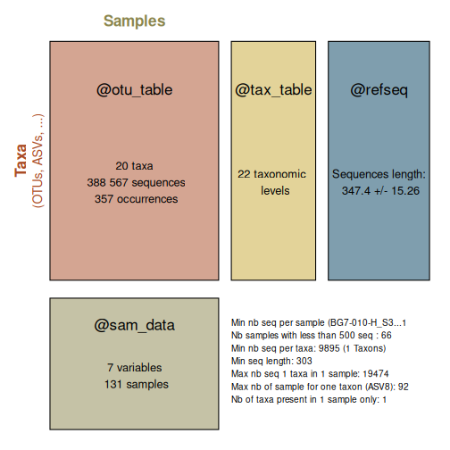
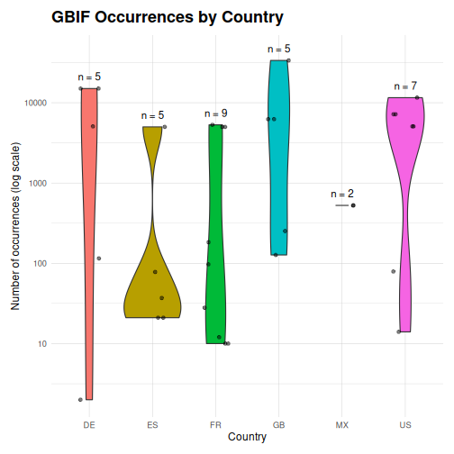
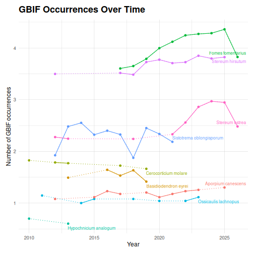
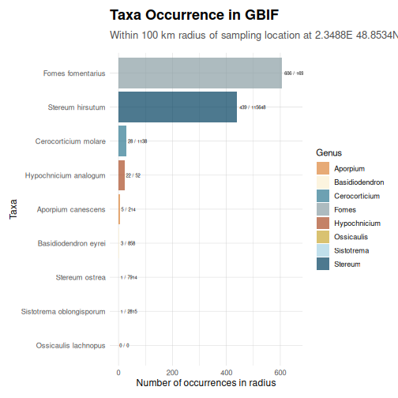
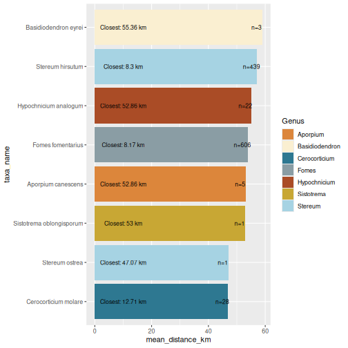
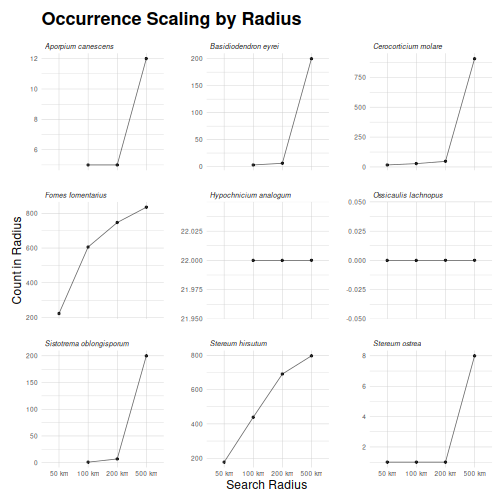
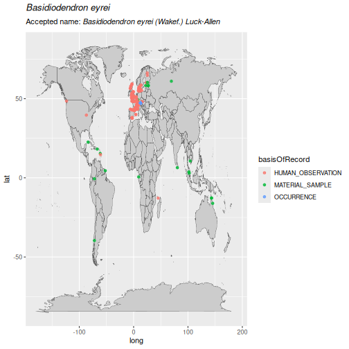

<style type="text/css">
.chunk-with-popups div.sourceCode {
 min-height: 2.5em;
   padding-bottom: 0.3em;
}

.popup-icons .popup-toggle {
  cursor: pointer;
  margin-left: 8px;
  margin-bottom: 8px;
  font-size: 18px;
  line-height: 1;
  display: inline-block;
}

.popup-toggle[data-target^="msg-popup-"] {
  color: #2e7891;           
}

/* Warning color */
.popup-toggle[data-target^="warn-popup-"] {
  color: #aa4c26;          
  text-stroke: 0.5px #aa4c26;
  -webkit-text-stroke: 0.5px #aa4c26;
}

/* Add space between message and warning icons only when both are present */
.popup-toggle[data-target^="msg-popup-"] + .popup-toggle[data-target^="warn-popup-"] {
  margin-left: 12px;
}

/* Tint pop-up borders to match icon color */
div[id^="msg-popup-"] {
  border-color: #2e7891;
}
div[id^="warn-popup-"] {
  border-color: #aa4c26;
}

/* optional: colored header text */
div[id^="msg-popup-"] .popup-header strong { color: #2e7891; }
div[id^="warn-popup-"] .popup-header strong { color: #aa4c26; }

/* popup base */
.popup {
  display: none; /* toggled by JS */
  position: absolute;
  bottom: 30px;
  right: 5px;
  background: #fff;
  border: 1px solid #333;
  border-radius: 6px;
  padding: 8px;
  box-shadow: 0 6px 18px rgba(0,0,0,0.18);
  z-index: 1000;
  max-width: 720px;
  max-height: 320px;
  overflow: auto;
  width: auto;
  box-sizing: border-box;
}

/* popup close button */
.popup-close {
  float: right;
  cursor: pointer;
  border: none;
  background: none;
  font-size: 18px;
  line-height: 1;
  color: #666;
  padding: 0 4px;
}

/* header and content */
.popup-header {
  margin-bottom: 6px;
}
.popup-pre {
  margin: 0;
  padding: 8px;
  background: #f5f5f5;
  border-radius: 4px;
  white-space: pre-wrap;
  line-height: 1.25;
  overflow-x: auto;
}

.sourceCode pre {
  margin: 0 !important;
  /* padding: 0.1em !important; */
  line-height: 1.2 !important;
}

.sourceCode code {
  line-height: 1.2 !important;
}

div.sourceCode {
  margin: 0.2em 0 !important;
}

/* Ensure proper spacing in wrapped divs */
  div[style*="position: relative"] > div.sourceCode,
div[style*="position: relative"] > pre {
  margin-top: 0 !important;
  margin-bottom: 0.2em !important;
}

/* Fix spacing in pop-up pre elements */
  div[id*="-popup-"] pre {
    margin: 0 !important;
    line-height: 1.2 !important;
  }
</style>


<script>
// v10 JS: reliable toggle + close when clicking outside + Escape to close
(function () {
  function onReady(fn) {
    if (document.readyState !== 'loading') fn();
    else document.addEventListener('DOMContentLoaded', fn);
  }

  onReady(function () {
    // delegate: handle toggle clicks
    document.querySelectorAll('.popup-toggle').forEach(function (btn) {
      btn.addEventListener('click', function (ev) {
        ev.stopPropagation();
        var id = btn.getAttribute('data-target');
        if (!id) return;
        var popup = document.getElementById(id);
        if (!popup) return;
        var isVisible = popup.style.display === 'block';
        // close any other popups first
        document.querySelectorAll('.popup').forEach(function (p) {
          p.style.display = 'none';
          p.setAttribute('aria-hidden', 'true');
        });
        if (!isVisible) {
          popup.style.display = 'block';
          popup.setAttribute('aria-hidden', 'false');
        } else {
          popup.style.display = 'none';
          popup.setAttribute('aria-hidden', 'true');
        }
      });
    });

    // stop clicks inside popup from bubbling to document
    document.querySelectorAll('.popup').forEach(function (popup) {
      popup.addEventListener('click', function (ev) {
        ev.stopPropagation();
      });
      // close button inside popup
      var btn = popup.querySelector('.popup-close');
      if (btn) {
        btn.addEventListener('click', function (ev) {
          ev.stopPropagation();
          popup.style.display = 'none';
          popup.setAttribute('aria-hidden', 'true');
        });
      }
    });

    // close on click outside any popup
    document.addEventListener('click', function () {
      document.querySelectorAll('.popup').forEach(function (p) {
        if (p.style.display && p.style.display !== 'none') {
          p.style.display = 'none';
          p.setAttribute('aria-hidden', 'true');
        }
      });
    });

    // close on Escape
    document.addEventListener('keydown', function (ev) {
      if (ev.key === 'Escape' || ev.key === 'Esc') {
        document.querySelectorAll('.popup').forEach(function (p) {
          if (p.style.display && p.style.display !== 'none') {
            p.style.display = 'none';
            p.setAttribute('aria-hidden', 'true');
          }
        });
      }
    });
  });
})();
</script>


``` r
library(taxinfo)
library(MiscMetabar)
library(ggplot2)
library(dplyr)
```


## Overview

The Global Biodiversity Information Facility (GBIF) is the world's largest repository of biodiversity occurrence data. The taxinfo package provides seamless integration with GBIF through specialized functions that retrieve occurrence data, create distribution maps, and analyze biogeographic patterns for taxa in your phyloseq objects.

## Core GBIF Functions

- `tax_gbif_occur_pq()`: Retrieve occurrence counts from GBIF
- `plot_tax_gbif_pq()`: Create distribution maps
- `range_bioreg_pq()`: Analyze biogeographic ranges
- `tax_check_ecoregion()`: Validate occurrences against ecoregions
- `tax_occur_check_pq()`: Check occurrences within a geographic radius

**Note:** Functions like `tax_gbif_occur_pq()` and `tax_occur_check_pq()` can work with either phyloseq objects or vectors of taxonomic names (`taxnames` parameter). When using a phyloseq object, results are automatically added to the tax_table. When using `taxnames`, a tibble is returned.

## Basic Occurrence Data Retrieval

### Get verified taxonomic names

<div class='chunk-with-popups' style='position: relative; margin: 0; padding: 0;'>
<div class='popup-icons' style='position: absolute; bottom: 5px; right: 5px; z-index: 10; background: rgba(255,255,255,0.9); padding: 2px 6px; border-radius: 4px;'><span class='popup-toggle' data-target='msg-popup-unnamed-chunk-2' title='Messages' aria-haspopup='true' aria-expanded='false'>🛈</span></div>
<div id='msg-popup-unnamed-chunk-2' class='popup' role='dialog' aria-hidden='true' onclick='event.stopPropagation();'><button class='popup-close' aria-label='Close'>&times;</button><div class='popup-header'><strong>Messages</strong></div><pre class='popup-pre'>#&gt; ✔ GNA verification summary:
#&gt; • Total taxa in phyloseq: 20
#&gt; • Taxa submitted for verification: 19
#&gt; • Genus-level only taxa: 2
#&gt; • Total matches found: 15
#&gt; • Synonyms: 4 (including 4 at genus level)
#&gt; • Accepted names: 11 (including 6 at genus level)
</pre></div>


``` r
# Load and prepare example data
data("data_fungi_mini", package = "MiscMetabar")

# Keep only first 20 taxa for speed
data_clean <- prune_taxa(taxa = taxa_names(data_fungi_mini)[1:20], data_fungi_mini) |>
  gna_verifier_pq(data_sources = 210)
```

</div>


### Find GBIF occurrence counts and add to phyloseq object

<div class='chunk-with-popups' style='position: relative; margin: 0; padding: 0;'>
<div class='popup-icons' style='position: absolute; bottom: 5px; right: 5px; z-index: 10; background: rgba(255,255,255,0.9); padding: 2px 6px; border-radius: 4px;'><span class='popup-toggle' data-target='msg-popup-unnamed-chunk-3' title='Messages' aria-haspopup='true' aria-expanded='false'>🛈</span></div>
<div id='msg-popup-unnamed-chunk-3' class='popup' role='dialog' aria-hidden='true' onclick='event.stopPropagation();'><button class='popup-close' aria-label='Close'>&times;</button><div class='popup-header'><strong>Messages</strong></div><pre class='popup-pre'>#&gt; ℹ Processing GBIF occurrences for Stereum ostrea
#&gt; ℹ Processing GBIF occurrences for Ossicaulis lachnopus
#&gt; 
■■■■■■■■■■■                       33% | ETA:  2s

ℹ Processing GBIF occurrences for Stereum hirsutum
#&gt; ■■■■■■■■■■■                       33% | ETA:  2s

■■■■■■■■■■■■■■                    44% | ETA:  2s

ℹ Processing GBIF occurrences for Basidiodendron eyrei
#&gt; ■■■■■■■■■■■■■■                    44% | ETA:  2s

ℹ Processing GBIF occurrences for Sistotrema oblongisporum
#&gt; ■■■■■■■■■■■■■■                    44% | ETA:  2s

■■■■■■■■■■■■■■■■■■■■■             67% | ETA:  1s

ℹ Processing GBIF occurrences for Fomes fomentarius
#&gt; ■■■■■■■■■■■■■■■■■■■■■             67% | ETA:  1s

■■■■■■■■■■■■■■■■■■■■■■■■          78% | ETA:  1s

ℹ Processing GBIF occurrences for Cerocorticium molare
#&gt; ■■■■■■■■■■■■■■■■■■■■■■■■          78% | ETA:  1s

■■■■■■■■■■■■■■■■■■■■■■■■■■■■      89% | ETA:  0s

ℹ Processing GBIF occurrences for Aporpium canescens
#&gt; ■■■■■■■■■■■■■■■■■■■■■■■■■■■■      89% | ETA:  0s

ℹ Processing GBIF occurrences for Hypochnicium analogum
</pre></div>


``` r
data_clean_gbif <- tax_gbif_occur_pq(data_clean)
```

</div>


### Example Visualization 

Here's an example of what GBIF occurrence data visualization can look like:
 
<div class='chunk-with-popups' style='position: relative; margin: 0; padding: 0;'>
<div class='popup-icons' style='position: absolute; bottom: 5px; right: 5px; z-index: 10; background: rgba(255,255,255,0.9); padding: 2px 6px; border-radius: 4px;'><span class='popup-toggle' data-target='warn-popup-unnamed-chunk-4' title='Warnings' aria-haspopup='true' aria-expanded='false'>⚠</span></div>
<div id='warn-popup-unnamed-chunk-4' class='popup' role='dialog' aria-hidden='true' onclick='event.stopPropagation();'><button class='popup-close' aria-label='Close'>&times;</button><div class='popup-header'><strong>Warnings</strong></div><pre class='popup-pre'>#&gt; Warning: `theme_idest()` was deprecated in taxinfo 0.2.0.
#&gt; ℹ Please use `ggplotpq::theme_idest()` instead.
#&gt; This warning is displayed once per session.
#&gt; Call `lifecycle::last_lifecycle_warnings()` to see where this warning was generated.
</pre></div>
<div class="figure">

<p class="caption">plot of chunk unnamed-chunk-4</p>
</div></div>


### Occurrence Counts by Country

Analyze geographic distribution patterns:

<div class='chunk-with-popups' style='position: relative; margin: 0; padding: 0;'>
<div class='popup-icons' style='position: absolute; bottom: 5px; right: 5px; z-index: 10; background: rgba(255,255,255,0.9); padding: 2px 6px; border-radius: 4px;'><span class='popup-toggle' data-target='msg-popup-unnamed-chunk-5' title='Messages' aria-haspopup='true' aria-expanded='false'>🛈</span></div>
<div id='msg-popup-unnamed-chunk-5' class='popup' role='dialog' aria-hidden='true' onclick='event.stopPropagation();'><button class='popup-close' aria-label='Close'>&times;</button><div class='popup-header'><strong>Messages</strong></div><pre class='popup-pre'>#&gt; ℹ Processing GBIF occurrences for Stereum ostrea
#&gt; 
■■■■■■■■                          22% | ETA: 39s

ℹ Processing GBIF occurrences for Ossicaulis lachnopus
#&gt; ■■■■■■■■                          22% | ETA: 39s

■■■■■■■■■■■                       33% | ETA: 32s

ℹ Processing GBIF occurrences for Stereum hirsutum
#&gt; ■■■■■■■■■■■                       33% | ETA: 32s

■■■■■■■■■■■■■■                    44% | ETA: 23s

ℹ Processing GBIF occurrences for Basidiodendron eyrei
#&gt; ■■■■■■■■■■■■■■                    44% | ETA: 23s

■■■■■■■■■■■■■■■■■■                56% | ETA: 15s

ℹ Processing GBIF occurrences for Sistotrema oblongisporum
#&gt; ■■■■■■■■■■■■■■■■■■                56% | ETA: 15s

■■■■■■■■■■■■■■■■■■■■■             67% | ETA: 10s

ℹ Processing GBIF occurrences for Fomes fomentarius
#&gt; ■■■■■■■■■■■■■■■■■■■■■             67% | ETA: 10s

■■■■■■■■■■■■■■■■■■■■■■■■          78% | ETA:  6s

ℹ Processing GBIF occurrences for Cerocorticium molare
#&gt; ■■■■■■■■■■■■■■■■■■■■■■■■          78% | ETA:  6s

■■■■■■■■■■■■■■■■■■■■■■■■■■■■      89% | ETA:  3s

ℹ Processing GBIF occurrences for Aporpium canescens
#&gt; ■■■■■■■■■■■■■■■■■■■■■■■■■■■■      89% | ETA:  3s

ℹ Processing GBIF occurrences for Hypochnicium analogum
</pre></div>


``` r
data_clean_gbif_country <- tax_gbif_occur_pq(data_clean, by_country = TRUE)
```


``` r

data_clean_gbif_country@tax_table |>
  as.data.frame() |>
  select(currentCanonicalSimple, US, FR, DE, GB, ES, MX) |>
  tidyr::pivot_longer(
    cols = c(US, FR, DE, GB, ES, MX),
    names_to = "country",
    values_to = "occurrences"
  ) |>
  mutate(occurrences = as.numeric(occurrences)) |>
  filter(!is.na(occurrences), occurrences > 0) |>
  ggplot(aes(x = country, y = occurrences, fill = country)) +
  geom_violin() +
  geom_jitter(width = 0.2, alpha = 0.5, height = 0) +
  scale_y_log10() +
  stat_summary(
    fun.data = function(x) {
      return(data.frame(y = max(x) + 0.1, label = paste("n =", length(x))))
    },
    geom = "text",
    vjust = 0
  ) +
  labs(
    title = "GBIF Occurrences by Country",
    x = "Country",
    y = "Number of occurrences (log scale)"
  ) +
  theme_idest() +
  theme(legend.position = "none")
```

<div class="figure">

<p class="caption">plot of chunk unnamed-chunk-5</p>
</div></div>


### Temporal Patterns

Examine occurrence trends over time. Here we don't use `add_to_phyloseq` since the data frame output is 
sufficient.

<div class='chunk-with-popups' style='position: relative; margin: 0; padding: 0;'>
<div class='popup-icons' style='position: absolute; bottom: 5px; right: 5px; z-index: 10; background: rgba(255,255,255,0.9); padding: 2px 6px; border-radius: 4px;'><span class='popup-toggle' data-target='msg-popup-unnamed-chunk-6' title='Messages' aria-haspopup='true' aria-expanded='false'>🛈</span><span class='popup-toggle' data-target='warn-popup-unnamed-chunk-6' title='Warnings' aria-haspopup='true' aria-expanded='false'>⚠</span></div>
<div id='msg-popup-unnamed-chunk-6' class='popup' role='dialog' aria-hidden='true' onclick='event.stopPropagation();'><button class='popup-close' aria-label='Close'>&times;</button><div class='popup-header'><strong>Messages</strong></div><pre class='popup-pre'>#&gt; ℹ Processing GBIF occurrences for Stereum ostrea
#&gt; ℹ Processing GBIF occurrences for Ossicaulis lachnopus
#&gt; 
■■■■■■■■■■■                       33% | ETA:  2s

ℹ Processing GBIF occurrences for Stereum hirsutum
#&gt; ■■■■■■■■■■■                       33% | ETA:  2s

■■■■■■■■■■■■■■                    44% | ETA:  2s

ℹ Processing GBIF occurrences for Basidiodendron eyrei
#&gt; ■■■■■■■■■■■■■■                    44% | ETA:  2s

■■■■■■■■■■■■■■■■■■                56% | ETA:  2s

ℹ Processing GBIF occurrences for Sistotrema oblongisporum
#&gt; ■■■■■■■■■■■■■■■■■■                56% | ETA:  2s

■■■■■■■■■■■■■■■■■■■■■             67% | ETA:  1s

ℹ Processing GBIF occurrences for Fomes fomentarius
#&gt; ■■■■■■■■■■■■■■■■■■■■■             67% | ETA:  1s

■■■■■■■■■■■■■■■■■■■■■■■■          78% | ETA:  1s

ℹ Processing GBIF occurrences for Cerocorticium molare
#&gt; ■■■■■■■■■■■■■■■■■■■■■■■■          78% | ETA:  1s

■■■■■■■■■■■■■■■■■■■■■■■■■■■■      89% | ETA:  0s

ℹ Processing GBIF occurrences for Aporpium canescens
#&gt; ■■■■■■■■■■■■■■■■■■■■■■■■■■■■      89% | ETA:  0s

ℹ Processing GBIF occurrences for Hypochnicium analogum
</pre></div>
<div id='warn-popup-unnamed-chunk-6' class='popup' role='dialog' aria-hidden='true' onclick='event.stopPropagation();'><button class='popup-close' aria-label='Close'>&times;</button><div class='popup-header'><strong>Warnings</strong></div><pre class='popup-pre'>#&gt; Warning: Removed 218 rows containing missing values or values outside the scale
#&gt; range (`geom_line()`).
#&gt; Warning: Removed 22 rows containing missing values or values outside the scale
#&gt; range (`geom_line()`).
#&gt; Warning: Removed 247 rows containing missing values or values outside the scale range
#&gt; (`geom_point()`).
</pre></div>


``` r
gbif_years <- tax_gbif_occur_pq(data_clean,
  by_years = TRUE,
  add_to_phyloseq = FALSE
) |>
  tidyr::pivot_longer(cols = -canonicalName, names_to = "year", values_to = "count") |>
  mutate(year = as.numeric(year))
```


``` r

# Visualize temporal trends for the occurences of taxa
gbif_years |>
  ggplot(aes(x = year, y = log10(count + 1), color = canonicalName)) +
  geom_line() +
  geom_line(data = filter(gbif_years, !is.na(count)), linetype = "dotted") +
  geom_point() +
  labs(
    title = "GBIF Occurrences Over Time",
    x = "Year",
    y = "Number of GBIF occurrences"
  ) +
  theme_idest() +
  ggrepel::geom_text_repel(
    data = summarise(group_by(arrange(filter(gbif_years, !is.na(count)), desc(year)), canonicalName), count = first(count), year = first(year)),
    aes(label = canonicalName, x = as.numeric(year)), hjust = 0,
    direction = "y", size = 3
  ) +
  xlim(2010, 2026) +
  theme(legend.position = "none")
```

<div class="figure">

<p class="caption">plot of chunk unnamed-chunk-6</p>
</div></div>


<div class='chunk-with-popups' style='position: relative; margin: 0; padding: 0;'>
<div class='popup-icons' style='position: absolute; bottom: 5px; right: 5px; z-index: 10; background: rgba(255,255,255,0.9); padding: 2px 6px; border-radius: 4px;'><span class='popup-toggle' data-target='warn-popup-unnamed-chunk-7' title='Warnings' aria-haspopup='true' aria-expanded='false'>⚠</span></div>
<div id='warn-popup-unnamed-chunk-7' class='popup' role='dialog' aria-hidden='true' onclick='event.stopPropagation();'><button class='popup-close' aria-label='Close'>&times;</button><div class='popup-header'><strong>Warnings</strong></div><pre class='popup-pre'>#&gt; Warning: Removed 144 rows containing missing values or values outside the scale
#&gt; range (`geom_line()`).
#&gt; Warning: Removed 144 rows containing missing values or values outside the scale range
#&gt; (`geom_point()`).
</pre></div>


``` r
gbif_years_cumsum <- gbif_years |>
  mutate(year = as.numeric(year)) |>
  arrange(year) |>
  group_by(canonicalName) |>
  mutate(year = as.numeric(year)) |>
  mutate(cum_count = cumsum(tidyr::replace_na(count, 0)))
ggplot(gbif_years_cumsum, aes(
  x = year, y = log10(cum_count + 1),
  color = canonicalName
)) +
  geom_line() +
  geom_point() +
  labs(
    title = "GBIF Cumulative Occurrences Over Time",
    x = "Year",
    y = "Number of GBIF occurrences"
  ) +
  theme_idest() +
  ggrepel::geom_text_repel(
    data = summarise(
      group_by(
        arrange(gbif_years_cumsum, desc(year)),
        canonicalName
      ),
      cum_count = first(cum_count),
      year = first(year)
    ),
    aes(
      label = canonicalName,
      x = as.numeric(year)
    ),
    hjust = 0, direction = "y", size = 3
  ) +
  xlim(2008, 2026) +
  theme(legend.position = "none")
```

<div class="figure">

<p class="caption">plot of chunk unnamed-chunk-7</p>
</div></div>


## Visualization and Mapping

### Basic Distribution Plots

Create occurrence distribution visualizations:


``` r
# Plot global vs regional occurrences
psmelt(data_clean_gbif) |>
  as.data.frame() |>
  group_by(currentCanonicalSimple) |>
  summarise(
    Global_occurences = as.numeric(unique(Global_occurences)),
    nb_seq = sum(Abundance),
    nb_samp = sum(Abundance > 0)
  ) |>
  filter(!is.na(Global_occurences)) |>
  ggplot(aes(
    x = log10(1 + nb_seq),
    y = log10(1 + Global_occurences)
  )) +
  geom_point(alpha = 0.7) +
  ggrepel::geom_text_repel(aes(label = currentCanonicalSimple),
    vjust = -0.5,
    size = 3,
    fontface = "italic",
    min.segment.length = 0.2,
    force = 4
  ) +
  coord_flip() +
  labs(
    title = "GBIF Occurrence Counts vs molecular abundance",
    x = "Number of sequences (log scale)",
    y = "Number of GBIF occurrences (log scale)"
  ) +
  theme_idest()
```

<div class="figure">

<p class="caption">plot of chunk unnamed-chunk-8</p>
</div>

### Interactive Distribution Maps

Create interactive maps showing species distributions:

<div class='chunk-with-popups' style='position: relative; margin: 0; padding: 0;'>
<div class='popup-icons' style='position: absolute; bottom: 5px; right: 5px; z-index: 10; background: rgba(255,255,255,0.9); padding: 2px 6px; border-radius: 4px;'><span class='popup-toggle' data-target='msg-popup-unnamed-chunk-9' title='Messages' aria-haspopup='true' aria-expanded='false'>🛈</span><span class='popup-toggle' data-target='warn-popup-unnamed-chunk-9' title='Warnings' aria-haspopup='true' aria-expanded='false'>⚠</span></div>
<div id='msg-popup-unnamed-chunk-9' class='popup' role='dialog' aria-hidden='true' onclick='event.stopPropagation();'><button class='popup-close' aria-label='Close'>&times;</button><div class='popup-header'><strong>Messages</strong></div><pre class='popup-pre'>#&gt; Number of non-matching ASV 0
#&gt; Number of matching ASV 20
#&gt; Number of filtered-out ASV 18
#&gt; Number of kept ASV 2
#&gt; Number of kept samples 137
#&gt; ℹ Start the computation of Ossicaulis lachnopus
</pre></div>
<div id='warn-popup-unnamed-chunk-9' class='popup' role='dialog' aria-hidden='true' onclick='event.stopPropagation();'><button class='popup-close' aria-label='Close'>&times;</button><div class='popup-header'><strong>Warnings</strong></div><pre class='popup-pre'>#&gt; Warning in verify_pq(physeq, verbose = verbose): At least one of your sample
#&gt; contains less than 500 sequences.
#&gt; Warning in verify_pq(physeq, verbose = verbose): At least one of your taxa is
#&gt; represent by less than 1 sequences.
#&gt; Warning in verify_pq(physeq, verbose = verbose): At least one of your samples
#&gt; metadata columns contains NA.
</pre></div>


``` r
plot_tax_gbif_pq(select_taxa_pq(data_clean, taxnames = "Ossicaulis lachnopus"),
  interactive_plot = TRUE
)
```

```
#> |--------------------------------------------|
#> | Total number (all records)    :        227 |
#> | Kept records                  :        206 |
#> |--------------------------------------------|
#> | Kept records according to parameters:
#> | spatial_issue = FALSE, has_xy = TRUE...GBIF records of Ossicaulis lachnopus: download starting...
#> 
------------- #1 (100%...)
#> ...Records (XY) filtering summary:
#> ----------------------------------------------
#>                     step removed remaining
#>          Grain filtering       3       203
#>       Duplicated records      73       130
#>          Absence records       0       130
#>          Basis selection      49        81
#>  Establishment selection       0        81
#>               Time frame       0        81
#>        Identical records       0        81
#>         Raster centroids       0        81
#> 
#> Initial records         : 206
#> Total removed           : 125
#> Final records (XY)      : 81
#> ----------------------------------------------
#> Final records (no XY)   : 0
```
```
#> [[1]]
```
</div>


### Static Distribution Maps


<div class='chunk-with-popups' style='position: relative; margin: 0; padding: 0;'>
<div class='popup-icons' style='position: absolute; bottom: 5px; right: 5px; z-index: 10; background: rgba(255,255,255,0.9); padding: 2px 6px; border-radius: 4px;'><span class='popup-toggle' data-target='msg-popup-unnamed-chunk-10' title='Messages' aria-haspopup='true' aria-expanded='false'>🛈</span></div>
<div id='msg-popup-unnamed-chunk-10' class='popup' role='dialog' aria-hidden='true' onclick='event.stopPropagation();'><button class='popup-close' aria-label='Close'>&times;</button><div class='popup-header'><strong>Messages</strong></div><pre class='popup-pre'>#&gt; ℹ Start the computation of Ossicaulis lachnopus
#&gt; ℹ Start the computation of Basidiodendron eyrei
</pre></div>


``` r
distribution_maps <- plot_tax_gbif_pq(
  taxnames = c("Ossicaulis lachnopus", "Basidiodendron eyrei"),
  n_occur = 1000
)
```

```
#> |--------------------------------------------|
#> | Total number (all records)    :        227 |
#> | Kept records                  :        206 |
#> |--------------------------------------------|
#> | Kept records according to parameters:
#> | spatial_issue = FALSE, has_xy = TRUE...GBIF records of Ossicaulis lachnopus: download starting...
#> 
------------- #1 (100%...)
#> ...Records (XY) filtering summary:
#> ----------------------------------------------
#>                     step removed remaining
#>          Grain filtering       3       203
#>       Duplicated records      73       130
#>          Absence records       0       130
#>          Basis selection      49        81
#>  Establishment selection       0        81
#>               Time frame       0        81
#>        Identical records       0        81
#>         Raster centroids       0        81
#> 
#> Initial records         : 206
#> Total removed           : 125
#> Final records (XY)      : 81
#> ----------------------------------------------
#> Final records (no XY)   : 0
```
```
#> |--------------------------------------------|
#> | Total number (all records)    :       1165 |
#> | Kept records                  :        857 |
#> |--------------------------------------------|
#> | Kept records according to parameters:
#> | spatial_issue = FALSE, has_xy = TRUE...GBIF records of Basidiodendron eyrei: download starting...
#> 
------------- #1 (100%...)
#> ...Records (XY) filtering summary:
#> ----------------------------------------------
#>                     step removed remaining
#>          Grain filtering      27       830
#>       Duplicated records     295       535
#>          Absence records       0       535
#>          Basis selection     286       249
#>  Establishment selection       0       249
#>               Time frame       0       249
#>        Identical records       0       249
#>         Raster centroids       0       249
#> 
#> Initial records         : 857
#> Total removed           : 608
#> Final records (XY)      : 249
#> ----------------------------------------------
#> Final records (no XY)   : 0
```


``` r
distribution_maps[[1]]
```

<div class="figure">

<p class="caption">plot of chunk unnamed-chunk-10</p>
</div>

``` r
distribution_maps[[2]]
```

<div class="figure">

<p class="caption">plot of chunk unnamed-chunk-10</p>
</div></div>


## Biogeographic Analysis

### Range Analysis

<div class='chunk-with-popups' style='position: relative; margin: 0; padding: 0;'>
<div class='popup-icons' style='position: absolute; bottom: 5px; right: 5px; z-index: 10; background: rgba(255,255,255,0.9); padding: 2px 6px; border-radius: 4px;'><span class='popup-toggle' data-target='msg-popup-unnamed-chunk-11' title='Messages' aria-haspopup='true' aria-expanded='false'>🛈</span><span class='popup-toggle' data-target='warn-popup-unnamed-chunk-11' title='Warnings' aria-haspopup='true' aria-expanded='false'>⚠</span></div>
<div id='msg-popup-unnamed-chunk-11' class='popup' role='dialog' aria-hidden='true' onclick='event.stopPropagation();'><button class='popup-close' aria-label='Close'>&times;</button><div class='popup-header'><strong>Messages</strong></div><pre class='popup-pre'>#&gt; Number of non-matching ASV 0
#&gt; Number of matching ASV 20
#&gt; Number of filtered-out ASV 17
#&gt; Number of kept ASV 3
#&gt; Number of kept samples 137
#&gt; ℹ Finding GBIF occurrence for Ossicaulis lachnopus
#&gt; ℹ Starting range computation for Ossicaulis lachnopus
#&gt; ! Not enough occurrence data for Ossicaulis lachnopus
#&gt; ! Not enough occurrence data to plot Ossicaulis lachnopus
#&gt; ℹ Finding GBIF occurrence for Basidiodendron eyrei
#&gt; ℹ Starting range computation for Basidiodendron eyrei
#&gt; ! Not enough occurrence data for Basidiodendron eyrei
#&gt; ! Not enough occurrence data to plot Basidiodendron eyrei
</pre></div>
<div id='warn-popup-unnamed-chunk-11' class='popup' role='dialog' aria-hidden='true' onclick='event.stopPropagation();'><button class='popup-close' aria-label='Close'>&times;</button><div class='popup-header'><strong>Warnings</strong></div><pre class='popup-pre'>#&gt; Warning in verify_pq(physeq, verbose = verbose): At least one of your sample
#&gt; contains less than 500 sequences.
#&gt; Warning in verify_pq(physeq, verbose = verbose): At least one of your taxa is
#&gt; represent by less than 1 sequences.
#&gt; Warning in verify_pq(physeq, verbose = verbose): At least one of your samples
#&gt; metadata columns contains NA.
</pre></div>


``` r
data_clean_range <- range_bioreg_pq(
  select_taxa_pq(data_clean,
    taxnames = c("Ossicaulis lachnopus", "Basidiodendron eyrei")
  ),
  make_plot = TRUE
)
```

```
#> |--------------------------------------------|
#> | Total number (all records)    :        227 |
#> | Kept records                  :        206 |
#> |--------------------------------------------|
#> | Kept records according to parameters:
#> | spatial_issue = FALSE, has_xy = TRUE...GBIF records of Ossicaulis lachnopus: download of sample starting...
#> 
------------- #1 (100%...)
#> ...Records (XY) filtering summary:
#> ----------------------------------------------
#>                     step removed remaining
#>          Grain filtering       3       203
#>       Duplicated records      73       130
#>          Absence records       0       130
#>          Basis selection      49        81
#>  Establishment selection       0        81
#>               Time frame       0        81
#>        Identical records       0        81
#>         Raster centroids       0        81
#> 
#> Initial records         : 206
#> Total removed           : 125
#> Final records (XY)      : 81
#> ----------------------------------------------
#> Final records (no XY)   : 0
```
```
#> |--------------------------------------------|
#> | Total number (all records)    :       1165 |
#> | Kept records                  :        857 |
#> |--------------------------------------------|
#> | Kept records according to parameters:
#> | spatial_issue = FALSE, has_xy = TRUE...GBIF records of Basidiodendron eyrei: download of sample starting...
#> 
------------- #1 (100%...)
#> ...Records (XY) filtering summary:
#> ----------------------------------------------
#>                     step removed remaining
#>          Grain filtering      27       830
#>       Duplicated records     295       535
#>          Absence records       0       535
#>          Basis selection     286       249
#>  Establishment selection       0       249
#>               Time frame       0       249
#>        Identical records       0       249
#>         Raster centroids       0       249
#> 
#> Initial records         : 857
#> Total removed           : 608
#> Final records (XY)      : 249
#> ----------------------------------------------
#> Final records (no XY)   : 0
```
</div>


``` r
data_clean_range[[2]]
```

```
#> NULL
```


### Ecoregion Validation

Check if occurrences match expected ecoregions:

<div class='chunk-with-popups' style='position: relative; margin: 0; padding: 0;'>
<div class='popup-icons' style='position: absolute; bottom: 5px; right: 5px; z-index: 10; background: rgba(255,255,255,0.9); padding: 2px 6px; border-radius: 4px;'><span class='popup-toggle' data-target='msg-popup-unnamed-chunk-13' title='Messages' aria-haspopup='true' aria-expanded='false'>🛈</span></div>
<div id='msg-popup-unnamed-chunk-13' class='popup' role='dialog' aria-hidden='true' onclick='event.stopPropagation();'><button class='popup-close' aria-label='Close'>&times;</button><div class='popup-header'><strong>Messages</strong></div><pre class='popup-pre'>#&gt; ℹ Ecoregion layer "eco_terra" is not bundled with taxinfo.
#&gt;   Downloading it once (~50 MB) to '/home/adrien/.cache/R/taxinfo'.
#&gt; eco_terra directory does not exist or contains no .shp files. 
#&gt;             
#&gt;  [/home/adrien/.cache/R/taxinfo/eco_terra/eco_terra] will be created and data will be downloaded.
#&gt;             
#&gt;  Downloading data...
#&gt; 
#&gt; Preparing to download ecoregion eco_terra 
#&gt;  data file to: /home/adrien/.cache/R/taxinfo
#&gt; 
#&gt; Downloaded: eco_terra
#&gt; 
#&gt; Description: Terrestrial Ecoregions of the World
#&gt; 
#&gt; Unzipped: eco_terra 
#&gt;  saved to: /home/adrien/.cache/R/taxinfo/eco_terra 
#&gt;  removed:  eco_terra.zip
#&gt; 
#&gt; ℹ Fetching GBIF occurrences for Xylobolus subpileatus
</pre></div>


``` r
tax_check_ecoregion(
  taxnames = "Xylobolus subpileatus",
  longitudes = c(2.3522, 4.2),
  latitudes = c(48.8566, 33)
)
```

```
#> $taxon_ecoregions
#> # A tibble: 91 × 6
#>    taxon_name            ECO_NAME                 biome realm n_occur prop_occur
#>    <chr>                 <chr>                    <chr> <chr>   <int>      <dbl>
#>  1 Xylobolus subpileatus Lower New England / Nor… Temp… Near…     124      0.124
#>  2 Xylobolus subpileatus Pannonian Mixed Forests  Temp… Pale…      65      0.065
#>  3 Xylobolus subpileatus Isthmian-Pacific Moist … Trop… Neot…      56      0.056
#>  4 Xylobolus subpileatus Florida Peninsula        Temp… Near…      53      0.053
#>  5 Xylobolus subpileatus Piedmont                 Temp… Near…      53      0.053
#>  6 Xylobolus subpileatus North Atlantic Coast     Temp… Near…      46      0.046
#>  7 Xylobolus subpileatus East Gulf Coastal Plain  Temp… Near…      43      0.043
#>  8 Xylobolus subpileatus Cumberlands And Souther… Temp… Near…      38      0.038
#>  9 Xylobolus subpileatus Upper East Gulf Coastal… Temp… Near…      34      0.034
#> 10 Xylobolus subpileatus Trans-Mexican Volcanic … Trop… Neot…      27      0.027
#> # ℹ 81 more rows
#> 
#> $points_ecoregion
#> # A tibble: 2 × 6
#>   point_id longitude latitude ECO_NAME                           biome     realm
#>      <int>     <dbl>    <dbl> <chr>                              <chr>     <chr>
#> 1        1      2.35     48.9 Atlantic Mixed Forests             Temperat… Pale…
#> 2        2      4.2      33   North Saharan Steppe And Woodlands Deserts … Pale…
#> 
#> $is_in_ecoregion
#>                       point_1 point_2
#> Xylobolus subpileatus   FALSE   FALSE
#> 
#> $ecoregion
#> $ecoregion$`Xylobolus subpileatus`
#>                            Lower New England / Northern Piedmont 
#>                                                              124 
#>                                          Pannonian Mixed Forests 
#>                                                               65 
#>                                   Isthmian-Pacific Moist Forests 
#>                                                               56 
#>                                                Florida Peninsula 
#>                                                               53 
#>                                                         Piedmont 
#>                                                               53 
#>                                             North Atlantic Coast 
#>                                                               46 
#>                                          East Gulf Coastal Plain 
#>                                                               43 
#>                        Cumberlands And Southern Ridge And Valley 
#>                                                               38 
#>                                    Upper East Gulf Coastal Plain 
#>                                                               34 
#>                     Trans-Mexican Volcanic Belt Pine-Oak Forests 
#>                                                               27 
#>                                    Upper West Gulf Coastal Plain 
#>                                                               26 
#>                                  Gulf Coast Prairies And Marshes 
#>                                                               25 
#>                                 Mississippi River Alluvial Plain 
#>                                                               25 
#>                                              Southern Blue Ridge 
#>                                                               25 
#>                                                      Great Lakes 
#>                                                               22 
#>                                          North Central Tillplain 
#>                                                               22 
#>                                       Talamancan Montane Forests 
#>                                                               18 
#>                     Corsican Montane Broadleaf And Mixed Forests 
#>                                                               17 
#>                                                           Ozarks 
#>                                                               17 
#>                                          Chesapeake Bay Lowlands 
#>                                                               14 
#>                                          West Gulf Coastal Plain 
#>                                                               14 
#>                                     South Atlantic Coastal Plain 
#>                                                               13 
#>                                        Central Tallgrass Prairie 
#>                                                               12 
#>                                       Mid-Atlantic Coastal Plain 
#>                                                               12 
#>                            Sierra Madre De Chiapas Moist Forests 
#>                                                               12 
#>                              Western Himalayan Broadleaf Forests 
#>                                                               12 
#>                                             Interior Low Plateau 
#>                                                               11 
#>                      Crosstimbers And Southern Tallgrass Prairie 
#>                                                                8 
#>                Italian Sclerophyllous And Semi-Deciduous Forests 
#>                                                                8 
#>                               Costa Rican Seasonal Moist Forests 
#>                                                                7 
#>                                        Western Allegheny Plateau 
#>                                                                7 
#>                                       Central Appalachian Forest 
#>                                                                6 
#>                               Himalayan Subtropical Pine Forests 
#>                                                                6 
#>                                          Oaxacan Montane Forests 
#>                                                                6 
#>                                     Central American Dry Forests 
#>                                                                5 
#>                             Eastern Australian Temperate Forests 
#>                                                                5 
#>                                 Osage Plains/Flint Hills Prairie 
#>                                                                5 
#>             Tyrrhenian-Adriatic Sclerophyllous And Mixed Forests 
#>                                                                5 
#>                                               Ouachita Mountains 
#>                                                                4 
#>                           Sierra Madre Oriental Pine-Oak Forests 
#>                                                                4 
#> Southwest Iberian Mediterranean Sclerophyllous And Mixed Forests 
#>                                                                4 
#>                                             Balkan Mixed Forests 
#>                                                                3 
#>                                           High Allegheny Plateau 
#>                                                                3 
#>                                  Isthmian-Atlantic Moist Forests 
#>                                                                3 
#>                                              Jalisco Dry Forests 
#>                                                                3 
#>                                 Northwestern Thorn Scrub Forests 
#>                                                                3 
#>                            Sierra Madre Del Sur Pine-Oak Forests 
#>                                                                3 
#>                                                Bajío Dry Forests 
#>                                                                2 
#>                         Canary Islands Dry Woodlands And Forests 
#>                                                                2 
#>                                          Chiapas Montane Forests 
#>                                                                2 
#>                                  Dinaric Mountains Mixed Forests 
#>                                                                2 
#>                                   East African Montane Moorlands 
#>                                                                2 
#>                Iberian Sclerophyllous And Semi-Deciduous Forests 
#>                                                                2 
#>                                 Kayah-Karen Montane Rain Forests 
#>                                                                2 
#>                                             Kazakh Forest Steppe 
#>                                                                2 
#>                                 Magdalena Valley Montane Forests 
#>                                                                2 
#>                  Northwestern Himalayan Alpine Shrub And Meadows 
#>                                                                2 
#>                                           Po Basin Mixed Forests 
#>                                                                2 
#>                                     Southern Pacific Dry Forests 
#>                                                                2 
#>                                       Taiheiyo Evergreen Forests 
#>                                                                2 
#>                      Western Himalayan Subalpine Conifer Forests 
#>                                                                2 
#>                                   Albertine Rift Montane Forests 
#>                                                                1 
#>                                   Alps Conifer And Mixed Forests 
#>                                                                1 
#>                                               Balsas Dry Forests 
#>                                                                1 
#>                                         Cantabrian Mixed Forests 
#>                                                                1 
#>                                     Cauca Valley Montane Forests 
#>                                                                1 
#>                                Central American Pine-Oak Forests 
#>                                                                1 
#>                                   Central European Mixed Forests 
#>                                                                1 
#>                                         Central Mexican Matorral 
#>                                                                1 
#>                                                 Columbia Plateau 
#>                                                                1 
#>                                      Crete Mediterranean Forests 
#>                                                                1 
#>                                   English Lowlands Beech Forests 
#>                                                                1 
#>                                        Ethiopian Montane Forests 
#>                                                                1 
#>                       Ethiopian Montane Grasslands And Woodlands 
#>                                                                1 
#>                                     Huang He Plain Mixed Forests 
#>                                                                1 
#>                                   Northern Appalachian / Acadian 
#>                                                                1 
#>                Northern Zanzibar-Inhambane Coastal Forest Mosaic 
#>                                                                1 
#>                           Northwest Russian-Novaya Zemlya Tundra 
#>                                                                1 
#>                              Northwestern Andean Montane Forests 
#>                                                                1 
#>          Nujiang Langcang Gorge Alpine Conifer And Mixed Forests 
#>                                                                1 
#>                                   Pindus Mountains Mixed Forests 
#>                                                                1 
#>                                            Prairie-Forest Border 
#>                                                                1 
#>                               Pyrenees Conifer And Mixed Forests 
#>                                                                1 
#>                                 Queensland Tropical Rain Forests 
#>                                                                1 
#>                         Sierra Madre Occidental Pine-Oak Forests 
#>                                                                1 
#>                                                   Sonoran Desert 
#>                                                                1 
#>                                            Superior Mixed Forest 
#>                                                                1 
#>                                           Tamaulipan Thorn Scrub 
#>                                                                1 
#>                    Upper Gangetic Plains Moist Deciduous Forests 
#>                                                                1 
#>                               Western European Broadleaf Forests 
#>                                                                1 
#>                                  Western Guinean Lowland Forests 
#>                                                                1
```
</div>


## Session information


``` r
sessionInfo()
```

```
#> R version 4.6.0 (2026-04-24)
#> Platform: x86_64-pc-linux-gnu
#> Running under: Pop!_OS 24.04 LTS
#> 
#> Matrix products: default
#> BLAS:   /usr/lib/x86_64-linux-gnu/openblas-pthread/libblas.so.3 
#> LAPACK: /usr/lib/x86_64-linux-gnu/openblas-pthread/libopenblasp-r0.3.26.so;  LAPACK version 3.12.0
#> 
#> locale:
#>  [1] LC_CTYPE=en_US.UTF-8       LC_NUMERIC=C              
#>  [3] LC_TIME=en_US.UTF-8        LC_COLLATE=en_US.UTF-8    
#>  [5] LC_MONETARY=en_US.UTF-8    LC_MESSAGES=en_US.UTF-8   
#>  [7] LC_PAPER=en_US.UTF-8       LC_NAME=C                 
#>  [9] LC_ADDRESS=C               LC_TELEPHONE=C            
#> [11] LC_MEASUREMENT=en_US.UTF-8 LC_IDENTIFICATION=C       
#> 
#> time zone: Europe/Paris
#> tzcode source: system (glibc)
#> 
#> attached base packages:
#> [1] stats     graphics  grDevices utils     datasets  methods   base     
#> 
#> other attached packages:
#> [1] taxinfo_0.1.2      MiscMetabar_0.16.8 dplyr_1.2.1        ggplot2_4.0.3     
#> [5] phyloseq_1.56.0   
#> 
#> loaded via a namespace (and not attached):
#>   [1] RColorBrewer_1.1-3      wk_0.9.5                jsonlite_2.0.0         
#>   [4] magrittr_2.0.5          farver_2.1.2            CoordinateCleaner_3.0.1
#>   [7] vctrs_0.7.3             multtest_2.68.0         RCurl_1.98-1.19        
#>  [10] base64enc_0.1-6         terra_1.9-27            htmltools_0.5.9        
#>  [13] forcats_1.0.1           curl_7.1.0              s2_1.1.11              
#>  [16] raster_3.6-32           divent_0.5-4            KernSmooth_2.23-26     
#>  [19] htmlwidgets_1.6.4       plyr_1.8.9              zoo_1.8-15             
#>  [22] uuid_1.2-2              whisker_0.4.1           igraph_2.3.2           
#>  [25] lifecycle_1.0.5         iterators_1.0.14        pkgconfig_2.0.3        
#>  [28] Matrix_1.7-5            R6_2.6.1                fastmap_1.2.0          
#>  [31] rbibutils_2.4.1         digest_0.6.39           mapview_2.11.4         
#>  [34] S4Vectors_0.50.1        leafem_0.2.5            textshaping_1.0.5      
#>  [37] crosstalk_1.2.2         vegan_2.7-5             labeling_0.4.3         
#>  [40] urltools_1.7.3.1        httr_1.4.8              NMOF_2.11-0            
#>  [43] mgcv_1.9-4              compiler_4.6.0          proxy_0.4-29           
#>  [46] bit64_4.8.2             withr_3.0.2             brew_1.0-10            
#>  [49] S7_0.2.2                DBI_1.3.0               maps_3.4.3             
#>  [52] MASS_7.3-65             gbif.range_1.6.0        leaflet_2.2.3          
#>  [55] classInt_0.4-11         biomformat_1.40.0       permute_0.9-10         
#>  [58] oai_0.4.0               tools_4.6.0             units_1.0-1            
#>  [61] otel_0.2.0              ape_5.8-1               zip_3.0.0              
#>  [64] rgbif_3.8.5             satellite_1.0.6         glue_1.8.1             
#>  [67] nlme_3.1-169            grid_4.6.0              sf_1.1-1               
#>  [70] cluster_2.1.8.2         reshape2_1.4.5          ade4_1.7-24            
#>  [73] generics_0.1.4          leaflet.providers_3.0.0 gtable_0.3.6           
#>  [76] tzdb_0.5.0              class_7.3-23            tidyr_1.3.2            
#>  [79] data.table_1.18.4       hms_1.1.4               sp_2.2-1               
#>  [82] xml2_1.5.2              utf8_1.2.6              XVector_0.52.0         
#>  [85] BiocGenerics_0.58.1     ggrepel_0.9.8           foreach_1.5.2          
#>  [88] pillar_1.11.1           stringr_1.6.0           vroom_1.7.1            
#>  [91] rglobi_0.3.4            splines_4.6.0           lattice_0.22-9         
#>  [94] survival_3.8-6          FNN_1.1.4.1             gmp_0.7-5.1            
#>  [97] bit_4.6.0               tidyselect_1.2.1        Biostrings_2.80.1      
#> [100] knitr_1.51              IRanges_2.46.0          Seqinfo_1.2.0          
#> [103] svglite_2.2.2           crul_1.6.0              stats4_4.6.0           
#> [106] xfun_0.58               wikitaxa_0.5.0          Biobase_2.72.0         
#> [109] taxize_0.10.1           leafpop_0.1.0           stringi_1.8.7          
#> [112] lazyeval_0.2.3          evaluate_1.0.5          codetools_0.2-20       
#> [115] httpcode_0.3.0          tibble_3.3.1            cli_3.6.6              
#> [118] RcppParallel_5.1.11-2   systemfonts_1.3.2       Rdpack_2.6.6           
#> [121] jquerylib_0.1.4         Rcpp_1.1.1-1.1          rnaturalearth_1.2.0    
#> [124] triebeard_0.4.1         png_0.1-9               parallel_4.6.0         
#> [127] readr_2.2.0             openalexR_3.0.1         mclust_6.1.2           
#> [130] ClusterR_1.3.6          WikipediR_1.7.1         bitops_1.0-9           
#> [133] scales_1.4.0            e1071_1.7-17            purrr_1.2.2            
#> [136] crayon_1.5.3            geosphere_1.6-8         rlang_1.2.0
```


